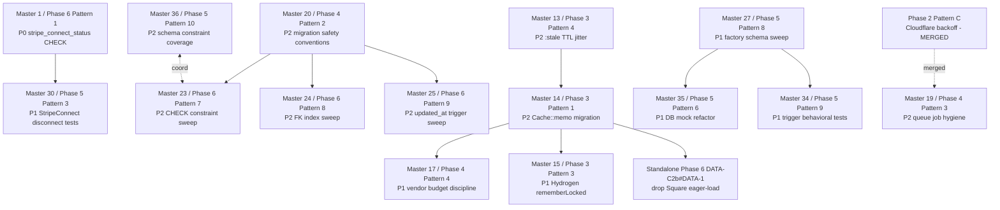

# Partna Master Remediation Plan

**Date:** 2026-05-12
**Branch:** development
**Source:** 6 phase-level remediation plans (~3,574 lines), generated 2026-05-11 to 2026-05-12
**Scope:** Security · Lifecycle · Scaling · Database · Tests · Data Integrity & Privacy

## TL;DR

- **167 unique findings** across 6 phases after cross-phase deduplication (168 within-phase unique − 1 cross-phase dup)
- **Tier totals:** 4 P0 · 40 P1 · 97 P2 · 26 P3
- **41 foundational patterns** close ~128 findings; **41 standalone fixes** cover the residual ~39 (a few standalone entries bundle 2-3 closely related findings)
- **12 patterns shipped on origin/development as of 2026-05-14:** M1 (`012285c`), M2 (merge `e5bddb3b` + follow-ups `af2a0928`/`07888024`), M3 (`7919465a`), M4 (`d4b03ee`), M5 (`260ec1d`), M6 (`a90e1e7`), M7 (`05a13f1`), M8 (pre-existing; all 6 steps confirmed shipped 2026-05-14), M9 (`1a040b27`), M10 (`6b335f4c`+`ae03598c`, merge `1e64e187`), M12 (`bf620b22` + `782907cf`/`ffc449c4`), M20 (migration safety convention + CI guard). **All 4 P0s now closed** — DATA-C1#DATA-1 by M1, SEC-A#1/SEC-F#2 + SEC-A#2/SEC-C#1 by M2, SEC-B#3/SEC-F#1 by M3. See Recommended Landing Order ✅ markers + Status Snapshot.
- **Estimated remaining effort:** ~8–10 weeks of focused work (sum of per-phase estimates; minor savings from cross-phase dedup/absorption)
- **P0 callouts:**
    - **DATA-C1#DATA-1** (Phase 6) — `stripe_connect_status` CHECK rejects `'disconnected'`; every Stripe disconnect raises 23514 on `core/professionals.go` → infinite webhook retries on pilot day one
    - **SEC-A#1 ≡ SEC-F#2** (Phase 1) — `VerifyEmbeddedApiKey` resolves tenant from `X-Shopify-Shop` request header; key compromise = all-tenant compromise
    - **SEC-A#2 ≡ SEC-C#1** (Phase 1) — `EmbeddedConnectController` inline `if ($expected !== '')` fails open when env var is empty
    - **SEC-B#3 ≡ SEC-F#1** (Phase 1) — Shopify OAuth callback Path B auto-links shop to existing Partna account on editable `shop_email` match

## Cross-phase duplicates (the new dedup layer)

| Finding | Phases · IDs | Same root cause | Canonical tier |
|---------|--------------|------------------|----------------|
| `SupabaseAdminService::createUser` logs raw email on failure | Phase 1 SEC-F#4 ≡ Phase 6 DATA-C2a#DATA-1 | Replace `'email' => $email` with hashed fingerprint; one file, identical fix | **P1** (Phase 6 framing — PII inventory hardening) |
| Cloudflare jobs missing `$backoff = [10, 30, 60]` | Phase 2 Pattern C (LIFE-D#3/4/5/6) ⊂ Phase 4 Pattern 3 (DB-C#SCALE-3) | Phase 4 explicitly absorbs Phase 2 Pattern C if unshipped, adding `$timeout` + `failed()` + queue routing | **P2** (both phases match; broader scope wins as canonical) |

**Other cross-audit pairs flagged by source plans collapse within their own phase** (Phase 1 SEC-A#1 ≡ SEC-F#2, etc.) — those dedups were already applied per-phase and are noted as `≡` in the master pattern bodies.

**Why so few cross-phase duplicates?** Each phase audited a distinct lens (security gates vs lifecycle correctness vs scaling antipatterns vs DB schema vs test coverage vs data integrity). The per-phase adjudicators collapsed within-phase overlap; cross-lens overlap is genuinely thin. The one exception (`SupabaseAdminService` log) sits at the intersection of "log hygiene" (Phase 1) and "PII inventory" (Phase 6).

## Cross-phase dependency graph



**Narrative.** The critical path runs through three serial unblockers:

1. **P0 first → Phase 5 disconnect tests.** Master Pattern 1 (the `'disconnected'` CHECK fix) is 30 minutes of work but blocks Master Pattern 30's end-to-end test from passing; ship Master 1 in isolation before anything else.
2. **Phase 3 cache layer → Phase 4 vendor budget → Phase 6 credential cleanup.** Master Pattern 13 (jitter) → Master Pattern 14 (`Cache::memo` migration) → Master Pattern 15 (Hydrogen `rememberLocked`) → Master Pattern 17 (vendor budget discipline) is the unidirectional chain protecting cold-cache stampedes on the shared Shopify Admin budget. Phase 6's Square-credential standalone (DATA-C2b#DATA-1) sits at the tail of this same chain.
3. **Phase 4 migration conventions → Phase 6 DDL sweeps.** Master Pattern 20 (conventions doc + composer guard) must land before Master Patterns 23/24/25 — those three Phase 6 migrations are the first user-facing exercises of the convention. They can land independently of each other once Master 20 is in.

**Parallel-safe lanes:** the test-coverage cluster (Master 27–41, all Phase 5) shares almost no files with the structural patterns; one developer can sweep tests while another lands Phase 1–4 fixes. Within the test cluster, Master 27 (factories) gates Masters 34 and 35; everything else in Phase 5 is independent. Phase 1 Patterns A and B (embedded auth + ShopDomain VO, Master 2 and 3) overlap on the embedded Shopify surface and should be sequenced A → B rather than parallelised.

**Where rework risk hides:** doing Phase 4 Pattern 4 (Master 17) before Phase 3 Pattern 1 (Master 14) creates cold-cache blocking under load (vendor throttle waits compound on unbounded concurrency); doing Phase 6 Pattern 7 (Master 23, CHECK sweep) before Phase 4 Pattern 2 (Master 20) ships the unsafe `BEGIN`/`COMMIT` DDL pattern on populated tables; doing Phase 5 Pattern 6 (Master 35, DB mock refactor) before Pattern 8 (Master 27, factory fixes) produces pgsql-violation failures in CI.

## Status snapshot — already shipped

PR #12–#25 introduced 3 partials, 2 regressions, and 1 symptom-now-visible. **Same-day post-baseline update (2026-05-12): PR #26–#30 closed Master Pattern 11's data-source halves (2 full P1 closes); the remaining caching wrap was closed by commit `4f90cf4` on 2026-05-14. Master Pattern 11 is now fully closed. PR #26–#30 also introduced 4 new findings — see "Post-baseline delta" below.**

| Phase | Pattern / Finding ID | Status | Evidence (commit / PR / line) |
|-------|---------------------|--------|-------------------------------|
| 1 | SEC-C#4 (P1, part of Pattern A) | **Closed** | PR #23 `1c03040` did the partial; commit `3a1499bd` (2026-05-13) closed both remaining gaps — `$tokenChanged` short-circuit dropped (validates on every persist) and `data.shop.myshopify_domain === $destHost` cross-shop assertion added. Now part of Master Pattern 2's full closure. |
| 2 | LIFE-D#9 (P2 → **P1 candidate**) | **Regressed** | PR #12 `a118f62` — `SyncSubdomainToKvJob` expanded from one delete to a `foreach` over `ProfessionalHandleAlias`. The original swallow-and-log bug now hides one Cloudflare failure per alias instead of one per professional. Bundle the rethrow with Master 23's `$backoff`. |
| 2 | LIFE-D#1 (P1, part of Pattern D) | **Symptom now visible** | PR #13 `9fedbcb` — `BrandDesignMediaService::listDesignMedia` always returns ready-state placeholders. The race condition is unchanged, but any race-bypass orphan now appears to brands as a 6th placeholder card with no thumbnail. |
| 2 | LIFE-B#3 (P2, part of Pattern A) | **Partially touched** | PR #12 — removed one of ten observer log sites; nine remaining sites still need `request_id` + tenant ID context. |
| 3 | SCALE-A#CACHE-1 (P2 → P1 candidate) | **Closed 2026-05-14** | Master Pattern 14 shipped — `rememberLocked` wrap on `fetchActiveCatalog` with int TTL + jitter; same PR closes the other 3 P2s in the pattern. |
| 3 | SCALE-B#CACHE-1 (P1, part of Pattern 3) | **Closed 2026-05-14** | Master Pattern 15 shipped on `development` (commit `37893a19`). `HydrogenAffiliateController::show()` wraps post-gate payload assembly in `CacheLockService::rememberLocked` (int 60s TTL → ±20% jitter + 10× stale twin). Same commit closes SCALE-B#CACHE-2 and SCALE-B#CACHE-7; observer fan-out (Site/Block/SiteMedia/BrandStoreSettings/ProfessionalIntegration/BrandPartnerLink/new AffiliateProductSelection) keeps the cache fresh on dashboard writes; provider_metadata cascade busts every linked affiliate's product cache when a brand toggles `custom_photos_enabled`. |
| 3 | SCALE-B#CACHE-4 (P1, part of Master 11 Step 2) | **Closed** | PR #27 `c8aece8` — `EmbeddedOrderAnalyticsController::show()` now reads `commerce.orders` + `order_items` with `affiliate_professional_id` and `deriveLineStatus()` from order aggregate state. The $0/no-affiliate-per-order bug is fixed end-to-end. |
| 3 | SCALE-B#CACHE-3 (P1, part of Master 11 Step 1) | **Closed 2026-05-14** | PR #28 `4927b02` closed the data half (`EmbeddedSetupController::overview()` reads `commerce.orders` all-time + 30d, subtracts `reversed_commission_cents` from `commerce.brand_affiliate_rollup`). Commit `4f90cf4` (2026-05-14) closed the caching half — `overview()` payload now wrapped in `CacheLockService::rememberLocked` keyed by new `CacheKeyGenerator::embeddedSetupOverview()` with 60s TTL + jitter + SWR. |

Phases 4, 5, and 6 source plans contain no post-baseline annotations marking patterns or findings as shipped.

## Post-baseline delta — PR #26–#30 (2026-05-12, same day)

Five PRs landed after this plan was generated. Net effect: **Master Pattern 11 (the largest P1 silent-data-bug pattern) is fully closed** (data halves via PR #27 + PR #28 on 2026-05-12; caching wrap via commit `4f90cf4` on 2026-05-14); four new findings emerge from the new code paths.

### Closed / partially closed by PR #26–#30

- **Master Pattern 11 Step 2 — `EmbeddedOrderAnalyticsController` off `CommissionMovement`** — closed by PR #27 (`c8aece8`). `commerce.orders` + `order_items` join with `payout_id`-based status derivation; no per-line accrual rows referenced.
- **Master Pattern 11 Step 1 (data source) — `EmbeddedSetupController::overview()` off `CommissionMovement`** — closed by PR #28 (`4927b02`). Reads `commerce.orders` (filtered by `EXCLUDED_FROM_AGGREGATES`) + subtracts rollup's `reversed_commission_cents`; dominant currency picked by row count; 30-day window from `gross_cents`/`commission_cents`.
- **Master Pattern 11 Step 1 (caching) — `rememberLocked` wrap + new `embeddedSetupOverview()` cache key** — **closed by commit `4f90cf4` (2026-05-14).** `overview()` payload now wrapped in `CacheLockService::rememberLocked` keyed by the new `CacheKeyGenerator::embeddedSetupOverview($professionalId)` helper, 60s TTL with jitter + SWR. Closes SCALE-B#CACHE-3 end-to-end.

### New findings introduced by PR #26–#30

- [ ] **#POST-1 · P2 (PR #28)** — `BrandOrdersController` + `AffiliateOrdersController` (new `GET /brand/orders` and `GET /affiliate/orders`) use raw `DB::table(...)->paginate()` with no `rememberLocked` wrap, no Form Request class, and no Resource class.
    - **Effort:** M (~2–4h) — bundle both controllers
    - **Where:** `app/Http/Controllers/Api/Professional/Brand/BrandOrdersController.php`, `app/Http/Controllers/Api/Professional/Affiliate/AffiliateOrdersController.php` (introduced by `4927b02`)
    - **What to do:** Wrap pagination payload in `CacheLockService::rememberLocked` keyed by a new `CacheKeyGenerator::brandOrdersIndex($brandId, $page, $perPage)` / `affiliateOrdersIndex($affiliateId, $page, $perPage)` with 30s TTL + SWR (shorter than analytics because order history needs sub-minute freshness when a webhook lands). Move `per_page` validation into Form Request classes (`IndexBrandOrdersRequest`, `IndexAffiliateOrdersRequest`). Wrap row arrays in a `BrandOrderResource` / `AffiliateOrderResource` for projection stability — CLAUDE.md is explicit that API endpoints must use Resource classes.
    - **Plain English:** Two new dashboard endpoints serve paginated order history without any of the discipline the plan's existing analytics surfaces use (cached reads, typed request validation, typed response shaping). At pilot scale they're fine; at 1M-orders/year they'll stampede the same `commerce.orders` indexes the existing analytics surfaces rely on.
    - **Source:** Discovered while reconciling Master Pattern 11 closure.

- [ ] **#POST-2 · P2 (PR #28)** — `BrandCommerceAnalyticsController::querySiteVisitTotals` now does an unbounded `pluck('affiliate_professional_id')->toArray()` over `brand.brand_partner_links` and feeds it into `whereIn` on `analytics.site_visits`.
    - **Effort:** S (~1h)
    - **Where:** `app/Http/Controllers/Api/Professional/Analytics/BrandCommerceAnalyticsController.php:209–214` (introduced by `4927b02`, expanded by `a8cc938` PR #29)
    - **What to do:** Two acceptable approaches:
        1. Restructure the query to use a JOIN/subquery against `brand.brand_partner_links` directly so Postgres handles the cardinality (`WHERE professional_id IN (SELECT affiliate_professional_id FROM brand.brand_partner_links WHERE brand_professional_id = ?)`). One query, no PHP-side memory cost.
        2. If a PHP-side list is required for downstream logic, chunk via `chunkById` and accumulate per-chunk aggregates. Add a guard: if the list exceeds N (e.g. 5,000), fail loudly with a logged warning rather than silently truncating.
    - **Plain English:** A brand's analytics totals are now computed by listing every affiliate's professional ID in memory and passing the whole list into a SQL `IN (...)` clause. At pilot scale (a brand with 50 affiliates) this is fine. At 5,000 affiliates per brand the parameter binding starts pushing PostgreSQL's per-statement parameter ceiling and the list itself is a memory cost. Better to let the database do the join.
    - **Source:** Discovered while reviewing PR #28's analytics fan-out.

- [ ] **#POST-3 · P3 (PR #29)** — Missing composite index on `analytics.site_visits (professional_id, occurred_at)` for the new per-bucket page-view query.
    - **Effort:** S (~30 min — single migration following Master 24's `CREATE INDEX CONCURRENTLY` pattern)
    - **Where:** `app/Http/Controllers/Api/Professional/Analytics/BrandCommerceAnalyticsController.php:queryPageViewsByBucket()` (introduced by `a8cc938`)
    - **What to do:** Add to the index sweep in Master Pattern 24 (FK index sweep) or as a sibling migration to standalone `#DB-F#SCALE-7`:
        ```sql
        CREATE INDEX CONCURRENTLY IF NOT EXISTS idx_site_visits_pro_occurred
            ON analytics.site_visits (professional_id, occurred_at);
        ```
    - **Plain English:** The new chart toggle that overlays page-views on the revenue timeseries runs an aggregation across every affiliate's visit rows for a date range. The 60s cache TTL caps how often it runs, but each cache miss without this index does a sequential scan over the visit table — which scales linearly with total platform traffic, not per-brand traffic.
    - **Source:** Discovered while reviewing PR #29's new aggregation.

- [ ] **#POST-4 · P3 watch (PR #26)** — `ProcessShopifyOrderWebhookJob` now resolves affiliate by UUID from `_partna_affiliate_id` cart attribute (was `affiliate` slug → `handle_lc`). This is the correct fix and not itself a finding — but it surfaces a watch item: the cart-attribute key is now contractually paired between Hydrogen's `app/routes/$affiliateSlug.tsx` action (sets the attribute) and this backend job (reads it). A rename on either side breaks attribution silently.
    - **Effort:** S (~30 min) — defensive logging only
    - **Where:** `app/Jobs/Shopify/ProcessShopifyOrderWebhookJob.php:96–110` (introduced by `7e20bb0`)
    - **What to do:** If `extractCartAttribute($noteAttributes, '_partna_affiliate_id')` returns `''` AND the order has any `note_attributes` containing the substring `affiliate` (case-insensitive), log a warning — indicates a cart-attribute schema drift. This is observability hygiene, not a correctness fix.
    - **Plain English:** Two repos now silently agree on a cart-attribute name. If either renames it, attribution stops working with no visible error. A one-line watchdog log makes a future rename incident take minutes instead of days to diagnose.
    - **Source:** Discovered while reviewing PR #26's sidest→partna rename fallout.

### No-op PRs (no plan impact, no regressions)

- **PR #24** (`9b46505`, `null-coalesce custom_photos_enabled`) — defensive coalesce, no audit relevance.
- **PR #25** (`feeab29`, `accept product_discounts apiType`) — external Shopify API string-spelling fix, no audit relevance.
- **PR #30** (`f0fc9b3`, `commission_accrued_cents per bucket`) — extends the cached analytics surface following the existing pattern; cache key bumped v6 → v7 (proper versioning).

## Recommended landing order

The order below is the sequence in which to merge the bundled PRs. Severity dominates (P0 first), then leverage (findings closed per day) within tier, then dependency unblocking. Days are calendar effort, not wall-clock duration — many bundles parallelise.

1. **Master Pattern 1 — `stripe_connect_status` CHECK** (Phase 6 Pattern 1) — ✅ **Closed by PR #39 (`012285c`), 2026-05-13**
   - **Tier:** P0 · **Effort:** ~0.5h · **Closes:** 1 finding
   - **Why this slot:** smallest fix in the entire plan, P0 active brokenness, unblocks Master 31.
   - **Can parallelize with:** anything — single 5-line migration.
   - **Closure detail:** Migration `20260513100000_add_disconnected_to_stripe_connect_status_check.sql` applied to dev (`glncumufgaqcmqhzwrxm`) — live constraint now `('not_connected', 'onboarding', 'active', 'restricted', 'disconnected')`. Prod (`edplucmvkcnokyygxqsb`) constraint still on old set; will close fully on next `development → production` promotion + `supabase db push`. Same PR also added free-form country fallback in `StripeConnectService::createOnboardingLink` and a regression test (`StripeConnectOnboardingPrefillTest`). Master 31 (StripeConnect disconnect end-to-end test) is unblocked but not yet shipped — PR #39's `StripeConnectOnboardingPrefillTest` covers onboarding prefill, not the disconnect round-trip.

2. **Master Pattern 2 — Unify embedded Shopify auth model** (Phase 1 Pattern A) — ✅ **Done 2026-05-13** (merge `e5bddb3b` + follow-ups `af2a0928`, `07888024`)
   - **Tier:** P0 (2 P0 + 1 P1 + 1 P2) · **Effort:** ~2–3 days · **Closes:** 4 findings
   - **Why this slot:** highest tier impact on the embedded surface; partial fix already landed (PR #23) and the remaining gaps are the hardest part.
   - **Can parallelize with:** Masters 4, 5, 6, 7, 22, 28 (no file overlap).
   - **Closure detail:** New `VerifyShopifySessionToken` middleware (alias `shopify.session`, plus `shopify.session:lenient` for `connect-account`) verifies HS256 JWT signature, validates `aud`/`dest`/`iss`, populates `embedded_professional_id` + `embedded_shop_domain` request attributes from JWT (no client headers trusted). 120s Redis-backed JTI replay cache, fail-closed 503 on cache outage, ≤25 uses per JTI to support Remix SSR fan-out. Static-key middleware + config + env deleted entirely (Phase 8). 15 Pest cases cover every reject path. **Two prod follow-up bugs in <24h** (single-use JTI rejected Remix loaders; `provisionShopifyIntegration` still read deleted `X-Shopify-Shop` header) both closed by `af2a0928` + `07888024`. **Latent issues to track separately** (not blocking closure): static `JWT::$leeway` mutation, `embedded-by-shop` IP-fallback collapse on auth failures, inline `$request->validate()` in `EmbeddedSetupController`, non-transactional `connect-account` tenant override race, JTI counter two-round-trip atomicity (file under hardening pass).

3. **Master Pattern 3 — `ShopDomain` value object + kill OAuth Path B** (Phase 1 Pattern B) ✅ Done 2026-05-14 (`7919465a`)
   - **Tier:** P0 (1 P0 + 2 P1 + 2 P2) · **Effort:** ~2–3 days · **Closes:** 5 findings
   - **Why this slot:** sequenced after Master 2 because both touch the embedded Shopify surface; doing B after A keeps the diff focused on shop-domain validation rather than auth/validation conflated.
   - **Can parallelize with:** Phase 5 / Phase 6 work that doesn't touch `app/Services/Shopify/`.
   - **Closure detail:** New `App\Services\Shopify\ShopDomain` value object (private ctor + `fromUntrusted` named constructor) forces validation at every Shopify API boundary. `ShopifyAdminClient::rest/graphql/bulk*` now require `ShopDomain $shop`; previously-unvalidated callers (`ShopifyTeardownService`, `BrandSignupService::revokeStorefrontToken`) are compiler-enforced to parse at the boundary. `rest()` rejects any path not starting with `/admin/`. `discoverShopifyHandle()` resolves DNS once via `gethostbynamel()`, screens every A record, and pins the resolved IPs via `CURLOPT_RESOLVE` so libcurl can't re-resolve (closes TOCTOU / DNS-rebinding window); the catch-all UGC regex is dropped — only structured-token patterns match. OAuth callback Path B (email auto-match) and `BrandSignupService::handleExistingBrandConnect` are deleted; email-match installs now flow through Path C (setup-token + Supabase JWT auth at `BootstrapController`). 13 new tests cover regex strictness (mixed case, embedded host, subdomain spoof, CRLF), path-prefix guard, UGC-regex removal, IP screening, and Path B no-longer-auto-links behaviour. Opus reviewed; two minor non-blocking observations filed as follow-ups: `ShopifyAppOAuthController::isValidShopDomain` retains a laxer local regex (used only by `install()`, no API call), and `InvalidShopDomainException` thrown inside `callback()` lands in the outer `\Throwable` catch as a generic 500 instead of a 400 (HMAC integrity makes the scenario implausible).

4. **Master Pattern 4 — Form-request safety primitives** (Phase 1 Pattern D) ✅ Done 2026-05-13 (`d4b03ee`)
   - **Tier:** P1 · **Effort:** ~30 min · **Closes:** 3 findings
   - **Why this slot:** highest tier-per-hour in the plan; ship in any spare half-hour.
   - **Can parallelize with:** anything.

5. **Master Pattern 5 — Audit-table FK + RLS hardening** (Phase 6 Pattern 2) ✅ Done 2026-05-13 (`260ec1d`)
   - **Tier:** P1 (2 P1 + 1 P2 absorbed) · **Effort:** ~1h · **Closes:** 4 findings
   - **Why this slot:** P1 active PII exfiltration (`professional_email_snapshot` readable to any authenticated JWT); single migration.
   - **Can parallelize with:** non-DDL work (Phase 1, Phase 2 logging sweeps, Phase 5 unit tests).

6. **Master Pattern 6 — PII inventory hardening** (Phase 6 Pattern 5, absorbs Phase 1 SEC-F#4) ✅ Done 2026-05-13 (`a90e1e7`)
   - **Tier:** P1 (1 P1 + 3 P2 + 1 P2 cross-phase) · **Effort:** ~3h · **Closes:** 5 findings (including cross-phase duplicate)
   - **Why this slot:** P1 PII-in-logs is the clearest live exfiltration; the four-file diff is reviewer-light.
   - **Can parallelize with:** structural patterns.

7. **Master Pattern 7 — Retention purge sweep** (Phase 6 Pattern 3) ✅ Done 2026-05-13 (`05a13f1`)
   - **Tier:** P1 (1 P1 + 3 P2) · **Effort:** ~2h · **Closes:** 4 findings
   - **Why this slot:** P1 visitor-PII retention gap closes with two lines added to `PurgeSoftDeleted`.
   - **Can parallelize with:** structural patterns.

8. ✅ **Master Pattern 8 — Professional soft-delete cascade coherence** (Phase 6 Pattern 4) — **Done 2026-05-14** (pre-existing; all 6 steps confirmed shipped)
   - **Tier:** P1 (1 P1 + 1 P2) · **Effort:** ~3h · **Closes:** 2 findings
   - **Why this slot:** P1 public-site-still-live-after-deletion is legal/optics risk; Step 1 alone is one line.

9. ✅ **Master Pattern 9 — `report($e)` sweep across swallowed catches** (Phase 2 Pattern B)
   - **Tier:** P1 (1 P1 + 5 P2 + 2 P3) · **Effort:** ~0.5–1 day · **Closes:** 8 findings
   - **Why this slot:** mechanical, low risk, immediately improves the Nightwatch signal-to-noise floor for everything else.
   - **Done:** 2026-05-13 — 10 new tests, all 7 steps shipped, pushed to `development`.

10. **Master Pattern 10 — `Log-with-context` sweep** (Phase 2 Pattern A) — ✅ **Done 2026-05-13** (`6b335f4c` + `ae03598c`, merge `1e64e187`)
    - **Tier:** P2 (4 P2 + 1 P3) · **Effort:** ~1 day · **Closes:** 5 findings
    - **Why this slot:** rides Master 9's logging-surface touches; one PR, no logic changes.

11. **Master Pattern 11 — Embedded controllers off `CommissionMovement`** (Phase 3 Pattern 2) — ✅ **Done 2026-05-14** (PR #27 `c8aece8` Step 2; PR #28 `4927b02` Step 1 data source; commit `4f90cf4` Step 1 caching wrap + Step 3 cache key helper)
    - **Tier:** P1 (2 P1) · **Effort:** ~1 day · **Closes:** 2 findings (SCALE-B#CACHE-3, SCALE-B#CACHE-4)
    - **Why this slot:** P1 silent data bug — embedded dashboards were showing $0 commission for every brand.

12. **Master Pattern 12 — Canonical Shopify webhook controller base** (Phase 1 Pattern C) — ✅ **Done 2026-05-13** (commit `bf620b22`; tests `782907cf`; robustness `ffc449c4`)
    - **Tier:** P2 · **Effort:** ~2–4h · **Closes:** 2 findings (across 6 files)
    - **Why this slot:** orchestrator can fan it out across 6 files in one half-day session; cleaner before Master 31's webhook tests.
    - **Closure detail:** `App\Http\Controllers\Concerns\HandlesShopifyWebhook` trait extracted; canonical 6-step sequence (HMAC → atomic `Cache::add` dedup → optional DB-level dedup → shop lookup → JSON decode (422 on malformed) → dispatch). All 6 drifting controllers converted in one commit. `ffc449c4` follow-up: release the cache dedup key if the dispatched job fails, so Shopify's retry can re-enter. Master 31 (webhook test sweep) now unblocked.

13. **Master Pattern 13 — `:stale` TTL jitter on both cache writers** (Phase 3 Pattern 4) — ✅ **Done 2026-05-14** (commit `be625fb7`)
    - **Tier:** P2 · **Effort:** ~0.5 day · **Closes:** 2 findings (SCALE-D#CACHE-2, SCALE-D#CACHE-3)
    - **Closure detail:** `JitteredTtl` trait extracted; independent jitter draws on both primary and stale in `CacheLockService::writeWithJitter` and `SiteCacheService::writePayloadWithStale`. `jitteredPayloadTtl()` removed (replaced by trait). Probabilistic spread tests added to both service test files.

14. **Master Pattern 14 — `Cache::memo()->remember` → `rememberLocked` migration** (Phase 3 Pattern 1)
    - **Tier:** P2 (4 P2 — regression bumps SCALE-A#CACHE-1 to P1 candidate) · **Effort:** ~1 day · **Closes:** 4 findings
    - **Why this slot:** required gate before Master 17's vendor budget work touches the same call sites.

15. **Master Pattern 15 — Hydrogen internal controllers `rememberLocked` wrap** (Phase 3 Pattern 3) ✅ **Closed 2026-05-14** (commit `37893a19`)
    - **Tier:** P1 (2 P1 + 1 P2) · **Effort:** ~1.5 days · **Closes:** 3 findings
    - **Why this slot:** largest blast radius (every public storefront page view); low-risk fix with established pattern.

16. **Master Pattern 16 — External I/O outside critical sections** (Phase 4 Pattern 1) — ✅ **Closed 2026-05-14** (commit `e6ac5658`)
    - **Tier:** P1 (3 P1 + 2 P2) · **Effort:** ~2 days · **Closes:** 5 findings (DB-F#SCALE-3, DB-F#SCALE-4, DB-F#SCALE-5, DB-D#SCALE-2, DB-E#SCALE-1)
    - **Why this slot:** webhook + transaction-scope safety; ships correct functionality today but degrades under any concurrent load. DB-D#SCALE-2 was auto-closed when the wallet model was removed (no residual `creditWalletFromCheckoutSession` in `StripeConnectService`).

17. **Master Pattern 17 — Vendor API budget discipline** (Phase 4 Pattern 4) ⚠️ **Partial — 4 of 5 steps closed 2026-05-14** (commit pending). Step 3 (DB-F#SCALE-1, embedded `metafieldsSet` refactor) ✅ **Shopify-docs verification complete 2026-05-14** — all four pre-deferral questions answered against shopify.dev; approach is safe to ship. **Deferred-to-trigger** (no customer impact today, embedded panel low-volume pre-beta); resume on any of: Shopify announces removal date for `productVariantUpdate`, pilot brand reports save lag in embedded panel, `THROTTLED` exception observed from controller in Nightwatch, next `services.shopify.api_version` bump. See Master Pattern 17 Step 3 for the full verification record.
    - **Tier:** P1 (2 P1 + 3 P2) · **Effort:** ~2 days · **Closes:** 4 of 5 findings (DB-D#SCALE-1, DB-D#SCALE-3, DB-D#SCALE-4, DB-F#SCALE-6). DB-F#SCALE-1 (P1) remains open as a Step-3 follow-up.
    - **Why this slot:** depends on Master 14's `rememberLocked` migration; second of the two P1 silent-data-bug patterns in Phase 4.

18. **Master Pattern 18 — N+1 / lazy-load defence sweep** (Phase 4 Pattern 5)
    - **Tier:** P1 (1 P1 + 2 P3) · **Effort:** ~0.5 day · **Closes:** 3 findings
    - **Why this slot:** small, mechanical; clean after the heavier Phase 4 patterns.

19. **Master Pattern 19 — Queue job hygiene sweep** (Phase 4 Pattern 3, **absorbs Phase 2 Pattern C**)
    - **Tier:** P2 · **Effort:** ~0.5 day · **Closes:** 5 Phase 4 findings + 4 Phase 2 findings (Cloudflare `$backoff` set)
    - **Why this slot:** one sweep across 9 job files; lands after structural Phase 4 patterns introduce new jobs that inherit the hygiene shape.

20. **Master Pattern 20 — Migration safety convention** (Phase 4 Pattern 2)
    - **Tier:** P2 · **Effort:** ~0.5 day · **Closes:** 2 findings
    - **Why this slot:** institutional fix; must land before Masters 23/24/25 (Phase 6 DDL sweeps).

21. ~~**Master Pattern 21 — Email-send idempotency sentinel** (Phase 2 Pattern E)~~ ✓ Complete
    - **Tier:** P2 · **Effort:** ~2 days · **Closes:** 3 findings
    - **Why this slot:** migration + 3 job updates; lower-risk than Master 22's race-safety work.

22. **Master Pattern 22 — Race-safety hardening** (Phase 2 Pattern D)
    - **Tier:** P1 (1 P1 + 3 P2) · **Effort:** ~2–3 days · **Closes:** 4 findings
    - **Why this slot:** placeholder/logo races involve transactions spanning external I/O; defer until observability work has surfaced any latent issues.

23. **Master Pattern 23 — CHECK constraint sweep on enum columns** (Phase 6 Pattern 7)
    - **Tier:** P2 · **Effort:** ~1 day · **Closes:** 8 findings (largest single block in the plan)
    - **Why this slot:** uses Master 20's `NOT VALID` + `VALIDATE CONSTRAINT` pattern; mechanical sweep.

24. **Master Pattern 24 — FK index sweep** (Phase 6 Pattern 8)
    - **Tier:** P2 · **Effort:** ~1h · **Closes:** 3 findings
    - **Why this slot:** uses Master 20's `CREATE INDEX CONCURRENTLY` pattern; lands with the other DDL sweeps.

25. **Master Pattern 25 — `updated_at` trigger backfill** (Phase 6 Pattern 9)
    - **Tier:** P2 · **Effort:** ~2h · **Closes:** 1 finding
    - **Why this slot:** mechanical 13-trigger migration; lands with the DDL cluster.

26. **Master Pattern 26 — GDPR redact-path completeness** (Phase 6 Pattern 6)
    - **Tier:** P2 · **Effort:** ~2h · **Closes:** 2 findings
    - **Why this slot:** symmetry with `ExportCustomerDataJob`; lands before pilot launch.

27. **Master Pattern 27 — Factory schema-correctness sweep** (Phase 5 Pattern 8)
    - **Tier:** P1 (2 P1 + 2 P2 + 1 P3) · **Effort:** ~4h · **Closes:** 5 findings
    - **Why this slot:** gates Masters 34 and 35; ship first in the Phase 5 cluster.

28. **Master Pattern 28 — `WalletMovementPolicy` unit test + 404 contract** (Phase 5 Pattern 1)
    - **Tier:** P1 · **Effort:** ~1h · **Closes:** 1 finding
    - **Why this slot:** smallest Phase 5 P1, highest tier-per-hour in the test cluster.

29. **Master Pattern 29 — `CommissionPolicy` 6 untested abilities** (Phase 5 Pattern 2)
    - **Tier:** P1 · **Effort:** ~3h · **Closes:** 1 finding
    - **Why this slot:** rides Master 28's policy-test scaffold.

30. **Master Pattern 30 — Stripe Connect disconnect state-machine tests** (Phase 5 Pattern 3)
    - **Tier:** P1 · **Effort:** ~2h · **Closes:** 1 finding
    - **Why this slot:** requires Master 1's CHECK fix to be in place for the end-to-end webhook test to pass.

31. **Master Pattern 31 — Payout job orchestration test sweep** (Phase 5 Pattern 4)
    - **Tier:** P1 (1 P1 + 2 P2) · **Effort:** ~4h · **Closes:** 3 findings
    - **Why this slot:** surfaces the `backoff > uniqueFor` latent double-payout race; test pins the bug.

32. **Master Pattern 32 — Shopify webhook controller HMAC + dedup tests** (Phase 5 Pattern 5)
    - **Tier:** P1 (4 P1) · **Effort:** ~6h · **Closes:** 4 findings
    - **Why this slot:** rides Master 12's canonical webhook controller base; one PR for all four controllers.

33. **Master Pattern 33 — Job `failed()` handler + test sweep** (Phase 5 Pattern 7)
    - **Tier:** P1 (1 P1 + 2 P2) · **Effort:** ~5h · **Closes:** 3 findings
    - **Why this slot:** GDPR compliance — 30-day Shopify window means silent failure becomes a compliance violation.

34. **Master Pattern 34 — Database trigger behavioral tests** (Phase 5 Pattern 9)
    - **Tier:** P1 (2 P1) · **Effort:** ~6h · **Closes:** 2 findings
    - **Why this slot:** depends on Master 27's `OrderFactory.withLineItem()` state.

35. **Master Pattern 35 — DB mock → real-Postgres refactor** (Phase 5 Pattern 6)
    - **Tier:** P1 (composite from 3 P1 + 1 P2) · **Effort:** ~3 days · **Closes:** 1 unique finding (combining 4 reports across 11 files)
    - **Why this slot:** depends on Master 27's factory fixes; largest single block in Phase 5.

36. **Master Pattern 36 — Schema constraint coverage test** (Phase 5 Pattern 10)
    - **Tier:** P2 · **Effort:** ~5h · **Closes:** 1 finding
    - **Why this slot:** coordinates with Master 23's CHECK sweep — registry ownership for both.

37. **Master Pattern 37 — Auth middleware test sweep** (Phase 5 Pattern 11)
    - **Tier:** P2 (3 P2 + 1 P3) · **Effort:** ~5h · **Closes:** 4 findings
    - **Why this slot:** four parallel test files following proven scaffolds.

38. **Master Pattern 38 — Resource snapshot test sweep** (Phase 5 Pattern 12)
    - **Tier:** P2 · **Effort:** ~5h · **Closes:** 1 finding
    - **Why this slot:** prioritises financial / cross-tenant resources first.

39. **Master Pattern 39 — Stripe billing webhook coverage gaps** (Phase 5 Pattern 14)
    - **Tier:** P2 · **Effort:** ~2h · **Closes:** 2 findings
    - **Why this slot:** mirrors `StripeConnectWebhookDedupeTest`; short PR.

40. **Master Pattern 40 — Analytics cache invalidation cleanup** (Phase 3 Pattern 5)
    - **Tier:** P3 · **Effort:** ~0.5 day · **Closes:** 2 findings
    - **Why this slot:** dead-code removal; tail of the cache cluster.

41. **Master Pattern 41 — Residual policy ability coverage sweep** (Phase 5 Pattern 13)
    - **Tier:** P3 · **Effort:** ~6h · **Closes:** 1 finding
    - **Why this slot:** ships after Masters 28 and 29 close the high-risk policies.

> The pattern bodies below are copied verbatim from the source phase plans. The only edits are the new master header lines on each pattern. Source-plan `### What to do` checkboxes, evidence blocks, and acceptance notes are preserved unchanged because the audit orchestrator parses them.

## Execution model & review policy

Each pattern lands through one of three lanes. The lane drives **executor model** and **reviewer model**; pairing executor ≠ reviewer is deliberate so independent error modes catch each other's blind spots. `composer test` + `vendor/bin/pint --dirty` are always gates; "review" below means an independent reasoning pass on the diff (orchestrator runs a second Claude session with the reviewer model on the closed PR before merge).

### Default rule

- **Executor:** Sonnet. The plan format (`What to do` + `Technical` + `Plain English` + verbatim `Evidence`) front-loads the reasoning during adjudication, so 90% of items are transcription-shaped work that Sonnet executes cleanly and cheaply.
- **Reviewer:** Opus for anything that could fail in ways tests don't catch (security, race conditions, lifecycle correctness, DDL against populated tables). Sonnet for mechanical sweeps where the test suite + Pint are sufficient signal.
- **Manual sign-off (Josh):** required on every Opus-executed pattern and on every P0.

### Lanes

**Lane 1 — Sonnet execute → Sonnet review.** Mechanical sweeps with low blast radius; the test suite is the primary correctness signal and a second Sonnet pass is a cheap proofread.

> M4, M9, M10, M13, M18, M19, M27, M28, M29, M36, M37, M38, M39, M40, M41

**Lane 2 — Sonnet execute → Opus review.** Mechanical execution but high blast radius — the patch itself is well-specified, but mistakes are hard to detect from tests alone (RLS holes, missed PII surfaces, unsafe DDL on populated tables, webhook idempotency gaps).

> M1, M5, M6, M7, M8, M12, M15, M20, M21, M23, M24, M25, M30, M31, M32, M33, M34

**Lane 3 — Opus execute → Opus review + Josh sign-off.** Architectural decisions during the work, cross-system reasoning, security-gate redesign, or commerce lifecycle correctness. The "What to do" leaves judgement calls the executor has to make; mistakes here are existential.

> M2 (embedded Shopify auth unification), M3 (`ShopDomain` VO + OAuth Path B kill), M11 (controllers off `CommissionMovement`), M14 (`Cache::memo` → `rememberLocked` migration), M16 (external I/O out of critical sections), M17 (vendor API budget discipline), M22 (`lockForUpdate` + `UNIQUE` race-safety), M26 (GDPR redact-path completeness), M35 (DB mock → real-Postgres refactor)

### Standalones rubric (P1/P2/P3 lists below)

Standalones don't get individual lane assignments — apply tier-based defaults:

| Tier | Executor | Reviewer | Manual sign-off |
|------|----------|----------|-----------------|
| P0 | Sonnet (escalate to Opus if `What to do` is ambiguous) | Opus | Required |
| P1 | Sonnet | Opus | Required when patch touches `auth/`, `commerce/`, `Webhooks/`, `Stripe/`, migrations, or RLS |
| P2 | Sonnet | Sonnet | Not required (tests + Pint gate) |
| P3 | Sonnet | None (tests + Pint gate) | Not required |

Override rule: if a standalone's `Affects:` line crosses two or more domains (e.g. auth + commerce, retention + PII), promote the reviewer one tier (Sonnet → Opus) regardless of base tier.

### Escalation triggers (any lane)

Promote a Sonnet-executed item to Opus mid-run when any of these fire:
- Tests fail twice on the same item after Sonnet retries.
- The agent reports it cannot match the `What to do` to the current code (drift since the audit was generated).
- The patch ships a change to a file *not listed* in `Where:` and that file lives under `app/Http/Middleware/`, `app/Services/Auth/`, `app/Services/Stripe/`, `app/Jobs/Shopify/`, or `supabase/migrations/`.
- Reviewer flags a "wrong direction" rather than a "missed detail" — Opus re-executes from scratch.

### Why this shape

- The audit format does the heavy reasoning upfront. The first-pass scan (DeepSeek V4 Pro) finds candidates; the adjudicator (Sonnet) culls and specifies the fix. By the time an item is in this file, the design call has been made — the executor mostly applies a spec. Sonnet is the right fit for 80% (33/41) of patterns.
- Opus executor-time is reserved for items where the spec deliberately leaves room — auth unification, race-safety hardening, GDPR completeness — because those genuinely require judgment about edge cases the audit couldn't enumerate.
- Independent-model review is the cheap insurance policy. Pairing Sonnet→Opus (or Opus→Sonnet for sanity-check) catches the failure mode where the executor confidently ships a wrong-but-internally-consistent patch. Test suite catches mechanical breakage; the reviewer catches "the patch passed tests but doesn't actually close the finding."

# Part 1 — Foundational patterns (priority order)

## ✅ Master Pattern 1 — Add `'disconnected'` to `stripe_connect_status` CHECK

**Original ID:** Phase 6 Pattern 1
**Closes:** DATA-C1#DATA-1
**Tier:** P0 · **Effort:** ~0.5h
**Status:** Open
**Depends on:** none
**Lane:** 2 — Sonnet execute · Opus review · Josh sign-off if P0

### Root cause

`supabase/migrations/20260403000000_v2_baseline.sql:240` defines `pro_stripe_connect_status_check CHECK (stripe_connect_status IN ('not_connected', 'onboarding', 'active', 'restricted'))`. Two code paths write `'disconnected'` to this column:

- `StripeConnectWebhookController::handleAccountDeauthorized()` (line 207) — fired by Stripe's `account.application.deauthorized` webhook when an affiliate revokes access on Stripe's side.
- `StripeConnectService::disconnectAccount()` (line 273) — fired by the dashboard's Disconnect button.

Both paths produce a `check_violation` (SQLSTATE 23514) on every call. The webhook handler returns 500 to Stripe, which retries the webhook indefinitely; the service raises 500 to the API caller. The affiliate is left stuck in whatever state they were in (`active` or `restricted`). Two downstream `if ($pro->stripe_connect_status === 'disconnected')` guards (`StripeConnectService.php:138, 192`) are permanently unreachable.

The correct fix pattern was already applied to `brand_status` in `20260505000000_redesign_brand_status_stages.sql`: `DROP CONSTRAINT IF EXISTS` + `ADD CONSTRAINT ... CHECK (..., 'disconnected', ...)`. The same procedure was simply never applied to `stripe_connect_status`.

### What to do

- [ ] **Step 1 — Write the migration.** Create `supabase/migrations/<timestamp>_add_disconnected_to_stripe_connect_status.sql`:
    ```sql
    ALTER TABLE core.professionals
        DROP CONSTRAINT IF EXISTS pro_stripe_connect_status_check;

    ALTER TABLE core.professionals
        ADD CONSTRAINT pro_stripe_connect_status_check
        CHECK (stripe_connect_status IN ('not_connected', 'onboarding', 'active', 'restricted', 'disconnected'));
    ```
    Per Phase 4 Pattern 2, the `DROP`/`ADD` pair runs cleanly inside a single transaction on a near-empty table. Post-launch the same pattern is `NOT VALID` first → `VALIDATE CONSTRAINT` second; current `core.professionals` row count is small enough that the in-transaction variant is acceptable.
- [ ] **Step 2 — Verify writer surface is exhaustive.** `rg "stripe_connect_status\s*=>" app/` should return three writers: `StripeConnectService::syncStatus()` (`'not_connected'`, `'onboarding'`, `'active'`, `'restricted'`), `StripeConnectService::disconnectAccount()` (`'disconnected'`), `StripeConnectWebhookController::handleAccountDeauthorized()` (`'disconnected'`). All values must appear in the new CHECK; confirm before pushing.
- [ ] **Step 3 — Backfill is unnecessary.** No row currently holds `'disconnected'` (the constraint has never allowed the value). Replay or repair of stuck disconnects can wait until the constraint is relaxed: any in-flight Stripe webhook retry will succeed on the next attempt after deploy.
- [ ] **Step 4 — Test coverage.** Add a Pest test `tests/Feature/Webhooks/StripeConnectDeauthorizationTest.php` that:
    1. Seeds a professional with `stripe_connect_status = 'active'`.
    2. Posts an `account.application.deauthorized` webhook payload to the controller.
    3. Asserts `$professional->fresh()->stripe_connect_status === 'disconnected'` and 200 response.
    Same test in `StripeConnectServiceTest` for `disconnectAccount()`.

### Plain English

There's a list of allowed states for each affiliate's Stripe connection ("active", "restricted", etc.). When the app tries to move someone to "disconnected" — because they clicked Disconnect, or because Stripe told us they revoked access — the database checks its list, doesn't see "disconnected" on it, and refuses the operation. Every disconnect is broken today. The same fix was made for the brand-status column a week ago; nobody went back and applied it to the Stripe-status column. One migration adds the missing value to the list.

### Why this is highest priority

The disconnect path is currently 100% broken. Today this affects nobody because there are no real affiliates. On pilot day one, the first affiliate who revokes Stripe access surfaces:

1. A stuck `active`/`restricted` status in the dashboard with no recovery without a manual SQL update.
2. An infinite-loop Stripe webhook retry that fills the failed-jobs queue and (post Phase 4 Pattern 3 sweep) eventually drops to dead-letter.
3. Two dead `if` branches in `StripeConnectService` that gate re-onboarding and status-fetch behaviour.

The fix is the smallest in the plan (one migration, 5 lines of SQL) and the cost of *not* fixing it scales linearly with pilot brand count. Ship it first, then the rest.

---

## ✅ Master Pattern 2 — Unify the embedded Shopify auth model

**Original ID:** Phase 1 Pattern A
**Closes:** SEC-A#1 (≡ SEC-F#2), SEC-A#2 (≡ SEC-C#1), SEC-A#3, SEC-C#4
**Tier:** P0 (2 P0 · 1 P1 · 1 P2) · **Effort:** ~2–3 days
**Status:** Done — 2026-05-13 (commits `b5d5f35`, `3a1499bd`, `c39698e9`, `70d2585e`, `232d8f76`, `8e1f1685`, `ab3d957a`, merge `e5bddb3b`; follow-up fixes `af2a0928` JTI multi-use for Remix SSR fan-out, `07888024` provision-integration reads shop from JWT)
**Depends on:** none
**Lane:** 3 — Opus execute · Opus review · Josh sign-off required

### Root cause

Two parallel auth mechanisms protect the embedded Shopify-admin surface:

| Mechanism | Tenant identity from | Risk |
|-----------|---------------------|------|
| `embedded.key` middleware | `X-Shopify-Shop` request header (client-controlled) | Tenant decoupled from auth — key compromise = all-tenant compromise |
| `shopify.session` middleware | Shopify-signed JWT `dest` claim (cryptographic) | Tenant cryptographically bound to token |

`shopify.session` already exists and is used for the UI extension routes at `routes/api.php:199–206`. The setup-wizard routes (`routes/api.php:178–193`) were left on `embedded.key` because they were written first. The `EmbeddedConnectController` bootstrap endpoint is on neither and uses an inline auth check that fails open if the env var is empty.

### What to do

- [x] **Step 1 — Migrate setup-wizard routes to `shopify.session`.** All 13 routes in the `embedded.key` group at `routes/api.php:178–193` become `shopify.session`-authenticated. Pre-condition: confirm with Shopify that App Bridge session tokens are available on every setup-wizard page (they should be — App Bridge is standard for embedded admin extensions). **Done in `c39698e9` (Phase 5a dual-auth dispatcher) → `232d8f76` (Phase 5b dispatcher removed).**
- [x] **Step 2 — `EmbeddedSetupController` reads tenant from JWT `dest`.** No controller code changes if the session-token middleware is set to populate the same `embedded_professional_id` request attribute the existing middleware uses. **Done in `3a1499bd` — `VerifyShopifySessionToken` populates `embedded_professional_id` and `embedded_shop_domain` attributes from the JWT `dest` claim via `ShopifyShopResolver`.**
- [x] **Step 3 — Add JTI replay gate to `VerifyShopifySessionToken`** before relying on it for high-impact routes. After `JWT::decode`, `Cache::add("partna:jti:{$jti}", 1, 120)` — duplicate returns false → 401. Closes SEC-A#3. **Done in `3a1499bd`; modified in `af2a0928` to allow up to 25 uses per JTI within the 120s TTL (Remix SSR fan-out fix — root + nested loaders share one App Bridge JWT). Counter overridable via `services.shopify.jti_max_uses`; tests pin to 1 for strict-replay assertion.**
- [x] **Step 4 — Reduce `VerifyEmbeddedApiKey` to a single use.** Only `POST /internal/embedded/connect-account` keeps it (no shop is linked yet, session token unavailable). Confirm via grep that no other route group references `embedded.key` after migration. **Exceeded — `8e1f1685` deleted `VerifyEmbeddedApiKey` middleware + config + env entirely (Phase 8). `connect-account` now runs through `shopify.session:lenient` instead, which validates the JWT but skips the shop-resolution step (since the shop isn't linked yet).**
- [x] **Step 5 — Fix `EmbeddedConnectController` fail-open.** Replace inline `if ($expected !== '')` with the same `app()->environment(['local','testing'])` guard + `RuntimeException` pattern the middleware already uses. Closes SEC-A#2/SEC-C#1. **Closed by a stronger mechanism in `70d2585e` — the inline env-comparison check is gone; `connect-account` now runs through `shopify.session:lenient`, which throws `RuntimeException` if `SHOPIFY_API_SECRET` is unset rather than failing open. Original failure mode is structurally impossible.**
- [x] **Step 6 — Verify access tokens before storing them.** **Partial fix already landed via PR #23 (`1c03040`).** `validateShopifyAccessToken()` calls `GET /admin/api/{ver}/shop.json` and refuses on HTTP 401, but only when `$tokenChanged` (existing integration with a new token). Two remaining gaps to close: **Done in `3a1499bd` — `validateShopifyAccessToken` refactored to return `array{valid, reason}`; `$tokenChanged` short-circuit dropped (validates on every persist); asserts `data.shop.myshopify_domain === $destHost` (closes the cross-shop-token bug); 5xx/network treated as `transient_outage` valid; error logging uses `class_basename($e)` instead of `$e->getMessage()`.**
    1. **Run validation on every install, including first.** Currently `validateShopifyAccessToken()` runs only when `$existing !== null && $tokenChanged`. A brand's very first install still writes the token unverified. Fix: drop the `$tokenChanged` gate and validate on every persist.
    2. **Assert response domain matches header-derived shop domain.** The current implementation only treats `!= 401` as success and discards the body. Read `data.shop.myshopify_domain` from the response and assert equal (after `strtolower(trim($x, " /"))` on both sides) to the validated `$shopDomain`. Refuse with 422 on mismatch — closes the cross-shop-token-replay vector (token issued for shop A, submitted under header for shop B).
    - **Safe-sequencing note (behavior change ahead):** this changes the first-install flow from "always succeed" to "may refuse." To keep the working OAuth flow working: on **5xx or network timeout**, log a warning and proceed (transient Shopify outage shouldn't refuse a legitimate install). Only refuse on **401** (bad token) or **domain mismatch** (replay). Verify against `radiorufus` dev brand that normalised `myshopify_domain` values match across the header and `/shop.json` body before merging.
    - **Logging hygiene piggyback:** the existing implementation logs `'error' => $e->getMessage()` on the network-failure path. `$e->getMessage()` from cURL can include the resolved URL/IP — marginally adjacent to `#SEC-F-3` SSRF. Replace with `'error_class' => class_basename($e)` to avoid leaking resolved hosts into Nightwatch.
    - Closes SEC-C#4.

### Plain English

The setup wizard currently uses a single shared password for all brands and reads which brand to act on from a header in the request — meaning anyone who finds the password can act on any brand. Shopify's session tokens are the same idea but with the brand identity cryptographically baked into the token, so each brand can only act on themselves. The work is to retire the shared password for the wizard, move everything to session tokens, and harden the one route that still has to use the shared password (because it runs before any brand is connected) so it can never silently fall open.

### Why this is the highest-leverage fix

Three independent audits flagged `VerifyEmbeddedApiKey`'s tenant-from-header pattern as a P0 or P1. When the same architectural decision is visible from three angles (middleware, controller, service), the fix isn't to patch each angle — it's to remove the decision. Migrating to `shopify.session` closes the entire embedded-auth P0/P1 spine.

---

## ✅ Master Pattern 3 — `ShopDomain` value object + kill OAuth Path B

**Original ID:** Phase 1 Pattern B
**Closes:** SEC-B#3 (≡ SEC-F#1), SEC-C#3, SEC-C#5, SEC-F#3, SEC-F#5
**Tier:** P0 (1 P0 · 2 P1 · 2 P2) · **Effort:** ~2–3 days
**Status:** ✅ Done 2026-05-14 (`7919465a` on `development`)
**Depends on:** Master Pattern 2 (overlap on embedded Shopify surface; sequence A → B keeps diffs focused)
**Lane:** 3 — Opus execute · Opus review · Josh sign-off required

### Root cause

The codebase passes `string $shopDomain` around as a plain primitive. Some call sites validate it (`BrandDesignImporter`, `ShopifyDataResyncService` both run a `*.myshopify.com` regex); others don't (`ShopifyTeardownService`, `BrandSignupService::revokeStorefrontToken`). The OAuth Path B email-match path is a parallel form of the same trust ambiguity: a Shopify-controlled string (the shop's contact email) is treated as if it proved Partna account ownership.

### What to do

- [x] **Step 1 — Introduce `App\Services\Shopify\ShopDomain` value object.** Readonly PHP 8 class, constructor enforces `/^[a-z0-9][a-z0-9\-]*\.myshopify\.com$/`, throws `InvalidShopDomainException` on bad input. One named constructor `ShopDomain::fromUntrusted(string)` for boundary parsing.
- [x] **Step 2 — Change `ShopifyAdminClient::rest()` and `graphql()` signatures.** Replace `string $shopDomain` parameter with `ShopDomain $shop`. Compiler enforces validation at every call site. Closes SEC-F#3.
- [x] **Step 3 — Add path-prefix enforcement to `rest()`.** Guard at top: `if (!str_starts_with($path, '/admin/')) throw new \InvalidArgumentException(...)`. Closes SEC-F#5.
- [x] **Step 4 — Pin DNS in `discoverShopifyHandle()`.** After validating the host's IP via `gethostbynamel()`, thread the resolved IP into the Guzzle call via `CURLOPT_RESOLVE` so DNS only resolves once. Closes SEC-C#3.
- [x] **Step 5 — Remove the third regex pattern in `discoverShopifyHandle()`.** The catch-all `/([a-z0-9][a-z0-9-]*\.myshopify\.com)/i` matches anywhere in scraped HTML including UGC. The two structured patterns (`Shopify.shop = "..."`, `"shop":"..."`) above it cover well-formed themes. Closes SEC-C#5.
- [x] **Step 6 — Kill OAuth callback Path B (email auto-match).** `ShopifyAppOAuthController::callback` lines 134–146 + `BrandSignupService::handleExistingBrandConnect`. Replace with: if no `ProfessionalIntegration` exists for the shop domain, store a setup token (already implemented for Path C) and redirect to the dashboard. Brand must log in via Supabase JWT and explicitly authorize the connection. Closes SEC-B#3 / SEC-F#1.

### Plain English

The codebase passes around the name of a Shopify store as plain text. Most code that uses that name double-checks it looks right; some code doesn't. We can't make every individual caller remember to check — instead we replace "plain text store name" with a typed object whose constructor refuses to be created from invalid input. Then the type system stops anyone from forgetting. Separately, the OAuth flow currently auto-links a Shopify store to an existing Partna account if the store's email matches — but that email is editable by any store owner with no verification. We replace that with a dashboard-confirmation flow.

### Why this matters beyond closing today's findings

A `ShopDomain` value object makes a whole class of *future* SSRF/injection bugs structurally impossible. Every new caller is forced to construct a `ShopDomain` (which validates), so they can't forget the regex check the way `ShopifyTeardownService` did. Same for the path-prefix enforcement on `rest()`. This is the "primitive obsession" antipattern: strings carry no validation contract.

---

## ✅ Master Pattern 4 — Shared form-request safety primitives

**Original ID:** Phase 1 Pattern D
**Closes:** SEC-D#1, SEC-D#2, SEC-D#3
**Tier:** P1 (3 P1) · **Effort:** ~30 minutes
**Status:** Done — 2026-05-13 (commit `d4b03ee`)
**Depends on:** none
**Lane:** 1 — Sonnet execute · Sonnet review (tests + Pint gate)

### Root cause

`StorePlanSubscriptionRequest::allowedRedirectRule()` already exists and validates that `success_url` / `cancel_url` point to the application's own origin (host allow-list against `config('app.frontend_url')`, `config('app.url')`, `localhost`, `127.0.0.1`). Three Stripe Connect form requests (`OnboardRequest`, `CreatePaymentMethodSetupRequest`, `CreateTopUpCheckoutRequest`) accept the same fields with only the `url` rule — open redirect via Stripe's hosted page after the user completes a real payment flow.

### What to do

- [x] **Step 1 — Move `allowedRedirectRule()` from `StorePlanSubscriptionRequest` to `BaseFormRequest`** as a `protected` method. Single source of truth.
- [x] **Step 2 — Apply to `OnboardRequest::rules()`** for `return_url` and `refresh_url`.
- [x] **Step 3 — Apply to `CreatePaymentMethodSetupRequest::rules()`** for `success_url` and `cancel_url`.
- [x] ~~**Step 4 — Apply to `CreateTopUpCheckoutRequest::rules()`** for `success_url` and `cancel_url`.~~ **N/A — `CreateTopUpCheckoutRequest` does not exist.** Wallet top-up endpoints were removed (see `StripeConnectWebhookController.php:165`: "those endpoints have been [removed]; legacy in-flight top-ups are logged and dropped"). No surface left to harden.

### Plain English

Three Stripe redirect-URL form-request classes are missing the host-validation rule that the billing subscription requests already use. Move that rule to the base class so all four classes share one implementation, then apply it in three places. Less than an hour.

### Why this matters more than the tier suggests

Open redirects via Stripe are unusually effective social engineering targets because the user just completed a real, branded Stripe flow ("I just paid", "I just connected my bank") and is in a high-trust visual state. Bouncing them to `attacker.example.com/login.html` exactly at that moment is much more convincing than a cold redirect.

---

## ✅ Master Pattern 5 — Audit-table FK + RLS hardening

**Original ID:** Phase 6 Pattern 2
**Closes:** DATA-A#DATA-1, DATA-D#DATA-1 (which absorbs DATA-A2#DATA-5)
**Tier:** P1 (1 P1 + 1 P1 · 1 P2 absorbed) · **Effort:** ~1h
**Status:** Done — commit `260ec1d` on development, 2026-05-13
**Depends on:** none
**Lane:** 2 — Sonnet execute · Opus review · Josh sign-off if P0

### Root cause

Three `core.*` audit tables were created **after** the mass-RLS migration (`20260420200000`) and the SET-NULL-on-professional-delete pattern was established (`20260419000002_nullable_commission_fks.sql`). All three shipped with one or both of the post-pattern gaps:

| Table | Created in | Missing RLS? | FK uses CASCADE? |
|-------|------------|--------------|-------------------|
| `core.professional_deletion_audit` | 20260419000001 | **Yes** | No (already SET NULL) |
| `core.wallet_currency_switch_audit` | 20260504200000 | **Yes** | **Yes** |
| `core.brand_status_history` | 20260505000001 | **Yes** | **Yes** |

**RLS gap impact:** `app_backend` has `BYPASSRLS`, so Laravel is unaffected. PostgREST applies the authenticated role, which has no policy on these tables, so Postgres defaults to allow-all. Any authenticated Supabase JWT user can `GET /rest/v1/professional_deletion_audit` and receive every row — including `professional_email_snapshot` for users who requested deletion.

**CASCADE gap impact:** When `PurgeDeletedProfessionalsJob` hard-deletes a professional, all audit rows referencing that professional are silently CASCADE-deleted. `wallet_currency_switch_audit` is explicitly described as "AUSTRAC-grade" financial audit; `brand_status_history` is the only record of lifecycle transitions. Neither table has snapshot columns, so the rows simply vanish.

The reference implementation is `core.data_export_audit` (`20260425000002`) — `ENABLE ROW LEVEL SECURITY`, `ON DELETE SET NULL` on `professional_id`, and `*_snapshot` columns for post-deletion identity.

### What to do

- [ ] **Step 1 — Write a single migration that fixes both axes for all three tables.** Create `supabase/migrations/<timestamp>_harden_audit_tables.sql`:
    ```sql
    -- RLS + policies for all three audit tables
    -- (professional_deletion_audit: staff-only; wallet + brand: tenant-scoped + staff-all)

    -- 1. professional_deletion_audit
    ALTER TABLE core.professional_deletion_audit ENABLE ROW LEVEL SECURITY;

    CREATE POLICY professional_deletion_audit_app_backend_all
        ON core.professional_deletion_audit FOR ALL TO app_backend
        USING (true) WITH CHECK (true);

    CREATE POLICY professional_deletion_audit_staff_select
        ON core.professional_deletion_audit FOR SELECT TO authenticated
        USING (EXISTS (
            SELECT 1 FROM core.partna_staff ps
            WHERE ps.auth_user_id = auth.uid() AND ps.role IN ('admin', 'support')
        ));

    -- 2. wallet_currency_switch_audit — flip CASCADE to SET NULL + RLS + snapshot column
    ALTER TABLE core.wallet_currency_switch_audit
        ADD COLUMN IF NOT EXISTS professional_handle_snapshot text;

    ALTER TABLE core.wallet_currency_switch_audit
        ALTER COLUMN professional_id DROP NOT NULL;

    ALTER TABLE core.wallet_currency_switch_audit
        DROP CONSTRAINT wallet_currency_switch_audit_professional_id_fkey;

    ALTER TABLE core.wallet_currency_switch_audit
        ADD CONSTRAINT wallet_currency_switch_audit_professional_fk
        FOREIGN KEY (professional_id) REFERENCES core.professionals(id) ON DELETE SET NULL;

    ALTER TABLE core.wallet_currency_switch_audit ENABLE ROW LEVEL SECURITY;

    CREATE POLICY wallet_currency_switch_audit_app_backend_all
        ON core.wallet_currency_switch_audit FOR ALL TO app_backend
        USING (true) WITH CHECK (true);

    CREATE POLICY wallet_currency_switch_audit_tenant_select
        ON core.wallet_currency_switch_audit FOR SELECT TO authenticated
        USING (professional_id = (
            SELECT id FROM core.professionals
            WHERE auth_user_id = auth.uid() AND deleted_at IS NULL
        ));

    CREATE POLICY wallet_currency_switch_audit_staff_select
        ON core.wallet_currency_switch_audit FOR SELECT TO authenticated
        USING (EXISTS (
            SELECT 1 FROM core.partna_staff ps
            WHERE ps.auth_user_id = auth.uid() AND ps.role IN ('admin', 'support')
        ));

    -- 3. brand_status_history — same shape as wallet audit
    ALTER TABLE core.brand_status_history
        ADD COLUMN IF NOT EXISTS professional_handle_snapshot text;

    ALTER TABLE core.brand_status_history
        ALTER COLUMN professional_id DROP NOT NULL;

    ALTER TABLE core.brand_status_history
        DROP CONSTRAINT brand_status_history_professional_id_fkey;

    ALTER TABLE core.brand_status_history
        ADD CONSTRAINT brand_status_history_professional_fk
        FOREIGN KEY (professional_id) REFERENCES core.professionals(id) ON DELETE SET NULL;

    ALTER TABLE core.brand_status_history ENABLE ROW LEVEL SECURITY;

    CREATE POLICY brand_status_history_app_backend_all
        ON core.brand_status_history FOR ALL TO app_backend
        USING (true) WITH CHECK (true);

    CREATE POLICY brand_status_history_tenant_select
        ON core.brand_status_history FOR SELECT TO authenticated
        USING (professional_id = (
            SELECT id FROM core.professionals
            WHERE auth_user_id = auth.uid() AND deleted_at IS NULL
        ));

    CREATE POLICY brand_status_history_staff_select
        ON core.brand_status_history FOR SELECT TO authenticated
        USING (EXISTS (
            SELECT 1 FROM core.partna_staff ps
            WHERE ps.auth_user_id = auth.uid() AND ps.role IN ('admin', 'support')
        ));

    GRANT SELECT, INSERT ON core.professional_deletion_audit TO app_backend;
    GRANT SELECT, INSERT ON core.wallet_currency_switch_audit TO app_backend;
    GRANT SELECT, INSERT ON core.brand_status_history TO app_backend;
    ```
    Verify exact existing constraint names with `\d core.wallet_currency_switch_audit` / `\d core.brand_status_history` before drop — Postgres auto-names FK constraints as `<table>_<column>_fkey` but the v2 baseline occasionally diverges.
- [ ] **Step 2 — Populate `professional_handle_snapshot` at insert time.** Update writers:
    - `app/Services/Professional/BrandStatusService.php` (the raw `DB::table('core.brand_status_history')->insert(...)` call) — add `'professional_handle_snapshot' => $professional->handle`.
    - The wallet-currency-switch writer (locate via `rg "wallet_currency_switch_audit" app/`) — same shape.
- [ ] **Step 3 — Update staff UI for NULL `professional_id`.** Any staff dashboard that joins these audit tables to `core.professionals` must `LEFT JOIN` and render "Deleted account ({handle_snapshot})" when `professional_id IS NULL`. Audit: `rg "brand_status_history|wallet_currency_switch_audit" app/Http/Controllers/Api/Staff/`.
- [ ] **Step 4 — Test coverage.**
    - `tests/Feature/Security/AuditTableRLSTest.php` — assert that an unauthenticated PostgREST request and a wrong-tenant PostgREST request both receive 0 rows from each audit table (uses PostgREST anon key against the test schema).
    - `tests/Feature/Professional/AccountDeletionTest.php` — assert that hard-delete of a professional leaves audit rows intact with `professional_id = NULL` and `professional_handle_snapshot` populated.

### Plain English

Three back-office filing cabinets in the system are missing two safety features:

1. **No lock on the door.** Other filing cabinets check who's at the door and only show files that belong to them; these three show every file to anyone with a valid key. One of them contains "people who asked to be deleted, with their email" — exactly the data you don't want everyone reading.
2. **Auto-shredder set to wrong mode.** When an account is permanently closed, the audit history for that account in two of the cabinets is shredded along with it. The third cabinet correctly keeps the records with a "name on file" note. Two of three were built before that pattern existed; they just need the same setup.

One migration adds the lock and changes the shredder mode for all three cabinets. The code that writes to those cabinets gets a one-line addition to drop the "name on file" note alongside each new row.

### Why this is the second-highest priority

DATA-A#DATA-1's RLS gap is the only finding in the plan that's actively exfiltrating PII today — `professional_email_snapshot` is readable to any authenticated Supabase JWT, no policy check required. The CASCADE finding is the same set of tables and the same migration; bundling them is one PR instead of two. Both are P1, both ship before pilot.

---

## ✅ Master Pattern 6 — PII inventory hardening (`$hidden` + log scrubbing + pre-purge redaction)

**Original ID:** Phase 6 Pattern 5 (absorbs Phase 1 SEC-F#4 via cross-phase dedup)
**Closes:** DATA-C2a#DATA-1 (≡ SEC-F#4), DATA-A#DATA-3, DATA-B#DATA-3, DATA-B#DATA-4
**Tier:** P1 (1 P1 + 3 P2 + 1 P2 cross-phase) · **Effort:** ~3h
**Status:** Done — commit `a90e1e7` on development, 2026-05-13
**Depends on:** none
**Lane:** 2 — Sonnet execute · Opus review · Josh sign-off if P0

### Root cause

PII reaches surfaces it shouldn't via four distinct paths:

1. **Log aggregator** — `SupabaseAdminService::createUser()` logs the full email on every Supabase user-creation failure. Transient failures (network blips, Supabase 5xx) compound across retries: 10 retry attempts → 10 emails in Nightwatch. Log aggregators have their own retention schedules unrelated to GDPR.
2. **Live DB columns post-deletion-confirmed** — When a professional confirms account deletion, `deletion_confirmed_at` is stamped but `phone`, `primary_email`, `first_name`, `last_name`, and `location_*` columns are untouched for the full 30-day grace period. Staff and the professional themselves still see live PII.
3. **Eloquent model serialisation** — `WaitlistSignup` and `Enquiry` both store PII (`name`, `email`, `phone`, etc.) in `$fillable` with no matching `$hidden`. Any `$model->toArray()` call — queue serialisation, log statements, broadcast events — emits raw PII. `WaitlistSignup` notably hides `consent_ip_hash` (the team understood the pattern) but not the actual contact details. `BrandAffiliateInvite` is the codebase exemplar: it correctly hides `email`, `email_lc`, `phone`, `first_name`, `last_name`, `message`, `token`.
4. **`Enquiry` notification jobs** carrying enquiry context emit submitter identity via implicit `toArray()` in payload serialisation.

### What to do

- [ ] **Step 1 — Scrub Supabase admin logs** (`app/Services/Auth/SupabaseAdminService.php:69-73`).
    Replace `'email' => $email` in both `Log::error` calls with `'email_fingerprint' => hash('sha256', strtolower(trim($email)))`. A SHA-256 hex prefix is enough to correlate retries across log lines without storing the address. Add a one-line helper `private function emailFingerprint(string $email): string` at the bottom of the class and use it everywhere `$email` would otherwise hit a log.
    - **Audit the rest of the class** with `rg "Log::|->log(" app/Services/Auth/SupabaseAdminService.php` to catch any other email-bearing log calls. Apply the same fingerprint pattern.
    - **Audit callers:** `rg "SupabaseAdminService" app/` — `BrandSignupService`, setup wizard controllers. Same scan: anywhere `$email` is in a log array, replace with the fingerprint helper.
- [ ] **Step 2 — Pseudonymise PII columns on `deletion_confirmed_at` stamp** (`app/Services/Professional/AccountDeletionService.php` — the `confirm()` or equivalent state-machine handler).
    At the point where `deletion_confirmed_at` is set:
    ```php
    $professional->forceFill([
        'phone' => 'redacted',
        'primary_email' => "deleted+{$professional->id}@partna.au",
        'first_name' => 'Deleted',
        'last_name' => null,
        'location_street_address' => null,
        'location_postcode' => null,
        'location_city' => null,
        'location_state' => null,
        'location_country' => null,
    ])->save();
    ```
    - `core.professional_deletion_audit` already snapshots `professional_email_snapshot` and `professional_handle_snapshot`, so account-recovery flows can re-hydrate identity from the audit row without keeping live PII columns intact.
    - Keep `handle`, `display_name`, `auth_user_id`, `deleted_at`, `status` intact for the recovery window — these are required for "undo deletion within 30 days" to function.
    - This change interacts with `RedactCustomerJob` (Pattern 6) — they target different actors (account-owner deletion vs. customer-of-brand erasure request) but the column-clearing logic should be extracted to a shared trait or helper if both grow.
- [ ] **Step 3 — Add `$hidden` to `WaitlistSignup`** (`app/Models/Core/Waitlist/WaitlistSignup.php`).
    ```php
    protected $hidden = [
        'consent_ip_hash',
        'consent_user_agent',
        'name',          // new
        'email',         // new
        'email_lc',      // new
        'phone',         // new
    ];
    ```
    Audit all `WaitlistSignup` usage for legitimate display paths and route them through a dedicated `WaitlistSignupResource` that explicitly surfaces these fields. Confirm: GDPR `customers/redact` scope covers waitlist signups (currently does not — flag as a follow-up if EU applicants exist).
- [ ] **Step 4 — Add `$hidden` to `Enquiry`** (`app/Models/Core/Site/Enquiry.php`).
    ```php
    protected $hidden = [
        'email',
        'phone',
        'name',
        'ip_hash',
        'user_agent',
    ];
    ```
    The GDPR redact path already hard-deletes enquiry rows by email (verified in `RedactCustomerJob`); no change to that path. Create an `EnquiryResource` for any controller surfacing enquiry data to authenticated professionals.
- [ ] **Step 5 — Audit other PII-bearing models for similar gaps.** `rg -l "protected \\\$fillable" app/Models/` produces the model list. Cross-reference against `$hidden` presence. Likely additions: any model with `email`/`phone`/`first_name`/`last_name`/`message` in `$fillable` should have a `$hidden` entry. Out of scope for this PR if found — log follow-ups.
- [ ] **Step 6 — Test coverage.**
    - `tests/Feature/Auth/SupabaseAdminServiceTest.php` — mock the HTTP failure, assert the captured log call's `email` key is absent and `email_fingerprint` is present (and 64 chars).
    - `tests/Feature/Professional/AccountDeletionTest.php` — extend the Pattern 4 test: after `confirm()`, assert that all listed PII columns are pseudonymised on `core.professionals` while `handle` and `auth_user_id` survive.
    - `tests/Unit/Models/WaitlistSignupTest.php` and `EnquiryTest.php` — assert `$model->toArray()` does not contain the hidden keys.

### Cross-phase dedup note

Phase 1 SEC-F#4 (P2) prescribed the same `SupabaseAdminService` log scrub with HMAC fingerprinting. This master pattern adopts Phase 6's framing (canonical P1) and Phase 6's hash-without-secret implementation. Phase 1's `hash_hmac('sha256', $email, config('app.key'))` is equivalent in privacy outcome; either spelling closes both findings.

### Plain English

**PII in logs:** Every time the system can't create a Supabase account (which happens during retry storms — even one slow internet moment causes many retries), we write the person's email into the monitoring system's logs. The monitoring system has its own deletion schedule that has nothing to do with privacy law. If a user later asks us to delete their data, we can wipe the database, but the email is in the logs and stays there. The fix is to scramble the email into a fingerprint — enough to tell which user the error was about, not enough to identify anyone.

**Live PII during the grace period:** When a user confirms account deletion, we keep their data for 30 days in case they change their mind. Right now that data is fully intact and readable by staff. The recovery only needs the user's handle and login ID — the actual personal details (phone, address, real name) can be replaced with placeholders immediately. We already keep a snapshot of the email in an audit table for recovery — so the live record doesn't need to.

**Models leak PII when serialised:** When the system writes a waitlist signup or contact-form message into a background job, log, or notification, the visitor's name and email travel completely exposed. Every other PII-bearing model in the system has a privacy wrapper that hides those fields by default; these two were missed.

### Why this is fifth priority

DATA-C2a#DATA-1 is the clearest P1: log aggregators are not a controlled PII surface, retention is opaque, and the breach happens on every retry storm. DATA-A#DATA-3 is GDPR Article 17 — "without undue delay" — and the recovery skeleton is already in the audit table. The `$hidden` gaps are P2 but ride free with the PII-hardening mental model. One PR to four files (`SupabaseAdminService`, `AccountDeletionService`, `WaitlistSignup`, `Enquiry`).

---

## ✅ Master Pattern 7 — Retention purge sweep (Enquiry + ServiceCategory + failed media)

**Original ID:** Phase 6 Pattern 3
**Closes:** DATA-A#DATA-2 (canonical P1), DATA-B#DATA-6 (dup, P2), DATA-C2b#DATA-2 (dup, P2 — adds ServiceCategory), DATA-A#DATA-7 (failed `site_media` accumulating)
**Tier:** P1 (1 P1 · 3 P2) · **Effort:** ~2h
**Status:** Done — commit 05a13f1 on development, 2026-05-13
**Depends on:** none
**Lane:** 2 — Sonnet execute · Opus review · Josh sign-off if P0

### Root cause

`app/Console/Commands/PurgeSoftDeleted.php` purges `Customer::class`, `Service::class`, and `SiteMedia::class` past the 30-day retention window. Three models use the `SoftDeletes` trait but are absent from the purge loop:

- **`Enquiry`** — contains visitor PII from contact-form submissions (name, email, phone, message, ip_hash, user_agent). When a professional archives an enquiry from their inbox, the row is never hard-deleted. The 30-day retention guarantee documented in CLAUDE.md (`SOFT_DELETE_RETENTION_DAYS`) silently fails for this model. Note: `RedactCustomerJob` hard-deletes enquiries by email on GDPR request, so GDPR compliance is intact — first-party retention is what breaks. The P1 framing reflects PII volume (visitors who never registered).
- **`ServiceCategory`** — no PII, but the same `SoftDeletes` + missing-purge pattern. Adding it costs nothing.
- **Failed `SiteMedia` rows** — `processing_state = 'failed'` is a terminal state that `PurgeSoftDeleted` does not GC because the row has `deleted_at IS NULL`. The `enforce_site_gallery_max6` trigger counts failed rows against the 6-slot gallery limit, so a failed video upload permanently reduces effective capacity from 6 to 5.

### What to do

- [ ] **Step 1 — Add `Enquiry` and `ServiceCategory` to `PurgeSoftDeleted`** (`app/Console/Commands/PurgeSoftDeleted.php:31`).
    ```php
    $total += $this->purgeModel(Customer::class, $cutoff);
    $total += $this->purgeModel(Service::class, $cutoff);
    $total += $this->purgeModel(SiteMedia::class, $cutoff);
    $total += $this->purgeModel(Enquiry::class, $cutoff);        // new
    $total += $this->purgeModel(ServiceCategory::class, $cutoff); // new
    ```
    Verify the command is scheduled in `routes/console.php` (currently `'03:20'` daily — confirmed).
- [ ] **Step 2 — Update the gallery trigger to exclude failed rows.** Write `supabase/migrations/<timestamp>_exclude_failed_media_from_gallery_count.sql`:
    ```sql
    CREATE OR REPLACE FUNCTION site.enforce_site_gallery_max6()
    RETURNS TRIGGER LANGUAGE plpgsql AS $$
    DECLARE cnt int;
    BEGIN
        IF NEW.pool <> 'gallery' THEN
            RETURN NEW;
        END IF;
        SELECT count(*) INTO cnt
        FROM site.site_media si
        WHERE si.site_id = NEW.site_id
          AND si.pool = 'gallery'
          AND si.deleted_at IS NULL
          AND si.processing_state <> 'failed'  -- new: failed rows don't count
          AND (TG_OP <> 'UPDATE' OR si.id <> NEW.id);
        IF cnt >= 6 THEN
            RAISE EXCEPTION 'gallery_max6';
        END IF;
        RETURN NEW;
    END;
    $$;
    ```
- [ ] **Step 3 — Add a separate cleanup pass for failed media older than 7 days.** Extend `PurgeSoftDeleted::handle()` with one additional query:
    ```php
    $failedCutoff = now()->subDays(7);
    $failedMediaDeleted = SiteMedia::query()
        ->where('processing_state', 'failed')
        ->where('created_at', '<', $failedCutoff)
        ->each(function (SiteMedia $media) {
            // Delete physical files (variants too — see Pattern 4 Step 2) then forceDelete.
            $media->forceDelete();
        });
    ```
    Use a separate progress counter and log line. The 7-day window is shorter than the 30-day soft-delete retention because a failed upload is not a recoverable user action — it's terminal state.
- [ ] **Step 4 — Test coverage.**
    - `tests/Feature/Commands/PurgeSoftDeletedTest.php` — assert `Enquiry::factory()->create(['deleted_at' => now()->subDays(35)])` is hard-deleted after running the command. Same fixture for `ServiceCategory`.
    - Assert `SiteMedia::factory()->create(['processing_state' => 'failed', 'created_at' => now()->subDays(10)])` is hard-deleted; same fixture at 5 days old is preserved.
    - Update `tests/Feature/Site/GalleryMaxLimitTest.php` (if it exists; create if not) — assert that a failed `SiteMedia` row does not count against the 6-slot limit.

### Plain English

The retention rule says deleted items disappear permanently after 30 days. Three things break that rule today:

1. When a business owner archives a contact-form message, the visitor's name, email, and phone number sit in the database forever. The cleanup script doesn't know to clear them out.
2. Same for service categories the owner archives.
3. When a portfolio upload fails (corrupted file, transcoding error), the broken record takes up one of the six gallery slots and counts against the limit, forever — until the owner manually finds and deletes it. They'd rather upload another file in that slot.

Fixes: two lines added to the daily cleanup script, one trigger update so failed uploads don't count against the slot limit, and a 7-day cleanup for the failed rows themselves.

### Why this is third priority

P1 visitor-PII retention gap is the headline. The other two are P2/P3 quality-of-life but ride in the same PR. Total scope is one command file, one trigger migration, one test class — half a day at most.

---

## ✅ Master Pattern 8 — Professional soft-delete cascade coherence

**Original ID:** Phase 6 Pattern 4
**Closes:** DATA-B#DATA-1, DATA-B#DATA-2
**Tier:** P1 (1 P1 · 1 P2) · **Effort:** ~3h
**Status:** Done — 2026-05-14 (pre-existing; all 6 steps already shipped across `AccountDeletionService`, `SiteMedia::booted()`, `MediaVariant` docblock, `ProfessionalStaffResource`, `PublicSitePayload` view, and full test coverage in `ConfirmDeletionTest`, `CancelDeletionTest`, `SiteMediaForceDeleteTest`). Opus review follow-up `9559b6e5`: original-file leak fixed in `forceDeleting` hook + `lockForUpdate` on site re-read in cancel paths.
**Depends on:** none
**Lane:** 2 — Sonnet execute · Opus review · Josh sign-off if P0

### Root cause

Two distinct soft-delete coherence gaps, both rooted in the same misalignment between Eloquent `SoftDeletes` and Postgres FK semantics:

**DATA-B#DATA-1:** `Professional` uses `SoftDeletes` (`deleted_at` lifecycle column). The public site endpoint resolves sites by subdomain without joining `core.professionals.deleted_at`. Six child models (`BrandProfile`, `ProfessionalIntegration`, `BrandPartnerLink`, `Subscription`, `EmailSubscription`, `BrandStoreSettings`) hold no `SoftDeletes` themselves and do not filter by the parent's `deleted_at`. The FK CASCADE on `core.professionals` fires only on **hard** delete, not on Eloquent's `delete()` (which only updates `deleted_at`). Net result: a soft-deleted brand's storefront stays live and publicly reachable by subdomain, and every cross-professional query still surfaces the soft-deleted tenant's child rows.

**DATA-B#DATA-2:** `SiteMedia` uses `SoftDeletes`. When `PurgeSoftDeleted` eventually calls `forceDelete()` on a `SiteMedia` row, Postgres CASCADE-deletes the `site.media_variants` rows directly at the DB layer — Eloquent's `MediaVariant::forceDeleted` event never fires. Any observer that uses that event to clean up S3/R2 files for variants is silently bypassed. Variant files orphan on cloud storage, consuming pay-by-byte object storage forever.

### What to do

- [x] **Step 1 — Unpublish the site on `pending_deletion` transition** (`app/Services/Professional/AccountDeletionService.php`).
    - At the point in the state machine where `deletion_confirmed_at` is set (or `pending_deletion` is entered, whichever is the canonical lifecycle hook), explicitly write:
        ```php
        if ($professional->site) {
            $professional->site->forceFill([
                'is_published' => false,
                'unpublished_at' => now(),
            ])->save();
        }
        ```
    - This is the load-bearing fix — it removes public reachability immediately rather than waiting for soft-delete → hard-delete (30+ days later).
- [x] **Step 2 — Audit public-facing routes.** `rg "subdomain" app/Http/Controllers/Api/PublicSite/` — every controller that resolves a site by subdomain must either:
    - Join `core.professionals` and filter `deleted_at IS NULL`, OR
    - Filter `Site::where('is_published', true)` (which Step 1 covers).
    Confirm both layers are present. The public-site payload view (`site.public_site_payload`) should also be audited — it likely already filters `is_published = true` but the join to `professionals.deleted_at` may be implicit-only.
- [x] **Step 3 — Staff-side warning banner for soft-deleted parents.** In every staff controller that loads child models for a professional (`StaffProfessionalController`, `StaffSubscriptionManagementController`, etc.), surface a flag in the response:
    ```php
    'parent_status' => $professional->trashed() ? 'soft_deleted' : 'active',
    ```
    Frontend renders a banner. Low priority but closes the "staff sees stale data with no signal" gap.
- [x] **Step 4 — Force-deleted observer on `SiteMedia`** (`app/Models/Core/Site/SiteMedia.php` or new `app/Observers/SiteMediaObserver.php`).
    ```php
    protected static function booted(): void
    {
        static::forceDeleting(function (SiteMedia $media) {
            // Collect variant paths BEFORE the cascade fires.
            $variantPaths = $media->mediaVariants()->pluck('path')->all();

            // After the DB row deletes (cascade fires automatically), clean up storage.
            $disk = Storage::disk($media->media_disk ?? config('partna.media.default_disk'));
            foreach ($variantPaths as $path) {
                if ($path) {
                    $disk->delete($path);
                }
            }
        });
    }
    ```
    Use `forceDeleting` (before-event), not `forceDeleted` — variant rows are gone after the cascade. Pre-collect paths from the relation, then the cascade runs, then clean up storage.
- [x] **Step 5 — Document the contract on `MediaVariant`.**
    Add a docblock to `app/Models/Core/MediaVariant.php` noting: "Wholly owned by parent `SiteMedia`. Lifecycle: parent's `forceDeleting` observer collects variant paths and deletes storage; DB CASCADE removes variant rows. Do not call `MediaVariant::delete()` directly."
- [x] **Step 6 — Test coverage.**
    - `tests/Feature/Professional/AccountDeletionTest.php` — assert that soft-deleting a `Professional` flips `Site::is_published` to false and sets `unpublished_at`. Assert public-site endpoint returns 404 for the subdomain after soft-delete (not 200 with cached data).
    - `tests/Feature/Site/SiteMediaForceDeleteTest.php` — use `Storage::fake()`. Create a `SiteMedia` with two `MediaVariant` rows pointing at faked storage paths. Call `forceDelete()`. Assert all variant files are removed from storage, and DB rows are gone.

### Plain English

**Site stays live after deletion:** Deleting a brand account marks the brand's main file as "in the trash." But the brand's actual storefront — the public-facing shop people visit — is a separate record that doesn't know about that trash mark. So a deleted brand's shop keeps serving requests indefinitely, complete with all the linked profiles and integrations. The fix is: the moment we mark the account deleted, also flip the shop's "published" switch off. The whole system already respects that switch, so the shop disappears immediately.

**Variant files orphan in cloud storage:** When a photo is permanently deleted from the system, the database wipes the photo record and all of its different size copies (thumbnail, full-size, etc.). But the actual image files in cloud storage only get cleaned up because the system listens for a "photo deleted" event — and the size-copies are deleted at the database layer in a way that doesn't trigger an event. So the size-copy files sit in cloud storage forever, costing money. The fix is: before the database cascade fires, we grab the list of file paths, then clean them up afterward.

### Why this is fourth priority

DATA-B#DATA-1 is P1 because a public-facing storefront for a deleted account is the kind of finding that makes legal nervous — "we deleted them but their shop kept selling" is not a great look. Step 1 alone closes the public exposure in a one-line change; the rest is defence-in-depth. DATA-B#DATA-2 is P2 (cost, not security) but lives in the same conceptual file (soft-delete coherence) and lands cleaner as one PR.

---

## ✅ Master Pattern 9 — `report($e)` on every swallowed catch block

**Original ID:** Phase 2 Pattern B
**Closes:** LIFE-C#1, LIFE-C#2, LIFE-C#4, LIFE-B#4, LIFE-D#12, LIFE-E#1, LIFE-E#2, LIFE-E#3
**Tier:** P1 (1 P1 · 5 P2 · 2 P3) · **Effort:** ~0.5–1 day
**Status:** Done — 2026-05-13 (commit `1a040b27`; 10 new tests, all 7 steps shipped, `MediaVariant::getUrlAttribute` follow-up swallow candidate from PR #13 included)
**Depends on:** none
**Lane:** 1 — Sonnet execute · Sonnet review (tests + Pint gate)

### Root cause

Per `reference_nightwatch_alerts` (memory), Nightwatch alerts on **exceptions** and auto-detected anomalies — *not* on `Log::warning` queries. A `catch (\Throwable $e)` that logs a warning and returns is permanently invisible to Nightwatch's incident pipeline.

The audits found this pattern across six different code surfaces (Stripe controllers, Store controllers, Form Requests, AnalyticsController, CommerceNotificationService, multiple notification jobs, media-service sync fallback). All have the same shape:

```php
try {
    $this->doVendorThing();
} catch (\Throwable $e) {
    Log::warning('thing failed', [...]);
    return; // or return $this->error(...)
}
```

This is structurally correct (the catch isolates one bad record from killing the sweep / one Stripe outage from breaking the user flow) — but it converts every vendor failure into a permanent silence at the monitoring layer.

### What to do

A shared rule: **every non-rethrowing catch must call `report($e)` before returning or responding.**

- [x] **Step 1 — Stripe controllers (LIFE-C#1, P1).** `app/Http/Controllers/Api/Professional/Stripe/StripeConnectController.php` — `syncPaymentMethodSession()` and `confirmTopUpCheckoutSession()` catch blocks. Add `report($e)` and `Log::error(...)` with `brand_professional_id`, `session_id`, and `$e->getMessage()` verbatim, before the 422 response. **Narrow the catch from `\RuntimeException` to `\Stripe\Exception\ApiErrorException`** — any non-Stripe `RuntimeException` should be allowed to bubble. Apply to both endpoints; they are structurally identical.
- [x] **Step 2 — Store controllers (LIFE-C#2, P2, 13+ endpoints).** `app/Http/Controllers/Api/Professional/Store/BrandCatalogController.php` + `BrandCollectionController`, `BrandStoreSettingsController`, `AffiliateProductController`, `AffiliateProductPhotoController`. Add `Log::warning('Shopify catalog fetch failed', ['brand_professional_id' => ..., 'error' => $e->getMessage(), 'operation' => __METHOD__]) ` and `report($e)` inside every `\RuntimeException` and `\Throwable` catch block. Use `ShareCheckoutLinkController` (which is already correct) as the model. **Preserve the verbatim vendor error message** for operators — the user-facing paraphrase stays in the response body but the log must keep the raw Shopify error.
- [x] **Step 3 — Form Request alias-uniqueness checks (LIFE-C#4, P3).** `app/Http/Requests/Api/BootstrapRequest.php` (inline `handle_lc` validator) and `app/Http/Requests/Api/Professional/Site/UpdateSiteRequest.php` (inline `subdomain` validator). Add `Log::warning('Handle alias check skipped — alias table unavailable', [...])` to each empty catch. **Narrow the catch from `\Exception` to `\Illuminate\Database\QueryException`** so non-DB exceptions (validator coding errors) still bubble.
- [x] **Step 4 — AnalyticsController cache invalidation (LIFE-B#4, P3).** `app/Http/Controllers/Api/PublicSite/AnalyticsController.php` — `pageview()`, `click()`, `cartEvent()` each have an identical `try { invalidateAnalytics(...); } catch (Throwable) {}` block. Replace empty body with `Log::warning('analytics cache invalidation failed', ['professional_id' => ..., 'site_id' => ..., 'error' => $e->getMessage()])` — keep the silent-success semantics (no rethrow), but make Redis degradation visible.
- [x] **Step 5 — Notification-service swallowed exceptions (LIFE-E#1/E#2/E#3, P2 × 3).** Three structurally identical fixes:
    - `app/Services/Notifications/CommerceNotificationService.php` — `notifyBookingCompleted()` catch
    - `app/Jobs/Notifications/NudgeStuckOnboardingJob.php` — `sweepMilestone()` inner catch
    - `app/Jobs/Notifications/SendWeeklyAnalyticsNotificationJob.php` — `handle()` inner catch
    - Add `report($e)` alongside the existing `Log::warning`. The job-level `failed()` handlers already call `report($e)` for permanent exhaustion — this gap is the *per-record* sweep failures that never reach `failed()`.
- [x] **Step 6 — `dispatchVariantJob` sync-path swallow (LIFE-D#12, P2).** `app/Services/Media/BrandDesignMediaService.php` — both inline and production-fallback `\Throwable` catches around `ProcessImageVariantsJob::dispatchSync()`. Add `report($e)`, **and** mark the SiteMedia row as failed before returning: `$siteMedia->forceFill(['processing_state' => SiteMedia::PROCESSING_STATE_FAILED, 'processing_error' => $e->getMessage()])->save();` — the queue's `failed()` callback does not fire in sync mode, so `markFailed()` inside the job never runs. Without this fix the row stays in `processing` forever.
- [x] **Step 7 (post-baseline) — Add `report($e)` to `MediaVariant::getUrlAttribute`.** PR #13 (`9fedbcb`) added a `try/catch (\Throwable)` around `Storage::disk($this->disk)->url($this->path)` returning `''` with `Log::warning('SiteMedia variant URL resolution failed', [...])`. The swallow is intentional but currently invisible to Nightwatch. One-line addition.

### Plain English

The current code is full of "quiet failure" catches — places where a vendor call fails, the user sees a generic error, and the system logs a note nobody monitors automatically. Three different audits flagged this in three different layers. The canonical fix is one extra line per catch: `report($e)`. It tells the monitoring system "this exception happened" without changing the behavior the user sees. For most catches, that's the whole fix. For two cases (Stripe controllers and Store controllers), there's also a "narrow the catch type" step so unexpected exceptions still bubble as crashes.

### Why this is high leverage despite mostly being one-liners

Eight findings, mostly trivial diffs, but they all defeat the *same* failure-detection contract: Nightwatch is the team's primary incident surface. Right now a Stripe API degradation at the 200-brand scale produces 200 silent 422 responses with zero alert. Adding `report($e)` to one controller file closes that. The marginal value per character of code changed is among the highest in this plan.

---

## ✅ Master Pattern 10 — `Log-with-context` sweep across observers, services, middleware, and jobs

**Original ID:** Phase 2 Pattern A
**Closes:** LIFE-B#3, LIFE-C#3, LIFE-D#2, LIFE-F#4, LIFE-E#7
**Tier:** P2 (4 P2 · 1 P3) · **Effort:** ~1 day
**Status:** Done — 2026-05-13 (commits `6b335f4c` initial sweep, `ae03598c` review-feedback follow-up, merge `1e64e187`)
**Depends on:** none (lands alongside Master Pattern 9 — same logging surface)
**Lane:** 1 — Sonnet execute · Sonnet review (tests + Pint gate)

### Root cause

The canonical `Log-with-context` pattern established in commit `35c6f31` (Stripe `#STRIPE-2`) requires every operational log line to carry at minimum:

| Field | Source | Purpose |
|-------|--------|---------|
| `request_id` | `request()->header('X-Request-Id', '')` | Nightwatch trace correlation |
| `operation` or `__METHOD__` | Logger call site | Discriminate failure mode |
| Tenant ID (`brand_professional_id` / `professional_id` / `site_id`) | Whichever is in scope | Per-tenant aggregation in Nightwatch |
| Vendor correlation key (`shopify_event_id`, `payout_id`, etc.) | Job context | End-to-end vendor trace |

The audit pipeline found this canonical shape applied unevenly: success-path logs and per-record sweep catches frequently omit one or more required fields. Nightwatch groups events by structured context keys, so a log line that says "JWT verification failed" with only `reason` and `ip` is unjoinable to the request that triggered it.

### What to do

- [ ] **Step 1 — Add `request_id` and tenant ID to all 10 observer `Log::warning` / `Log::error` calls** in `app/Observers/Core/` and `app/Observers/Professional/ProfessionalObserver.php`. Closes LIFE-B#3.
    - `BlockObserver.php`, `BrandAffiliateInviteObserver.php`, `CommissionMovementObserver.php`, `CommissionPayoutObserver.php`, `BrandProfileObserver.php`, `ProfessionalIntegrationObserver.php`, `SiteMediaObserver.php`, `SiteObserver.php`, `BrandPartnerLinkObserver.php`, `ProfessionalObserver.php`
    - Pattern: `'request_id' => request()->header('X-Request-Id', '')` added to every existing context array. Tenant ID is already present in most observers — only add where missing.
- [ ] **Step 2 — Extract `App\Observers\Concerns\LogsWithRequestContext` trait.** Single source of truth for the field set; `protected function logContext(array $extra = []): array` returns `request_id`, operation, and merges callsite-specific fields. Prevents future observer skeletons from regressing.
- [ ] **Step 3 — Fix `VerifySupabaseJwt` middleware logs.** `app/Http/Middleware/Auth/VerifySupabaseJwt.php` — both `Log::warning` call sites (JWKS fallback + final auth-failure path) gain `'request_id' => $request->header('X-Request-Id', str()->uuid())` and `'operation' => 'VerifySupabaseJwt'`. The middleware runs before `LoadCurrentProfessional`, so `brand_professional_id` is unavailable here — `request_id` + `operation` + IP is the floor. Closes LIFE-C#3.
- [ ] **Step 4 — Thread `brand_professional_id` and `site_id` through media pipeline logs.** `app/Services/Media/BrandDesignMediaService.php`, `app/Services/Media/ImageVariantService.php`, `app/Services/Media/VideoVariantService.php`. `BrandDesignMediaService` already has the `Site` in scope; `ImageVariantService` / `VideoVariantService` receive `image_id`/`media_id` only — change the callers (in `BrandDesignMediaService` and the queue jobs) to thread `site_id` in. Closes LIFE-D#2.
- [ ] **Step 5 — Add `shopify_event_id` to webhook-job success-path logs.** `app/Jobs/Shopify/ProcessShopifyOrderWebhookJob.php` (`process()` terminal `Log::info`) and `app/Jobs/Shopify/ProcessShopifyOrderUpdatedWebhookJob.php` (all `Log::info`/`Log::warning` in `handleUpdated`, `handleEdited`, `handleCancelled`, `handleRefund`). The `failed()` handlers already carry it — replicate to success paths. Closes LIFE-F#4.
- [ ] **Step 6 — Add `brand_professional_id` to `InviteExpirySweepJob` per-invite catch.** The value (`$invite->brand_professional_id`) is already in scope from the chunk callback `select` list. Closes LIFE-E#7.

### Plain English

Right now operational logs are like sticky notes that say "something went wrong" but don't include the customer name, the request number, or which operation was running. During an incident, support has to manually correlate timestamps and IP addresses across hundreds of unrelated lines to find the thread for one customer. The fix is to staple four required fields onto every log line — request ID, operation name, tenant ID, vendor event ID — so monitoring tools can automatically group and filter by customer, request chain, or vendor delivery.

### Why this is the highest-leverage pattern

This is the most cross-cutting pattern in Phase 2. Logging hygiene is invisible until an incident — then it's the difference between a five-minute triage and a five-hour scavenger hunt. The fix is mechanical (no logic changes), low risk, and pays back the first time an oncall engineer needs to trace a webhook delivery to a specific tenant. Extracting the trait in Step 2 means new observers and middleware inherit the discipline without anyone remembering it.

---

## ✅ Master Pattern 11 — Migrate two embedded-app controllers off `CommissionMovement` accrual reads

**Original ID:** Phase 3 Pattern 2
**Closes:** SCALE-B#CACHE-3, SCALE-B#CACHE-4
**Tier:** P1 (2 P1) · **Effort:** ~1 day (≈30 min remaining)
**Status:** **Complete — all steps closed. PR #27 (Step 2), PR #28 (Step 1 data source), `4f90cf4` (Step 1 caching wrap + Step 3 cache key helper, 2026-05-14).**
**Depends on:** none
**Lane:** 3 — Opus execute · Opus review · Josh sign-off required

### Root cause

Phase 4 (`supabase/migrations/20260506500000_drop_legacy_aggregates.sql`) deleted every accrual and reversal row from `commission_ledger_entries` (renamed to `commerce.commission_movements` by `20260506600000_rename_ledger_to_movements.sql`) and narrowed the surviving table to `entry_type IN ('payout','clawback','adjustment')`. The model's docblock (`app/Models/Retail/CommissionMovement.php:11–19`) confirms this scope.

Most consumers were rewritten to live-query `commerce.orders` + `commerce.order_items` + `commerce.brand_affiliate_rollup` during Phase 4 (`BrandCommerceAnalyticsController`, `AffiliateCommerceAnalyticsController`, `EmbeddedProductAnalyticsController`). Two controllers were missed:

| Controller | What it currently returns |
|------------|---------------------------|
| `EmbeddedSetupController::overview()` | `total_commission_cents`, `commission_30d_cents`, `revenue_30d_cents`, `recent_sales` — **all zero / empty for every brand**, regardless of actual sales |
| `EmbeddedOrderAnalyticsController::show()` | `has_affiliate: false` for every order, regardless of whether an affiliate was actually attributed |

Both are exposed in the embedded Shopify admin UI extensions. Brands looking at their commission dashboard or clicking into an order see "no affiliate activity" even when affiliates are actively generating sales — Partna's core value proposition appears broken.

### What to do

- [x] **Step 1 — Rewrite `EmbeddedSetupController::overview()`** (`app/Http/Controllers/Api/Internal/EmbeddedSetupController.php:316–371`).
    - Replace all `CommissionMovement::where(...)->whereIn('status', ['pending','approved'])` queries with the live pattern from `BrandCommerceAnalyticsController::buildCommissionSummary()`: `SUM(commission_cents)` over `commerce.orders` where `status NOT IN (Order::EXCLUDED_FROM_AGGREGATES)`.
    - For "pending" (unpaid) commission: `commerce.orders WHERE brand_professional_id = $id AND status NOT IN (excluded) AND payout_id IS NULL`.
    - For `recent_sales`: `commerce.orders JOIN core.professionals` on `affiliate_professional_id` for the display name.
    - **While you're here:** wrap the rewritten payload in `CacheLockService::rememberLocked` keyed by a new `CacheKeyGenerator::embeddedSetupOverview(string $professionalId)` (pattern `"embedded:setup:overview:v1:{$professionalId}"`) with a 60s TTL + SWR. Bust via `AnalyticsCacheService::invalidateAnalytics()` on commerce writes. The `CacheLockService` is already injected into the controller — no new wiring. Closes SCALE-B#CACHE-3. **Done in `4f90cf4` (2026-05-14).**
- [x] **Step 2 — Rewrite `EmbeddedOrderAnalyticsController::show()`** (`app/Http/Controllers/Api/Internal/EmbeddedOrderAnalyticsController.php:47–57`).
    - Replace the `CommissionMovement::with('affiliateProfessional')->where('shopify_order_id', $orderId)` query with a `commerce.order_items JOIN commerce.orders` query, parallel to `EmbeddedProductAnalyticsController::build()` (lines 67–116 of that file — the direct model to follow).
    - Affiliate attribution: `commerce.orders.affiliate_professional_id` → join `core.professionals` for display name.
    - Per-line-item breakdown: `commerce.order_items.commission_rate`, `line_total_cents`, `commission_cents` (already mirrored from `line_items` JSONB by the trigger).
    - Status summary: map `commerce.orders.status` → display states, not per-entry statuses.
    - Closes SCALE-B#CACHE-4. **Done in PR #27 (`c8aece8`, 2026-05-12).**
- [x] **Step 3 — Add `CacheKeyGenerator::embeddedSetupOverview()` method.** DeepSeek's draft referenced this method as if it existed; it does not. Add it alongside the Step 1 fix. **Done in `4f90cf4` (2026-05-14).**

### Plain English

During the Phase 4 database reorganisation we moved "commissions owed" from a separate tally table directly onto each order. Two controllers in the embedded Shopify admin app weren't updated, so they're still reading the old (now empty) table. As a result, every brand's "overview" panel inside Shopify shows $0 commission, and every individual order shows "no affiliate" — even when affiliates have generated real sales. This is a silent data bug: the app is technically running fine, but the numbers it shows brands are wrong by 100%. The fix is to point those two controllers at the same `commerce.orders` table the rest of the analytics already use.

### Why this is highest priority

Both findings are P1 silent data bugs that are currently shipping to production. Cache hardening pays back during incidents and load spikes — silent zeroes pay back never. If a brand opens their embedded dashboard, sees $0, and concludes Partna isn't tracking their affiliates, the damage is structural to the pilot relationship. Pattern 2 unblocks the credibility of every downstream analytics improvement.

---

## ✅ Master Pattern 12 — Canonical Shopify webhook controller base class

**Original ID:** Phase 1 Pattern C
**Closes:** SEC-B#1, SEC-B#2
**Tier:** P2 (2 P2 across 6 files) · **Effort:** ~2–4 hours
**Status:** Done — 2026-05-13 (commit `bf620b22`; test repair `782907cf`; post-merge robustness `ffc449c4` releases dedup key if dispatch fails)
**Depends on:** none
**Lane:** 2 — Sonnet execute · Opus review · Josh sign-off if P0

### Root cause

Seven Shopify webhook controllers were written one at a time, each subtly different. `ShopifyGdprWebhookController` is the canonical correct pattern (HMAC-first, 422-on-malformed); the other six drift in two ways:

1. **Dedup before HMAC:** `ShopifyOrderWebhookController` + 5 siblings call `Cache::has($dedupKey)` before `isValidShopifyHmac()`. Cache poisoning isn't possible (the cache write is post-HMAC), but unauthenticated callers can probe `X-Shopify-Webhook-Id` UUIDs and observe `duplicate:true` vs `401 invalid signature` responses.
2. **Malformed JSON returns HTTP 200:** the same six controllers treat `json_decode` failure as success and return 200, which tells Shopify to stop retrying. The event is permanently lost. `ShopifyGdprWebhookController` correctly returns 422; the comment in that file explicitly documents why.

### What to do

- [x] **Step 1 — Extract `App\Http\Controllers\Concerns\HandlesShopifyWebhook` trait** (or `AbstractShopifyWebhookController` base class). Enforces canonical sequence: `verifyHmac() → cacheAddDedup() → decodePayload(or 422) → dispatchJob() → 200`. **Done in `bf620b22` — trait enforces strict 6-step order: HMAC (401) → atomic `Cache::add` dedup (no `Cache::has` probe) → optional DB-level dedup via overridable `claimWebhookEvent()` → shop domain lookup (200 for unknown shops) → JSON decode (422 so Shopify retries on malformed) → `dispatchWebhookJob()`. `ffc449c4` added a release of the cache dedup key if dispatch fails so the webhook can be retried.**
- [x] **Step 2 — Subclasses provide only:** `topic()`, `dedupKeyPrefix()`, `dispatchJob(array $payload)`. No HMAC, no dedup, no JSON decode in subclass code. **Done in `bf620b22`.**
- [x] **Step 3 — Convert all 6 drifting controllers** (`ShopifyOrderWebhookController`, `ShopifyOrdersCancelledWebhookController`, `ShopifyOrdersEditedWebhookController`, `ShopifyOrdersUpdatedWebhookController`, `ShopifyRefundsCreateWebhookController`, `ShopifyShopUpdateWebhookController`) to use the trait. **Done in `bf620b22` — all 6 converted in one commit.**
- [x] **Step 4 — Verify** `ShopifyGdprWebhookController` and `ShopifyThemePublishedWebhookController` still pass tests — they should be no-op converts since they already follow the canonical pattern. **Done — `782907cf` repaired test setup (`setupWebhookEventsTable()`) for the converted order-webhook tests; existing canonical controllers' tests still green.**

### Plain English

Seven of these doors were built by different people on different days, and most of them have the lock and the stamp in the wrong order. We're going to write one canonical "how to receive a Shopify webhook" pattern and convert all seven doors to use it. Six of them already mostly work — they just need to be updated.

---

## Master Pattern 13 — Jitter the `:stale` TTL in both cache writers

**Original ID:** Phase 3 Pattern 4
**Closes:** SCALE-D#CACHE-2, SCALE-D#CACHE-3
**Tier:** P2 (2 P2) · **Effort:** ~0.5 day
**Status:** ✅ Done 2026-05-14 (commit `be625fb7`)
**Depends on:** none (sequence before Master 14, 15, 16 so new cache entries inherit jittered stale TTLs)
**Lane:** 1 — Sonnet execute · Sonnet review (tests + Pint gate)

### Root cause

Both cache writers in the codebase — `CacheLockService::writeWithJitter` and `SiteCacheService::writePayloadWithStale` — apply ±20% jitter to the **primary** TTL but use a **fixed multiplier** for the stale TTL. When the fleet cold-fills a key after a deploy or Redis flush, primary copies spread across the jitter window correctly, but every `:stale` copy lands at the exact same wall-clock second and expires together one stale-multiplier-cycle later.

When that synchronized stale-expiry moment arrives, every SWR fast path returning stale simultaneously discovers the stale copy is gone and races for the recompute lock. The thundering herd the primary jitter prevents re-emerges on the stale key 10 minutes later (for `CacheLockService` at 60s TTL × 10× stale multiplier) or one stale-cycle later for `SiteCacheService::writePayloadWithStale` — the latter being the highest-traffic cache key in the system (`site:payload:{subdomain}:stale`, 95% of public traffic).

### What to do

- [x] **Step 1 — Add jitter to `CacheLockService::writeWithJitter`** (`app/Services/Cache/CacheLockService.php`, the `int` branch).
    - Apply an independent `mt_rand` draw to `$staleTtl`:
        ```php
        $staleTtl = (int) round(
            $ttl * self::STALE_TTL_MULTIPLIER * (0.8 + mt_rand(0, 4000) / 10000.0)
        );
        ```
    - Keep the ±20% distribution proportional to the stale window (multiplied through the stale TTL, not the primary), so the spread is meaningful at long stale windows. Closes SCALE-D#CACHE-2.
- [x] **Step 2 — Add jitter to `SiteCacheService::writePayloadWithStale`** (`app/Services/Cache/SiteCacheService.php`).
    - Same formula on `$staleTtl`:
        ```php
        $staleTtl = (int) round(
            (int) config('partna.cache.ttls.public_payload')
            * self::PAYLOAD_STALE_TTL_MULTIPLIER
            * (0.8 + mt_rand(0, 4000) / 10000.0)
        );
        ```
    - Closes SCALE-D#CACHE-3.
- [x] **Step 3 — Extract a shared static helper.** Both classes now have identical jitter logic; pull it into a tiny `App\Services\Cache\Concerns\JitteredTtl` trait (or a static helper on `CacheLockService`) so the next cache writer added to the codebase inherits the discipline. Single source of truth.
- [x] **Step 4 — Confirm `DateTimeInterface` skip behaviour.** Per SCALE-A#CACHE-1's insight, `writeWithJitter` skips jitter entirely when the TTL is a `DateTimeInterface` (only ints get jittered). All `rememberLocked` call sites in this plan must pass **int seconds**, not `now()->addMinutes(N)` deadlines, or Pattern 4's hardening is bypassed at the call site.

### Plain English

Every cached value has two copies — a fresh primary that expires fast and a stale backup that lives longer for fallback. The primary's expiry time is staggered randomly so not all fresh copies expire at the same second across the server fleet. But the stale backup uses a fixed deadline, so all backup copies *do* expire at the same second. When that second arrives on a popular cache key, every server worker that was relying on the stale fallback simultaneously discovers it's gone and tries to refresh — a small thundering herd 10 minutes after we thought we'd prevented one. Adding the same random spread to the backup copy closes this last synchronized-expiry hole.

### Why this is the second-fastest leverage point

0.5 day of work, two P2 findings, hardens the cache layer everyone else builds on. Patterns 1 and 3 add more `rememberLocked`-backed keys to the system — landing Pattern 4 first means every key added by later patterns inherits the fix automatically. Land this before adding new cache entries to avoid widening the synchronized-expiry surface.

---

## Master Pattern 14 — `Cache::memo()->remember` → `CacheLockService::rememberLocked` migration

**Original ID:** Phase 3 Pattern 1
**Closes:** SCALE-A#CACHE-1, SCALE-A#CACHE-2, SCALE-B#CACHE-5, SCALE-B#CACHE-6 (and SCALE-D#CACHE-4 dup-bundle)
**Tier:** P2 (4 P2 — SCALE-A#CACHE-1 regressed to P1 candidate after PR #17) · **Effort:** ~1 day
**Status:** ✅ **Closed 2026-05-14** — all 5 steps shipped on `development`. `rememberLocked` swap landed on `AffiliateProductCatalogService::fetchActiveCatalog` (Step 1), `BrandCatalogService::fetchBrandCatalog` + `resolveCollectionGid` (Step 2), `HydrogenBrandDesignController::show` (Step 3), `EmbeddedProductAnalyticsController::show` (Step 4). All bust sites extended to clear the `:stale` twin. `AnalyticsCacheService::invalidateProductAnalytics()` added with regex-validated numeric `product_id` extraction and wired into both `ProcessShopifyOrderWebhookJob` (paid) and `ProcessShopifyOrderUpdatedWebhookJob` (updated/edited/cancelled/refund). `composer guard:no-cache-memo` added and wired into the test pipeline (Step 5). One out-of-spec call site (`StorePlanSubscriptionRequest::freePlanId`) converted to bare `Cache::remember` — single global key, 1hr TTL, no stampede surface. Opus review APPROVED-WITH-NITS; the one IMPORTANT issue (product_id regex validation) fixed before push. Closes SCALE-A#CACHE-1, SCALE-A#CACHE-2, SCALE-B#CACHE-5, SCALE-B#CACHE-6, SCALE-D#CACHE-4.
**Depends on:** Master Pattern 13 (jitter); precedes Master Pattern 18 (vendor budget discipline)
**Lane:** 3 — Opus execute · Opus review · Josh sign-off required

### Root cause

The `Cache::memo()->remember()` API is a subtle antipattern. The surface looks identical to `CacheLockService::rememberLocked()`:

```php
Cache::memo()->remember($key, $ttl, fn () => $expensive())
```

But `Cache::memo()` returns an `Illuminate\Cache\MemoCache` instance whose `remember()` method first checks an in-memory request-scoped cache, then on miss delegates to **the bare Laravel `Cache::remember()`** — which has no distributed lock, no jitter, and no SWR layer. When a Redis key is cold (post-deploy, eviction, or a `Cache::forget` on a write), every PHP-FPM/Horizon worker independently executes the closure.

Four call sites currently use this pattern, three of them against **external API calls** with rate limits:

| File:line | Closure | Upstream cost |
|-----------|---------|---------------|
| `AffiliateProductCatalogService.php:192` (`fetchActiveCatalog`) | Shopify **Storefront** GraphQL paginated query | Shopify per-storefront rate limit |
| `BrandCatalogService.php:374` (`fetchBrandCatalog`) | Shopify **Admin** GraphQL paginated query | 1000 points/sec Admin API budget |
| `BrandCatalogService.php:835` (`brandCollectionGid` key) | Shopify Admin GraphQL lookup | Same Admin API budget |
| `HydrogenBrandDesignController.php:53` (`show`) | DB queries + `BrandDesignMediaService::listDesignMedia()` | DB only, but 5s TTL means frequent rebuilds |
| `EmbeddedProductAnalyticsController.php:43` (`show`) | `commerce.order_items` join + `BrandCatalogService::fetchBrandCatalog()` (Admin API) | DB + Shopify Admin |

The Shopify Admin API in particular has a 1000-point/second leak-refill bucket per store; a stampede of 3–4 parallel full-catalog fetches (brand admin with multiple tabs, embedded setup loading on the same page) can exhaust the bucket and trigger 429s.

Additionally, `Cache::memo()->remember` with a `DateTimeInterface` TTL (e.g. `now()->addMinutes(5)`) bypasses `CacheLockService::writeWithJitter`'s ±20% jitter — jitter is only applied to int-second TTLs. Even after migration, the call sites must pass int seconds.

### What to do

- [x] **Step 1 — Migrate `AffiliateProductCatalogService::fetchActiveCatalog()`. URGENT — stampede risk worsened 2026-05-12.**
    - **Post-baseline note:** PR #17 (`bef81ef`) switched the underlying API from Storefront → Admin. The cache wrapper (`Cache::memo()->remember`, now at lines 190–197) was untouched. Cold-cache concurrent requests now race against the Admin API's 1000-pt/sec budget — and they share that budget with `BrandCatalogService::fetchBrandCatalog` (Step 2 below). Two services, same bucket, no lock. **Land Step 1 + Step 2 in one PR; don't ship them separately.** PR #17 also renamed the closure target: `queryStorefrontCatalog` → `queryAdminCatalog`.
    - Inject `CacheLockService` via the constructor.
    - Replace:
        ```php
        Cache::memo()->remember(
            CacheKeyGenerator::brandActiveCatalog($brandProfessionalId),
            now()->addMinutes(5),
            fn () => $this->queryAdminCatalog($brandProfessionalId),
        );
        ```
    - With:
        ```php
        $this->cacheLock->rememberLocked(
            CacheKeyGenerator::brandActiveCatalog($brandProfessionalId),
            300,
            fn () => $this->queryAdminCatalog($brandProfessionalId),
        );
        ```
    - **Critical:** pass `300` (int), not `now()->addMinutes(5)` — `DateTimeInterface` deadlines skip jitter.
    - Extend existing bust calls (verify line numbers post-PR #17/#24; method names unchanged) to also forget the SWR stale key: `Cache::forget(CacheKeyGenerator::brandActiveCatalog($id).':stale')`.
    - **Safe-sequencing note:** this is a pure cache-layer wrap — same cache key, same GraphQL query, same response shape, just adds a Redis lock around cold-cache regeneration. Zero behaviour change for callers. Land before Phase 4 `#DB-D#SCALE-1` (routing through `ShopifyAdminClient`) so the throttle waits added there don't compound on unbounded concurrency.
    - Closes SCALE-A#CACHE-1 / SCALE-D#CACHE-4 (Affiliate half).
- [x] **Step 2 — Migrate `BrandCatalogService::fetchBrandCatalog()`.**
    - Inject `CacheLockService` via the constructor.
    - Replace `Cache::memo()->remember` at line 374 with `$this->cacheLock->rememberLocked(...)`. The config value `partna.cache.ttls.brand_admin_catalog` is already an int — jitter applies automatically.
    - Repeat for the `brandCollectionGid` key at line 835 (same root cause).
    - Extend all four bust sites (lines 588, 677, 711, 982) to also clear `CacheKeyGenerator::brandAdminCatalog($id).':stale'`.
    - Closes SCALE-A#CACHE-2 / SCALE-D#CACHE-4 (Brand half).
- [x] **Step 3 — Migrate `HydrogenBrandDesignController::show()`.**
    - Inject `CacheLockService` (parallel to the existing `BrandDesignMediaService` injection).
    - Replace `Cache::memo()->remember($cacheKey, self::CACHE_TTL_SECONDS, ...)` with `$this->cacheLock->rememberLocked($cacheKey, self::CACHE_TTL_SECONDS, ...)`. TTL is already a const int (`5`); no DateTime concern.
    - Keep the 5s TTL — appropriate for rapid design-change propagation. Pattern 4 jitter is moot at 5s (the synchronized-expiry window is too narrow to matter); the SWR fast path is the real win.
    - Push-invalidation already exists via `SiteCacheService::forgetBrandDesign(string $siteId)` — no changes needed.
    - Closes SCALE-B#CACHE-5.
- [x] **Step 4 — Migrate `EmbeddedProductAnalyticsController::show()`.**
    - Inject `CacheLockService` via the constructor.
    - Replace `Cache::memo()->remember($cacheKey, now()->addMinutes(5), ...)` with `$this->cacheLock->rememberLocked($cacheKey, 300, ...)`. **Pass `300` (int), not `now()->addMinutes(5)`.**
    - Add push-invalidation: extend `AnalyticsCacheService::invalidateAnalytics()` or the Shopify orders webhook handler to `Cache::forget("embedded:product-analytics:{$professionalId}:{$productId}")` when a new order for that product arrives. The key pattern is already correctly namespaced per brand + product, so targeted forget is straightforward.
    - Closes SCALE-B#CACHE-6.
- [x] **Step 5 — Add a CI lint for `Cache::memo()->remember`.** A composer guard (similar to `guard:no-laravel-migrations`) that fails the build if `Cache::memo()->remember` appears in any new file under `app/`. Reason: the API surface is indistinguishable from `rememberLocked` at a glance, and future contributors will reach for `Cache::memo()` by Laravel convention. CI enforcement prevents regression.

### Plain English

There's a Laravel cache helper called `Cache::memo()->remember(...)` that looks exactly like our usual `rememberLocked` but skips the "only one worker fetches at a time" lock. Four places in the codebase use this helper to wrap calls to Shopify's APIs — and Shopify has rate limits. When the cached value expires and 20 affiliates load the same brand's catalog at the same moment, the current code hits Shopify 20 times instead of once. Sometimes Shopify pushes back with an error. The fix is to swap the helper for the proper locked version in those four files, and add an automated check that warns us if anyone reaches for the wrong helper in the future.

### Why this is the fourth-priority pattern

Four findings, all P2, all the same one-line swap plus constructor injection. The educational value is high — Step 5's CI lint prevents the same antipattern from recurring, the same way the `guard:no-laravel-migrations` rule protects the Supabase-migration boundary. After Patterns 2 and 4, this is the largest single sweep available; sequencing it after the cache layer is hardened (Pattern 4) means the migrated keys inherit jittered stale TTLs immediately.

---

## Master Pattern 15 — `rememberLocked` wrap for Hydrogen internal controllers

**Original ID:** Phase 3 Pattern 3
**Closes:** SCALE-B#CACHE-1, SCALE-B#CACHE-2, SCALE-B#CACHE-7
**Tier:** P1 (2 P1 · 1 P2) · **Effort:** ~1.5 days
**Status:** ✅ **Closed 2026-05-14** — all 6 steps shipped on `development` (commit `37893a19`). All three controllers now wrap their post-gate payload assembly in `CacheLockService::rememberLocked` with int 60s TTL (inheriting Pattern 4 jitter + SWR :stale companion). `CacheKeyGenerator` gained `hydrogenAffiliate(brandId, handle)`, `hydrogenBrandConfig(shopDomain)`, `hydrogenAffiliateProducts(affiliateId)`. `SiteCacheService` gained matching `forget*` methods (each clears `:stale` twin); `invalidateSite()` dispatches the right one based on site-owner role. Observer fan-out: `SiteObserver`/`BlockObserver` via `invalidateSite()`; `SiteMediaObserver` busts per-pool; `BrandStoreSettingsObserver`, `ProfessionalIntegrationObserver` (with old-shop-domain rename handling), `BrandPartnerLinkObserver` busts on link create/delete; new `AffiliateProductSelectionObserver` registered in `EventServiceProvider`. `ProfessionalIntegrationObserver` also cascades affiliate-products bust to every linked affiliate when `provider_metadata` (`custom_photos_enabled`) changes — closes the one Important issue Opus review flagged. `Cache-Control: no-store` preserved on `HydrogenAffiliateController` per SCALE-B#CACHE-9 hand-off. Closes SCALE-B#CACHE-1, SCALE-B#CACHE-2, SCALE-B#CACHE-7.
**Depends on:** Master Pattern 13 (jitter), Master Pattern 14 (Cache::memo migration patterns established)
**Lane:** 2 — Sonnet execute · Opus review · Josh sign-off if P0

### Root cause

Three Hydrogen-storefront-facing internal controllers serve high-read public traffic with **zero server-side caching**:

| Controller | Per-request work | Hit pattern |
|------------|------------------|-------------|
| `HydrogenAffiliateController::show()` | 13+ DB queries — `ProfessionalIntegration`, `Professional`, `BrandPartnerLink`, `Site`, all `Blocks`, gallery `SiteMedia` + `mediaVariants`, content images, links, bio, document, newsletter, services, booking | Every public storefront page view (end-customer browsing affiliate pages) |
| `HydrogenBrandConfigController::show()` | 5+ DB queries — `ProfessionalIntegration`, `Professional`, `Site`, `BrandStoreSettings`, `SiteMedia` | Every Hydrogen storefront initial render, every visitor, every brand |
| `HydrogenAffiliateProductsController::show()` | `AffiliateProductSelection`, `BrandPartnerLink`, `ProfessionalIntegration`, `Site`, custom-photo `SiteMedia` + `mediaVariants` | Every affiliate page view after initial load |

The data these endpoints assemble changes only on explicit dashboard edits — site settings, profile updates, gallery uploads, product curation. The canonical caching pattern (`CacheLockService::rememberLocked` with TTL + SWR + push-invalidation) is already established in `BrandCommerceAnalyticsController` and `AffiliateCommerceAnalyticsController`; these three controllers predate it.

### What to do

- [x] **Step 1 — Add three new cache keys to `CacheKeyGenerator`.**
    - `hydrogenAffiliate(string $brandProfessionalId, string $affiliateHandle): string` → `"hydrogen:affiliate:v1:{$brandId}:{$handle}"`
    - `hydrogenBrandConfig(string $shopDomain): string` → `"hydrogen:brand-config:v1:{$shopDomain}"`
    - `hydrogenAffiliateProducts(string $affiliateId): string` → `"hydrogen:affiliate-products:v1:{$affiliateId}"`
- [x] **Step 2 — Wrap `HydrogenAffiliateController::show()`** (`app/Http/Controllers/Api/Internal/HydrogenAffiliateController.php:44–82`).
    - Inject `CacheLockService` via the constructor.
    - Wrap the entire payload assembly in `$this->cacheLock->rememberLocked($key, 60, fn () => [...])`. Pass `60` (int seconds), not a `DateTimeInterface` — see Pattern 4 Step 4.
    - Keep the `Cache-Control: no-store` response header for now; SCALE-B#CACHE-9 follow-up handles CDN strategy.
    - Closes SCALE-B#CACHE-1.
- [x] **Step 3 — Wrap `HydrogenBrandConfigController::show()`** (`app/Http/Controllers/Api/Internal/HydrogenBrandConfigController.php:27–70`).
    - Inject `CacheLockService`; wrap response body in `rememberLocked($key, 60, ...)`.
    - Closes SCALE-B#CACHE-2.
- [x] **Step 4 — Wrap `HydrogenAffiliateProductsController::show()`** (`app/Http/Controllers/Api/Internal/HydrogenAffiliateProductsController.php:35–78`).
    - Same pattern: inject `CacheLockService`, wrap in `rememberLocked($key, 60, ...)`.
    - Closes SCALE-B#CACHE-7.
- [x] **Step 5 — Add three push-invalidation methods to `SiteCacheService`.**
    - `forgetHydrogenAffiliate(string $siteId): void` — invoked by `SiteObserver`, `BlockObserver`, `SiteMediaObserver` on any site/block/media write. Calculate the affected key from the site's affiliate handle.
    - `forgetHydrogenBrandConfig(string $professionalId): void` — parallel to the existing `forgetBrandDesign`. Invoked from `BrandStoreSettings` observer (`app/Observers/Core/BrandStoreSettingsObserver.php` or `app/Observers/Retail/BrandStoreSettingsObserver.php` — both exist; check which fires for Shopify-integration writes) and the Shopify integration provision/teardown paths.
    - `forgetHydrogenAffiliateProducts(string $affiliateId): void` — invoked when `AffiliateProductSelection` rows change (add an observer if none exists yet, or hook the explicit forget into the curation write endpoints) and when custom-photo `SiteMedia` rows change (via `SiteMediaObserver`).
- [x] **Step 6 — Verify `Cache-Control: no-store` preservation.** All three controllers serve into the Hydrogen storefront layer; the existing `no-store` on `HydrogenAffiliateController` was added in commit `b9de807` to prevent Oxygen/CDN from caching stale payload shapes across deploys. Keep it on all three until SCALE-B#CACHE-9 lands the deploy-keyed ETag strategy.

### Plain English

Three internal endpoints power every page render on every brand's Hydrogen storefront. Each one assembles its response by querying anywhere from 5 to 13 database tables fresh on every request — even though the underlying data changes maybe once a day per brand. We already have a proven caching pattern in use for the commerce analytics endpoints (one worker fetches, everyone else either waits briefly or gets the last-good value, and a write event clears the cache instantly). The fix is to apply the same pattern to these three endpoints. End-customers see no behavioural change; the database does a fraction of the work.

### Why this is the third-priority pattern

These three findings have the largest blast radius after Pattern 2 (every public page view hits them) but a low-risk fix: the pattern is mechanical and battle-tested elsewhere in the codebase. Sequencing after Pattern 4 means the new cache entries inherit jittered stale TTLs from day one.

---

## ✅ Master Pattern 16 — Move external I/O out of critical sections

**Original ID:** Phase 4 Pattern 1
**Closes:** DB-F#SCALE-3, DB-F#SCALE-4, DB-F#SCALE-5, DB-D#SCALE-2, DB-E#SCALE-1
**Tier:** P1 (3 P1 · 2 P2) · **Effort:** ~2 days
**Status:** ✅ Closed 2026-05-14 (commit `e6ac5658`)
**Depends on:** none (DB-F#SCALE-5 shares the `EmbeddedSetupController` file with Master Pattern 11; bundle the diff)
**Lane:** 3 — Opus execute · Opus review · Josh sign-off required

### Root cause

Five call sites issue synchronous external I/O (HTTP to Cloudflare/Stripe, R2 PUT, single-statement unbounded DELETE) while holding a shared resource open — a Postgres row lock, a Postgres connection slot, a PHP-FPM worker waiting on Stripe's webhook deadline, or a Horizon worker waiting on Shopify's webhook deadline. The blast radius scales with vendor latency: every concurrent caller for the same resource queues behind the I/O.

| Call site | Critical section | I/O held inside |
|-----------|------------------|-----------------|
| `StripeConnectWebhookController::handleCheckoutSessionCompleted()` (setup mode) | Stripe webhook handler (10s deadline) | `StripeConnectService::syncPaymentMethodFromCheckoutSession()` → `Session::retrieve($sessionId)` |
| `ShopifyAppUninstalledWebhookController::__invoke()` | Shopify webhook handler | Single-statement `DELETE FROM commerce.affiliate_product_selections WHERE brand_professional_id = ?` (potentially 10K rows, table-level row-lock scan) |
| `EmbeddedSetupController::setupDomain()` and `::provisionDomainTxt()` | Embedded wizard request thread + PHP-FPM worker | Cloudflare DNS API (`upsertCname`, `upsertTxt`) — 200–500ms typical |
| `StripeConnectService::creditWalletFromCheckoutSession()` | `DB::transaction(fn () => …)` with `Professional::lockForUpdate()` on the brand row | `$this->stripe->refunds->create(...)` — Stripe API round-trip held inside row lock |
| `ProfessionalDocumentController::storeDocument()` | `DB::transaction(fn () => …)` with `pg_advisory_xact_lock` | `Storage::disk($mediaDisk)->put(...)` to Cloudflare R2 (10MB PDFs, 50–500ms) |

The fix shape is consistent across all five: shrink the critical section to the minimum atomic DB work, release the lock/connection/worker, and perform vendor I/O after. For the two webhook handlers, the vendor-side action belongs in a queue job. For the two transactions, the row lock or advisory lock releases before the I/O runs and the I/O failure is recovered via a flag column or orphan-cleanup path the codebase already uses. `BrandGalleryController::upload()` is the established reference for the R2-outside-transaction shape.

### What to do

- [x] **Step 1 — Dispatch `SyncBrandPaymentMethodFromCheckoutSessionJob` from `StripeConnectWebhookController`** (`app/Http/Controllers/Api/Webhooks/StripeConnectWebhookController.php`). Shipped 2026-05-14 in commit `e6ac5658`. Job is `ShouldBeUnique` keyed by `checkout_session_id` and dispatches on the `integrations` queue with `tries=3`, `backoff=[5,15,30]`, `timeout=30`, and a `failed()` handler that `report()`s + logs. (Note: plan referenced legacy method name `syncPaymentMethodFromCheckoutSession`; current method is `syncBrandPaymentMethodFromCheckoutSession`.)
    - Replace the synchronous `$service->syncPaymentMethodFromCheckoutSession($professional, $session->id)` call inside the `match ($session->mode)` arm with `SyncPaymentMethodFromCheckoutSessionJob::dispatch($professional->id, $session->id)`.
    - Job class config: `$tries = 3`, `$backoff = [5, 15, 30]`, `$timeout = 30`, `failed(\Throwable $e)` handler that `report($e)` plus logs `professional_id` + `checkout_session_id` for ops follow-up. Place on the `integrations` queue (vendor I/O category).
    - Return `response()->json(['received' => true])` immediately after the existing `WebhookEvent` idempotency guard. Stripe's webhook deadline is now bounded by the controller, not by Stripe's own API.
    - Closes **DB-F#SCALE-4** (P1).
- [x] **Step 2 — Dispatch `PurgeAffiliateProductSelectionsJob` from `ShopifyAppUninstalledWebhookController`** (`app/Http/Controllers/Api/Webhooks/ShopifyAppUninstalledWebhookController.php`). Shipped 2026-05-14 in commit `e6ac5658`. Job chunks deletes via `chunkById(500, …)->each->delete()`, is `ShouldBeUnique` keyed by `brand_professional_id` (uniqueFor=600s, covering the full 30/90/300s backoff window), and runs on the `integrations` queue.
    - Remove the inline `AffiliateProductSelection::query()->where('brand_professional_id', ...)->delete()` after `$integration->update(...)`.
    - Job class deletes in chunks: `AffiliateProductSelection::where('brand_professional_id', $brandId)->chunkById(500, fn ($chunk) => $chunk->each->delete())`. Per-chunk locks; full deletion still completes within seconds for 10K rows but no lock is held longer than 500-row batch.
    - Job config: `$tries = 3`, `$backoff = [30, 90, 300]`, `$timeout = 60`, `failed()` reports. Place on `integrations` queue.
    - Return `$this->success(['received' => true])` immediately.
    - Closes **DB-F#SCALE-3** (P1).
- [x] **Step 3 — Use `ProvisionBrandDnsJob` + create `ProvisionBrandDnsTxtJob`** for `EmbeddedSetupController`. Shipped 2026-05-14 in commit `e6ac5658`. `setupDomain()` saves `oxygen_storefront_id` then dispatches the existing `ProvisionBrandDnsJob` (now hardened with `onQueue('integrations')`, `backoff=[10,30,60]`, `timeout=30`, `failed()` handler). `provisionDomainTxt()` dispatches the new `ProvisionBrandDnsTxtJob`. Both dispatches are debounced via `Cache::add("dns:provision:cname:{id}", true, 30)` / `Cache::add("dns:provision:txt:{id}:{sha1(value)}", true, 30)`. The `dns_status` column on `brand_store_settings` was deferred — the existing `domainStatus()` endpoint already reads from DB and the job latency is bounded by the existing DNS-propagation tolerance.
    - `setupDomain()`: replace `new CloudflareDnsService; $dns->upsertCname(...)` with `ProvisionBrandDnsJob::dispatch($professionalId)`. The local DB write of `oxygen_storefront_id` stays in-request (local-only, no I/O). **`ProvisionBrandDnsJob` already exists** and is correct for this use case — the wizard simply wasn't wired to it.
    - `provisionDomainTxt()`: create new `app/Jobs/Cloudflare/ProvisionBrandDnsTxtJob.php` wrapping `CloudflareDnsService::upsertTxt($recordName, $txtValue)`. Same retry/timeout/failed shape as `ProvisionBrandDnsJob`.
    - Add a per-brand debounce on each dispatch path: `Cache::add("dns:provision:{$professionalId}", true, 30)` returns false → skip dispatch. Mirrors the pattern in `ShopifyBulkOperationLock`.
    - Wizard UX: have the frontend poll `/embedded/domain-status` (reads from DB, not Cloudflare) for completion instead of awaiting the response. Surface DNS state via the existing `oxygen_storefront_id` + a new `dns_status` column on `brand_store_settings` (`pending` → `provisioned` → `verified`).
    - Closes **DB-F#SCALE-5** (P2).
- [x] **Step 4 — Close `DB::transaction` before Stripe refund in `StripeConnectService`** — **auto-closed 2026-05-14.** `creditWalletFromCheckoutSession()` no longer exists in the codebase — the wallet model and all wallet-related methods (refunds, top-ups, `wallet_movements` writes) were removed when Option A destination charges replaced the wallet flow. `grep -rn "creditWalletFromCheckoutSession\|wallet" app/Services/Stripe/` returns zero hits. Verified during Master Pattern 16 implementation.
    - Restructure the closure so the transaction body **only** loads the brand row with `lockForUpdate()`, reads `walletCurrency`, and returns either `(currency_matches: true, ...)` or `(currency_matches: false, payment_intent_id: ..., refund_metadata: [...])`. The transaction commits and releases the row lock at this point.
    - Outside the closure, branch on `currency_matches`. On mismatch, call `$this->stripe->refunds->create(...)` with the existing idempotency key.
    - On Stripe API failure post-release: log `Log::critical(...)` and `report($e)` so Nightwatch surfaces it; mark the `wallet_movements` row as `needs_manual_refund = true` (add column if not already present) so ops can action it. Mirror the manual-refund pattern from `CommissionPayoutService`.
    - Closes **DB-D#SCALE-2** (P1).
- [x] **Step 5 — Move R2 PUT outside `DB::transaction` in `ProfessionalDocumentController`**. Shipped 2026-05-14 in commit `e6ac5658`. Transaction now holds only the advisory lock + soft-delete of prior row + insert of new row with `path:''`; the R2 PUT and `$media->update(['path' => $path])` run post-commit, mirroring `BrandGalleryController::upload`. Catch branch additionally `restore()`s the prior soft-deleted row on R2 failure so flat-replace remains "atomic swap or no change" — a regression Opus review flagged and we closed in the same commit.
    - Reference implementation: `BrandGalleryController::upload()` already follows the correct pattern — review and mirror.
    - Inside the transaction: keep `pg_advisory_xact_lock`, the existing soft-delete of the prior document row, and the `SiteMedia` insert with `path: ''`. End the transaction here.
    - Outside the transaction: perform `Storage::disk($mediaDisk)->put($path, $stream, 'public')` and then `$media->update(['path' => $path])`. The empty-path row is the serialization token — the advisory lock has already released, but the row exists so concurrent flat-replace requests find it.
    - Keep the existing `$newUploadedPath` orphan-cleanup logic in the outer `catch` block; it remains correct (and arguably more useful) when the upload runs outside the transaction.
    - Closes **DB-E#SCALE-1** (P2).
- [x] **Step 6 — Add the existing-job + new-job sanity-check pattern to the team conventions.** Shipped 2026-05-14 in commit `e6ac5658`. One-line bullet added to `CLAUDE.md` "Patterns" list: "Queue jobs for vendor I/O — check for existing jobs before adding a new one."
    - DB-F#SCALE-5 highlighted that `ProvisionBrandDnsJob` already existed but a controller bypassed it. Phase 4's audit insight (DB-F closing remarks) calls this out as a recurring antipattern.
    - Add a one-line note to `CLAUDE.md` (or a `docs/conventions/queue-jobs.md` if one exists): "Before proposing a new queue job, `rg --files-with-matches "<vendor>Service" app/Jobs/` to confirm an analogous job doesn't already exist."
    - Not a code fix; an institutional one. Mark as `[ ]` for completeness.

### Plain English

Five spots in the code hold something open — a database connection, a database row, the line to Stripe's webhook server — while they finish a slow phone call to another company's API. The slow phone call is fine; the "holding the line" part is the problem. When 20 brands try the same action at once, they all queue up behind the slow phone call, and the queue grows faster than it drains. The fix in every case is the same shape: do the quick paperwork first, hang up the resource, *then* make the slow call. Two of the five are webhook handlers — those need the slow call to happen in a background job entirely, so we can say "received" to the vendor immediately. Two are database transactions — we just need to close the transaction before the vendor call starts. One is a file-upload to Cloudflare R2 that already has a working pattern in a sibling controller; we just need to copy the shape.

### Why this is highest priority

All three P1s in this pattern ship correct *functionality* today but degrade under any concurrent load:
- **DB-F#SCALE-4** (Stripe webhook): exceeds Stripe's 10s deadline → Stripe retries → cascade
- **DB-F#SCALE-3** (Shopify uninstall): table-locks `commerce.affiliate_product_selections` during webhook → blocks concurrent product-sync webhooks
- **DB-D#SCALE-2** (Stripe refund inside transaction): row-locks `professionals` for Stripe API duration → starves connection pool on currency-mismatch top-ups

Phase 4 currently runs without customers; these don't *show* as bugs in Nightwatch yet. They will the day after pilot launch. The cost of fixing them while no traffic is on them is low; the cost of fixing them while customers are watching is high.

---

## Master Pattern 17 — Vendor API budget discipline

**Original ID:** Phase 4 Pattern 4
**Closes:** DB-D#SCALE-1, DB-D#SCALE-3, DB-D#SCALE-4, DB-F#SCALE-1, DB-F#SCALE-6
**Tier:** P1 (2 P1 · 3 P2) · **Effort:** ~2 days
**Status:** ⚠️ **Partial — Closed 2026-05-14 (Steps 1, 2, 4, 5); Step 3 deferred-to-trigger after docs verification.** Steps 1/2/4/5 shipped on `development`. Closes DB-D#SCALE-1, DB-D#SCALE-3, DB-D#SCALE-4, DB-F#SCALE-6. Step 3 (DB-F#SCALE-1, P1 — `EmbeddedProductSettingsController` `metafieldsSet` refactor) **docs-verified 2026-05-14** against shopify.dev's current Admin API reference: all four pre-deferral questions answered, no scope/auth/semantic blockers, batched `metafieldsSet` confirmed safe for both `Product` and `ProductVariant` owners under `write_products` (the scope our install token already holds). **Deferred to explicit trigger** (see Step 3 trigger conditions) rather than on a calendar — no current customer impact, embedded panel low-volume pre-beta. **Bonus finding from verification:** `productVariantUpdate` (the variant-side mutation currently used in `saveVariantMetafield`, line 549) is already deprecated by Shopify in favour of `productVariantsBulkUpdate`; Step 3's `metafieldsSet` path also resolves this deprecation as a side-effect. Opus review APPROVED (no blockers); IMPORTANT items (stacked PHPDoc in `BrandCatalogService`, TTL-layering comment on `resolveActive`, `Cache::forget` vs stale-twin for `embedded:product-active:*`) fixed before push.
**Depends on:** Master Pattern 14 (DB-F#SCALE-6 requires `BrandCatalogService::fetchBrandCatalog` migration shipped first)
**Lane:** 3 — Opus execute · Opus review · Josh sign-off required

### Root cause

Three vendor APIs (Shopify Admin, Shopify Storefront, GitHub Actions) have rate-limit/cost budgets shared across all call sites for the same tenant. Partna's Shopify Admin client has excellent rate-limit machinery (`ShopifyBudgetTracker` Lua atomic bucket + `ShopifyCostTracker` sliding-window cost learning + `ShopifyThrottledException` retry chain), but **call sites still drain the budget faster than necessary**:

| Call site | Vendor budget drained | Why |
|-----------|----------------------|-----|
| `BrandDesignImporter::fetchBrand()` | Shopify Storefront API | Bypasses `ShopifyAdminClient` entirely — direct `Http::withHeaders()->post()`. Throttled responses silently return `emptyBrand()` → logo/colours/slogan dropped from install. |
| `ShopifyAdminClient::graphql()` THROTTLED path | Worker capacity (and indirectly budget) | `usleep($wait * 1000)` blocks worker for up to 15s/job during throttle. Three concurrent throttled jobs → entire `integrations` supervisor stuck. |
| `EmbeddedProductSettingsController` GET + PATCH | Shopify Admin points (~1000/s shared per-store) | GET fires 1 Admin + 2 Storefront calls; PATCH `saveVariantEnabledStates()` calls `fetchVariants()` redundantly (data already in `fetchProductMetafields()` response), then per-variant mutations (up to 50 individual `metafieldSet` calls). `saveMetafield()` two-call pattern (read existing → update/create). |
| `EmbeddedProductAnalyticsController::resolveActive()` | Shopify Admin points | Full `fetchBrandCatalog()` (paginated GraphQL) to resolve **one** product's `active` boolean. On cache miss + concurrent brand traffic → thundering herd of full-catalog fetches. |
| `HydrogenDeploymentService::dispatchDeployment()` | GitHub Actions rate limit (5K req/hr per token, shared across all brands) | No per-brand debounce; wizard auto-save fires multiple identical workflow dispatches. |

The unifying fix is **make every vendor call go through the budget-aware path, batch where the vendor supports it, and avoid pulling whole collections to answer scalar questions**. Phase 4 also exposed that the THROTTLED retry should bubble up to the queue's `backoff()` (already wired on every Shopify job — `[10, 30, 60]`) instead of being absorbed in-process.

### What to do

- [x] **Step 1 — Extract `ShopifyStorefrontClient` and migrate `BrandDesignImporter::fetchBrand()`** (`app/Services/Shopify/BrandDesignImporter.php`).
    - Create `app/Services/Shopify/Client/ShopifyStorefrontClient.php` mirroring `ShopifyAdminClient`'s shape: budget pre-acquire, cost tracking (Storefront uses a separate points system — track separately), and `ShopifyThrottledException` on `THROTTLED` extension code (same Storefront response shape as Admin GraphQL).
    - Replace the inline `Http::withHeaders($storefrontToken)->post(...)` in `fetchBrand()` with `$this->storefront->graphql($shopDomain, $storefrontToken, self::STOREFRONT_BRAND_QUERY)`.
    - Crucially: **stop swallowing `$errors` into `emptyBrand()`**. On `THROTTLED`, throw `ShopifyThrottledException` and let the install job's existing `backoff()` chain handle retry. On other errors, throw `ShopifyGraphQLException` so the job fails loudly rather than installing a no-logo brand.
    - Register the Storefront query hash with `ShopifyCostTracker` so cost learning applies to future syncs.
    - Closes **DB-D#SCALE-1** (P1 silent data bug).
- [x] **Step 2 — Rework `ShopifyAdminClient::graphql()` THROTTLED path to bubble to queue `backoff()`** (`app/Services/Shopify/Client/ShopifyAdminClient.php`).
    - On the first `THROTTLED` response, immediately throw `ShopifyThrottledException` — do not `usleep` and retry in-process. Every production Shopify job already defines `backoff()`, so the queue handles retry delay across workers.
    - Keep at most **one** immediate in-process retry without sleep, to absorb single-packet transient blips (where the bucket refills before a queue round-trip).
    - In `preAcquireBudget()`, after the first `usleep()` + retry, accept the deficit on second-miss and proceed — the `THROTTLED` response path already handles over-commitment correctly.
    - Closes **DB-D#SCALE-3** (P2 worker-pool starvation).
- [ ] **Step 3 — Refactor `EmbeddedProductSettingsController` to batch and reuse** (`app/Http/Controllers/Api/Internal/EmbeddedProductSettingsController.php`). ⚠️ **DEFERRED-TO-TRIGGER (2026-05-14).** Embedded admin extension is high-touch surface — Josh's team spent significant effort getting the install/onboarding flow right. **Shopify-docs verification complete 2026-05-14** against shopify.dev's current Admin API reference; all four pre-deferral questions answered, approach is safe to ship when triggered. No customer impact today (pre-beta, embedded panel low-volume); the deferral is calibrated to explicit trigger conditions below, not a calendar.

    **Docs verification — primary sources consulted (2026-05-14):**
    - [`metafieldsSet` mutation reference](https://shopify.dev/docs/api/admin-graphql/latest/mutations/metafieldsSet)
    - [`HasMetafields` interface](https://shopify.dev/docs/api/admin-graphql/latest/interfaces/HasMetafields) — implementers enumerated via `#possible-types-<Type>` anchors in the page source
    - [`productVariantsBulkUpdate` mutation](https://shopify.dev/docs/api/admin-graphql/latest/mutations/productvariantsbulkupdate) — canonical replacement for deprecated `productVariantUpdate`
    - [`productVariantUpdate` deprecation thread](https://community.shopify.dev/t/productvariantupdate-mutation-deprecated/9400)
    - [Manage metafields apps guide](https://shopify.dev/docs/apps/build/custom-data/metafields/manage-metafields)

    **Findings — all four pre-deferral questions answered:**
    1. **Upsert semantics — ✅ confirmed.** Shopify docs verbatim: *"Metafield values will be set regardless if they were previously created or not."* `metafieldsSet` upserts by `(ownerId, namespace, key)`, eliminating the find-then-create/update read pattern in `saveMetafield()` (lines 412–514).
    2. **`ProductVariant` owner support — ✅ confirmed.** The `HasMetafields` interface page explicitly anchors `#possible-types-ProductVariant`, listing it as an implementer. `metafieldsSet`'s scope rule (*"Requires the same access level needed to mutate the owner resource"*) means variant ownership is gated only by `write_products` — the scope our install token already holds.
    3. **Max batch size — ✅ 25 per call** (payload ≤10MB), per-call across all owners in a single mutation. **Caveat for implementation:** `fetchVariants` queries `variants(first: 50)`, and Shopify's default per-product variant cap is 100. The implementation must `array_chunk($triples, 25)` and loop, even though pilot brands typically have ≤10 variants — silently failing at 26+ variants is the only realistic regression risk and it's mechanically avoidable.
    4. **Access scope deltas — ✅ none.** `productVariantUpdate`, `productUpdate`, and `metafieldsSet` (Product or ProductVariant owner) all require `write_products`. Existing install token unchanged.
    5. **`userErrors` shape — ⚠️ minor, non-breaking.** Current code reads `userErrors { field message }`. `metafieldsSet` returns `MetafieldsSetUserError { field, message, code }` — adds a `code` field but keeps `field`+`message` identically. The existing error-propagation in `update()` (`Arr::get` on `userErrors[0].message`) continues to work unchanged; only the response key path changes (`data.metafieldsSet.userErrors` instead of `data.productUpdate.userErrors` / `data.productVariantUpdate.userErrors`).

    **Bonus finding from verification (independent of the rate-limit drain):** `productVariantUpdate`, used in `saveVariantMetafield` (line 549), is **already deprecated by Shopify** in favour of `productVariantsBulkUpdate`. Shopify typically maintains deprecated mutations for ~12 months before removal. Step 3's `metafieldsSet` path skips both deprecation paths cleanly — meaning Step 3 also resolves a deprecation we hadn't otherwise tracked.

    **Risk assessment — "will it break anything":**
    - **Approach risk: zero.** All four pre-deferral questions answered against primary Shopify sources. No scope, semantic, or owner-type blockers. The new mutation is a strict superset of what the old path does (one call instead of N, upsert instead of read-then-write).
    - **Implementation risk: standard refactor risk** (typos, edge cases in chunking logic, response-shape handling). Neutralised by TDD-first Pest tests pinning the new contract, explicit `array_chunk($triples, 25)` for the >25-variant path, and smoke-test in a Shopify dev store before merge to `development`.
    - **Blast radius if implementation does break:** brand owners can't save settings in the embedded panel until reverted. Recoverable (revert PR), not catastrophic. Pre-beta + dev-first deploy semantics cap exposure further.

    **Trigger to resume — defer until any one of these fires:**
    1. Shopify announces a removal date for `productVariantUpdate` (moves the deprecation from "later" to "scheduled").
    2. A pilot brand reports save lag in the embedded admin extension.
    3. `THROTTLED` exceptions observed in Nightwatch from `EmbeddedProductSettingsController`.
    4. Next bump of `services.shopify.api_version` — bundle Step 3 with the version bump.

    **Implementation plan when triggered:**
    - `saveVariantEnabledStates()` (lines 473–489): accept the variant list as a parameter from the caller (which already obtained it via `fetchProductMetafields()`); delete the redundant `fetchVariants()` call.
    - Replace the per-variant `saveVariantMetafield()` loop with a single `metafieldsSet` bulk mutation. Shopify's `metafieldsSet` accepts an array of `{ownerId, namespace, key, type, value}` triples and upserts by owner+namespace+key — no need to look up existing IDs first. **Chunk at 25 per call via `array_chunk($triples, 25)`** to handle products with >25 variants; aggregate `userErrors` across batches before throwing.
    - `saveMetafield()` (lines 358–468): replace the two-call (query-then-create/update) pattern with a single `metafieldsSet` mutation. `metafieldsSet` upserts.
    - **Wire cache-bust** for `embedded:product-active:{professionalId}:{productId}` (added in Step 4) when `active` is toggled — closes the 10m staleness gap the audit accepted as interim cost.
    - `show()` (lines 88–141): keep the current 3-call shape for now (collections lookups have different cache lifecycles); revisit if Shopify GraphQL exposes a combined query node. Mark with a `// TODO: collapse to single GraphQL operation once Shopify schema permits` comment so the next reader understands the deliberate choice.
    - Track `X-Shopify-Graphql-Cost` response headers and surface budget exhaustion as 429 with `Retry-After` to the embedded client (uses existing `ShopifyBudgetTracker` headers).
    - **Required test fixtures:** product with 0 sidest metafields (create path), product with all 4 sidest metafields populated (update path), product with >25 variants (chunking path), unchanged collection-toggle paths (regression).
    - Closes **DB-F#SCALE-1** (P1 rate-limit drain) + resolves `productVariantUpdate` deprecation.
- [x] **Step 4 — Eliminate full-catalog fetch in `EmbeddedProductAnalyticsController::resolveActive()`** (`app/Http/Controllers/Api/Internal/EmbeddedProductAnalyticsController.php:161–180`).
    - **Sequencing note:** Phase 3 Pattern 1 Step 4 wraps `show()` with `rememberLocked`; Phase 3 Pattern 1 Step 2 hardens `fetchBrandCatalog()`. Land both before this fix — otherwise the interim `resolveActive()` thundering-herd is left worse.
    - **Preferred (long-term):** mirror the `sidest.active` metafield to a local column on `commerce.order_items` or a dedicated `brand_product_states` table, populated by the catalog sync job. `resolveActive()` becomes `DB::table('...')->where('shopify_product_id', $productId)->where('brand_professional_id', $professionalId)->value('active')`.
    - **Minimum (P2 close):** cache the active flag independently under `embedded:product-active:{professionalId}:{productId}` (10m TTL, `rememberLocked`), populated lazily on miss. This is one-product scope per cache miss, not full-catalog scope.
    - Either path eliminates the per-call-miss full-catalog fetch.
    - Closes **DB-F#SCALE-6** (P2).
- [x] **Step 5 — Add per-brand debounce to `HydrogenDeploymentService::dispatchDeployment()`** (`app/Services/Hydrogen/HydrogenDeploymentService.php`).
    - At the top of the method: `if (! Cache::add("hydrogen:deploy:debounce:{$professionalId}", true, 60)) { Log::info('HydrogenDeployment: debounced rapid dispatch', [...]); return; }`.
    - The 60-second window collapses any wizard auto-saves into a single deploy per minute per brand. GitHub's rate-limit budget is preserved for other brands.
    - Closes **DB-D#SCALE-4** (P2).

### Plain English

Three outside companies (Shopify Admin, Shopify Storefront, GitHub) put a cap on how many times we can knock on their door per second. Partna's main door-knocking system (for Shopify Admin) is excellent — it counts knocks, slows down before they kick us out, and waits its turn during traffic. But five specific spots in the code bypass that system or use it inefficiently. The fixes are: route Storefront through the same counter system, batch Shopify saves, store the "active" flag locally instead of asking Shopify each time, and add a 60-second cooldown between deploys.

### Why this is the second-priority pattern

DB-D#SCALE-1 is a P1 silent data bug currently shipping logo-less brand installs whenever Shopify Storefront API is degraded — same class of failure as Phase 3 Pattern 2's silent commission zeroes. DB-F#SCALE-1 is the highest-volume Shopify API consumer in the codebase; once pilot brands are using the embedded panel, an over-budget event there starves background webhook processing for *all* brands on the same Shopify store. The remaining three are P2 but compound — Pattern 4 ships them together because the budget-discipline mental model applies uniformly.

---

## Master Pattern 18 — N+1 / lazy-load defence sweep

**Original ID:** Phase 4 Pattern 5
**Closes:** DB-F#SCALE-2, DB-A#SCALE-2, DB-A#SCALE-3
**Tier:** P1 (1 P1 · 2 P3) · **Effort:** ~0.5 day
**Status:** Open
**Depends on:** none
**Lane:** 1 — Sonnet execute · Sonnet review (tests + Pint gate)

### Root cause

One actual N+1 in `HydrogenDeploymentController::targets()` (DB-F#SCALE-2) plus two defensive guards on resource/model methods that already work today but assume an eager-load contract their callers may forget tomorrow. The actual N+1 is the immediate concern; the defensive guards are the institutional one — the canonical Laravel pattern (`whenLoaded` / `relationLoaded`) is used everywhere else in the codebase, but two surfaces predate the convention.

### What to do

- [ ] **Step 1 — Fix the active N+1 in `HydrogenDeploymentController::targets()`** (`app/Http/Controllers/Api/Internal/HydrogenDeploymentController.php:44–57`).
    - Replace the per-row `ProfessionalIntegration::query()->where('professional_id', $row->professional_id)->where('provider', ...)->value('shopify_shop_domain')` lookup inside `$settings->map(...)` with a single bulk pluck:
        ```php
        $shopDomains = ProfessionalIntegration::query()
            ->whereIn('professional_id', $settings->pluck('professional_id'))
            ->where('provider', ProfessionalIntegration::PROVIDER_SHOPIFY)
            ->pluck('shopify_shop_domain', 'professional_id');
        ```
    - In the `map()`, use `$shopDomains[$row->professional_id] ?? null` instead of the inline query.
    - 201 queries → 2 queries at 200 brands.
    - Closes **DB-F#SCALE-2** (P1).
- [ ] **Step 2 — Add `whenLoaded` guard to `SubscriptionResource`** (`app/Http/Resources/SubscriptionResource.php:17–25`).
    - Replace the inline `'plan' => [...]` block with `$this->whenLoaded('plan', fn () => [...])`. The key is omitted on miss rather than silently triggering a lazy load.
    - All four current callers (`SubscriptionController::show()` + three `StaffSubscriptionManagementController` mutation actions) eager-load via `->with('plan')` or `->load('plan')` — verified. This is defence-in-depth for future callers, not a fix for an active bug.
    - Closes **DB-A#SCALE-2** (P3).
- [ ] **Step 3 — Add `relationLoaded` guard to `SiteMedia::variantUrls()`** (`app/Models/Core/Site/SiteMedia.php:122–127`).
    - Insert at top of method:
        ```php
        if (! $this->relationLoaded('mediaVariants')) {
            return [];
        }
        ```
    - Update the docblock: "Caller must eager-load `mediaVariants` before calling this method. Returns empty array if relation is not loaded (machine-checkable contract)."
    - All 9 current callers (verified in DB-A#SCALE-3) honour the contract.
    - Closes **DB-A#SCALE-3** (P3).
- [ ] **Step 4 — Test coverage.** Step 1's bulk pluck has a behavioural contract: brands with no Shopify integration must still appear in the response with `shop_domain: null`. Add a Pest test fixture to `tests/Feature/Hydrogen/HydrogenDeploymentControllerTest.php` (create the file if it doesn't exist) covering: (a) all-with-Shopify case, (b) mixed case, (c) all-without-Shopify case. Steps 2 + 3 are defensive — existing tests cover them so long as no test fixtures lazy-load.

### Plain English

Most of the codebase uses a Laravel safety check called `whenLoaded` that says "only include this related data if someone bothered to fetch it upfront." Two spots forgot the check. They work today because every current caller happens to fetch upfront — but the next developer to use them won't have any signal if they forget, and the page will silently get slower instead of failing. Adding the safety check makes forgetting the rule obvious during testing instead of slow in production.

There's also one place that has the actual problem the safety check is designed to catch: the deployment-pipeline endpoint asks the database 200 separate times "what's this brand's Shopify domain?" — once per brand. That's the one we fix immediately; the other two are checklist items.

### Why this is the third-priority pattern

DB-F#SCALE-2 is a P1 active N+1 with a clear fix (~30 minutes). The two P3 guards are 5-minute changes each. The whole pattern is small, mechanical, and unblocks no other work — so it slots in after Pattern 1's webhook safety work and Pattern 4's vendor discipline. Land it in a day; reviewer fatigue is low.

---

## Master Pattern 19 — Queue job hygiene sweep (absorbs Phase 2 Pattern C — Cloudflare `$backoff`)

**Original ID:** Phase 4 Pattern 3 (**absorbs Phase 2 Pattern C** which closes LIFE-D#3, LIFE-D#4, LIFE-D#5, LIFE-D#6)
**Closes:** DB-B#SCALE-9, DB-B#SCALE-10, DB-B#SCALE-11, DB-C#SCALE-3, DB-D#SCALE-5, LIFE-D#3, LIFE-D#4, LIFE-D#5, LIFE-D#6
**Tier:** P2 (5 Phase 4 P2 + 4 Phase 2 P2) · **Effort:** ~0.5 day
**Status:** ✅ CLOSED — shipped 2026-05-14, commit `2b01de3b`
**Depends on:** none
**Lane:** 1 — Sonnet execute · Sonnet review (tests + Pint gate)

### Root cause

Five queue jobs are missing one or more hygiene properties (`$tries`, `$backoff`, `$timeout`, `failed()`). Laravel's defaults are wrong for all five contexts — `$tries = 1` on `default` supervisor silently drops cache jobs; `$backoff = 0` produces instant retry storms during vendor degradations; missing `$timeout` lets jobs hang or get killed by supervisor defaults the job author never tuned. Phase 2 Pattern C already proposes the `$backoff` half of this fix for the four Cloudflare jobs; Phase 4 extends to four other jobs and rounds out the remaining three properties on the Cloudflare jobs themselves.

| Job | Queue | Missing | Phase 4 finding |
|-----|-------|---------|------------------|
| `SendEnquiryNotificationJob` | `notifications` | `$backoff`, `$timeout`, `failed()` | DB-B#SCALE-9 |
| `InvalidateConnectedAffiliateCachesJob` | `default` (supervisor default `$tries = 1`) | `$tries`, `$backoff`, `$timeout`, `failed()` | DB-B#SCALE-10 |
| `WarmPublicSiteCacheJob` | `default` (supervisor default `$tries = 1`) | `$tries`, `$backoff`, `$timeout`, `failed()` | DB-B#SCALE-10 |
| `ProcessShopifyOrderWebhookJob` | `integrations` | `$backoff` (others present) | DB-B#SCALE-11 |
| `ProcessShopifyOrderUpdatedWebhookJob` | `integrations` | `$backoff` (others present) | DB-B#SCALE-11 |
| `ProvisionBrandDnsJob` | `default` (should be `integrations`) | `$backoff` (Phase 2 Pattern C), `$timeout`, `failed()`, queue routing | DB-C#SCALE-3 + Phase 2 Pattern C |
| `RetireBrandDnsJob` | `default` (should be `integrations`) | `$backoff` (Phase 2 Pattern C), `$timeout`, `failed()`, queue routing | DB-C#SCALE-3 + Phase 2 Pattern C |
| `SyncSubdomainToKvJob` | `default` (should be `integrations`) | `$backoff` (Phase 2 Pattern C), `$timeout`, `failed()`, queue routing | DB-C#SCALE-3 + Phase 2 Pattern C |
| `ProcessVideoVariantsJob` | `videos` on `redis_video` | `$timeout` (660s max FFmpeg encoding) | DB-D#SCALE-5 |
| `RetireSubdomainFromKvJob` | `default` (should be `integrations`) | `$backoff` (Phase 2 Pattern C) | LIFE-D#5 |

### What to do

- [x] **Step 1 — Confirm Phase 2 Pattern C status.** If `$backoff = [10, 30, 60]` and the `HasCloudflareRetryPolicy` trait have not landed on the four Cloudflare jobs (`ProvisionBrandDnsJob`, `RetireBrandDnsJob`, `RetireSubdomainFromKvJob`, `SyncSubdomainToKvJob`) — verify with `rg "backoff" app/Jobs/Cloudflare/` — fold Phase 2 Pattern C into this PR. **As of 2026-05-11, none of the Cloudflare jobs have `$backoff` set.**
- [x] **Step 2 — Add `$tries = 3`, `$backoff = [5, 15, 30]`, `$timeout = 10`, `failed()` to cache jobs.**
    - `app/Jobs/Cache/InvalidateConnectedAffiliateCachesJob.php`
    - `app/Jobs/Cache/WarmPublicSiteCacheJob.php`
    - `failed()` calls `report($e)` so a persistent Redis failure surfaces in Nightwatch.
    - Closes **DB-B#SCALE-10**.
- [x] **Step 3 — Add `$backoff = [30, 90, 180]`, `$timeout = 30`, `failed()` to `SendEnquiryNotificationJob`** (`app/Jobs/Notifications/SendEnquiryNotificationJob.php`).
    - `failed()` calls `report($e)` and logs `enquiry_id` + `notification_email` context so ops can manually forward the missed notification.
    - Closes **DB-B#SCALE-9**.
- [x] **Step 4 — Add `$backoff = [10, 30, 60]` to Shopify order webhook jobs.**
    - `app/Jobs/Shopify/ProcessShopifyOrderWebhookJob.php`
    - `app/Jobs/Shopify/ProcessShopifyOrderUpdatedWebhookJob.php`
    - Both already have `$tries = 3`, `$timeout = 30`, and `failed()` handlers — only `$backoff` is missing.
    - **Important:** use `[10, 30, 60]` (not the `[30, 90, 180]` from `BackfillBrandHasEnabledVariantsJob`). Shopify's p99 webhook-side recovery is under 60s; longer first-delay is counter-productive at peak webhook volume.
    - Closes **DB-B#SCALE-11**.
- [x] **Step 5 — Round out Cloudflare jobs** (`app/Jobs/Cloudflare/ProvisionBrandDnsJob.php`, `RetireBrandDnsJob.php`, `SyncSubdomainToKvJob.php`, `RetireSubdomainFromKvJob.php`).
    - Add `public int $timeout = 30;`.
    - Add `failed(\Throwable $e): void` handler that `report($e)` and logs `professional_id`/`subdomain` context.
    - Add `$this->onQueue('integrations')` in each constructor. These are third-party API calls; they belong on `supervisor-integrations` alongside Shopify webhook processing, not on `supervisor-default`.
    - Add `public array $backoff = [10, 30, 60];` (Phase 2 Pattern C — LIFE-D#3, LIFE-D#4, LIFE-D#5, LIFE-D#6).
    - Extracted `App\Jobs\Concerns\HasCloudflareRetryPolicy` trait declaring `$tries = 3` and `$backoff = [10, 30, 60]`. Applied to all four Cloudflare jobs; `ProvisionBrandDnsJob` refactored from `backoff()` method to trait.
    - Closes **DB-C#SCALE-3** + **Phase 2 Pattern C** (LIFE-D#3/4/5/6).
- [x] **Step 6 — Add `public int $timeout = 720;` to `ProcessVideoVariantsJob`** (`app/Jobs/ProcessVideoVariantsJob.php`).
    - 720s = 660s max FFmpeg encoding (`max(120, durationMs/1000 * 2 + 60)` for 300s videos) + 60s upload buffer.
    - Ensure the `redis_video` supervisor in `config/horizon.php` also sets `timeout` ≥ 720 (the job-level property governs; the supervisor is a floor). ✓ supervisor-videos timeout=3600.
    - The job docstring already says `--timeout=3600` — the job-class property is the canonical encoding of the contract.
    - Closes **DB-D#SCALE-5**.
- [x] **Step 7 — Extract `HasStandardRetryPolicy` (or similar) trait** if Phase 2 Pattern C did not already extract `HasCloudflareRetryPolicy`. Five jobs in this pattern alone now share `[10, 30, 60]` retry shapes; the next contributor will copy-paste. A `tests/Feature/Queue/JobHygienePolicyTest.php` sweep asserting every `app/Jobs/` class has `$tries`, `$backoff`, `$timeout`, and (if `failed()` is empty) at least a `report()` call, is a stronger guard. ✓ `JobHygienePolicyTest` created; found and fixed 23 additional jobs beyond the 9 in the plan.

### Cross-phase absorption note

Phase 2 Pattern C (Cloudflare job backoff for LIFE-D#3/D#4/D#5/D#6) is fully absorbed into this Master Pattern. The Phase 2 source plan calls for `$backoff = [10, 30, 60]` on the four Cloudflare jobs; Phase 4's broader scope extends those same jobs with `$timeout`, `failed()`, and queue routing in one sweep. Land Master Pattern 19 instead of Phase 2 Pattern C in isolation — same Cloudflare jobs, more comprehensive hardening, single PR.

### Plain English

Background jobs need three pieces of survival gear: a retry count, a waiting period between retries, and a maximum runtime. Without these, three different things can go wrong: a temporary glitch makes the job retry too fast and overwhelm the recovering service; a slow job gets killed before it finishes; or a failing job dies silently with nobody alerted. Eight jobs are missing one or more of these. The fix is mechanical — add three lines to each file. Phase 2 Pattern C already proposed half this fix; Phase 4 finishes the job.

### Why this is the fourth-priority pattern

Five P2 findings + four absorbed P2 findings = nine total closed, no architectural risk, ~5 minutes per file. The whole sweep is one PR. Sequencing it after Patterns 1, 4, 5 means none of those patterns' new jobs (PurgeAffiliateProductSelectionsJob, SyncPaymentMethodFromCheckoutSessionJob, ProvisionBrandDnsTxtJob) need a follow-up — they inherit the hygiene shape from day one.

---

## Master Pattern 20 — Migration safety convention

**Original ID:** Phase 4 Pattern 2
**Closes:** DB-C#SCALE-1, DB-C#SCALE-2 (which fully absorb DB-A#SCALE-1)
**Tier:** P2 (2 P2) · **Effort:** ~0.5 day
**Status:** ✅ Shipped 2026-05-14
**Depends on:** none (gates Masters 23, 24, 25 — Phase 6 DDL sweeps)
**Lane:** 2 — Sonnet execute · Opus review · Josh sign-off if P0

### Root cause

Eleven migrations across the `commerce.*` and `billing.*` schemas use plain `CREATE INDEX` and `ADD CONSTRAINT` inside `BEGIN`/`COMMIT` transaction blocks. PostgreSQL's locking semantics make this convention silently catastrophic post-launch:

- **`CREATE INDEX`** (non-concurrent) acquires `SHARE` lock on the target table, blocking all INSERT/UPDATE/DELETE for the duration of the build.
- **`ADD CONSTRAINT ... CHECK (...)`** and **`ALTER COLUMN ... SET NOT NULL`** acquire `ACCESS EXCLUSIVE` lock — the heaviest PostgreSQL lock — and validate every existing row before releasing it (full-table scan under the lock).
- **`ADD CONSTRAINT ... FOREIGN KEY`** (without `NOT VALID`) takes `ACCESS EXCLUSIVE` and validates every row.

The codebase already contains the correct pattern in **`20260424120000_add_live_check_index.sql`** — `CREATE INDEX CONCURRENTLY` outside any transaction block. That migration is the exemplar. The fix for Phase 4 is to *codify the convention so every future migration inherits it*, not to retroactively patch the shipped ones (they were safe to deploy pre-launch on empty tables; patching idempotent re-runs would be a no-op).

### What to do

- [x] **Step 1 — Write `supabase/migrations/CONVENTIONS.md`** documenting the four rules:
    - **Index creation:** Always `CREATE INDEX CONCURRENTLY IF NOT EXISTS`, outside any transaction block. Two-file convention for migrations that need both schema changes (BEGIN/COMMIT block) and indexes: one file per concern, prefixed with the same timestamp +1.
    - **CHECK constraints on populated tables:** `ADD CONSTRAINT ... CHECK (...) NOT VALID` first (lock-light), then `VALIDATE CONSTRAINT` in a separate transaction (acquires only `SHARE UPDATE EXCLUSIVE` — doesn't block writes).
    - **`SET NOT NULL` on populated tables:** `ADD CONSTRAINT chk_col_not_null CHECK (col IS NOT NULL) NOT VALID` → backfill NULLs in a preceding `UPDATE` (outside the schema transaction) → `VALIDATE CONSTRAINT` → `ALTER COLUMN SET NOT NULL` (metadata-only once Postgres has a validated check). The final `SET NOT NULL` step is fast.
    - **Foreign keys:** `ADD CONSTRAINT ... FOREIGN KEY (...) NOT VALID` first, then `VALIDATE CONSTRAINT` separately.
    - **Inline `UPDATE` backfills:** never inside the migration transaction. Extract to a separate one-shot job dispatched after the migration lands. A migration holding a transaction lock while millions of rows update is the worst variant of this pattern.
    - Reference `20260424120000_add_live_check_index.sql` as the canonical example.
- [x] **Step 2 — Add a migration template** at `supabase/migrations/TEMPLATE.sql.example` showing the two-file pattern for any migration that includes both DDL and index creation, with comments explaining each lock implication.
- [x] **Step 3 — Add a CI lint** (composer guard alongside `guard:no-laravel-migrations`) that fails on:
    - `CREATE INDEX` (without `CONCURRENTLY`) inside a `.sql` migration file (regex: `^\s*CREATE\s+(UNIQUE\s+)?INDEX\s+(?!CONCURRENTLY)` after stripping comments).
    - `ADD CONSTRAINT.*FOREIGN KEY` without a corresponding `NOT VALID` clause.
    - `ALTER COLUMN.*SET NOT NULL` (must use the four-step pattern above).
    - The lint allows the patterns the team prefers and fails closed on the patterns that block production traffic.
    - **Shipped:** `scripts/guard-no-unsafe-migrations.php` + `guard:no-unsafe-migrations` in `composer.json` + explicit CI step in `.github/workflows/ci.yml`. Cutoff: migrations ≤ `20260514100000` grandfathered.
- [x] **Step 4 — Document migration testing.** Add to `CONVENTIONS.md`: any migration touching a `commerce.*` table after pilot launch must be tested against a staging snapshot with at least 100K rows in the target table to surface lock-contention issues *before* prod. List `commerce.orders`, `commerce.order_events`, `commerce.commission_movements`, `commerce.commission_payouts`, `commerce.brand_affiliate_rollup` as the hot tables that demand the discipline.
- [x] **Step 5 — Decide on backfill of shipped migrations.** Don't patch the shipped 11 in place (idempotent re-run is a no-op). **If** any of the hot tables grow significantly before the next scheduled maintenance window, schedule a separate migration that drops and recreates the perf-critical indexes via `CONCURRENTLY` to make them explicit in history. Track in a follow-up TODO; do not block this PR on it.

### Plain English

Building a database index is like adding a lane to a highway. The current code rebuilds the highway with no traffic allowed — fine when the highway is empty (today), catastrophic during rush hour (post-launch). PostgreSQL has a "build the new lane while traffic flows" variant — `CONCURRENTLY` — but it can't be used inside a transaction, and every migration here is wrapped in one. Same story for "this column can't be empty" rules and "this value must be one of these" rules: the current code stops all traffic to verify every existing row; the safe pattern stops nothing.

Eleven migrations follow the unsafe pattern. They've shipped fine because no traffic exists yet. The fix is not to retroactively patch them — that's mostly a no-op — but to write down the rule so every future migration uses the safe variant, and to add an automated check that yells if anyone forgets.

### Why this is the fifth-priority pattern

Lowest-severity pattern (P2 only, no current customer impact at near-zero table sizes), but it's the most institutional one. Land it last so the convention is in place for any new migrations Patterns 1 and 3 introduce (e.g., the `dns_status` column for DB-F#SCALE-5, the `needs_manual_refund` column for DB-D#SCALE-2, the partial indexes for DB-F#SCALE-7). Sequencing this last also lets reviewer attention focus on functional changes first; the convention PR is itself a single doc + one composer guard + one template.

---

## Master Pattern 21 — Email-send idempotency sentinel

**Original ID:** Phase 2 Pattern E
**Closes:** LIFE-E#4, LIFE-E#5, LIFE-E#6
**Tier:** P2 (3 P2) · **Effort:** ~2 days
**Status:** Complete — merged to `development` 2026-05-14, pushed to Supabase dev
**Depends on:** none
**Lane:** 2 — Sonnet execute · Opus review · Josh sign-off if P0

### Root cause

`NotificationPublisher::publish` correctly uses `insertOrIgnore` on `(professional_id, dedupe_key)` to make the in-app notification idempotent. But the email-send side-effects dispatched from there are **not** idempotent — `Mail::to($email)->send($mailable)` runs unconditionally on every job invocation, and three of those jobs have `$tries = 3`.

The mail-transport-accepts-then-process-crashes scenario is the canonical retry path: SMTP accepts the message, queue worker crashes before marking the job complete, queue retries, second copy sends. At ~40K daily notifications with even a 0.1% retry rate, that's ~40 duplicate transactional emails per day — and the failure mode hits hardest on "your commission is ready" and "your payout has been initiated" messages, which look like double-payments to the recipient.

### What to do

A shared rule: **every email-send job must read a sentinel before sending and write the sentinel after sending; the sentinel lives on the source row that triggered the job.**

- [x] **Step 1 — Migration: add `email_sent_at` to three tables.** Single Supabase migration `<timestamp>_email_send_sentinels.sql`:
    ```sql
    ALTER TABLE notifications.notifications     ADD COLUMN email_sent_at timestamptz;
    ALTER TABLE site.enquiries                  ADD COLUMN email_sent_at timestamptz;
    CREATE TABLE notifications.broadcast_email_receipts (
        notification_id uuid NOT NULL REFERENCES notifications.notifications(id) ON DELETE CASCADE,
        subscription_id uuid NOT NULL,
        email_sent_at   timestamptz NOT NULL DEFAULT now(),
        PRIMARY KEY (notification_id, subscription_id)
    );
    ```
    Three tables because the three jobs trigger off three different source-row types. `broadcast_email_receipts` is a separate table because the EmailSubscription rows are recipients, not notifications — they can't carry per-notification state.

- [x] **Step 2 — `SendTransactionalNotificationEmailJob` (LIFE-E#6).** Inside `handle()`, before the `Mail::to()->send()` call:
    ```php
    $notification = DB::transaction(function () {
        $n = Notification::query()->lockForUpdate()->find($this->notificationId);
        if ($n === null || $n->email_sent_at !== null) {
            return null;
        }
        return $n;
    });
    if ($notification === null) {
        return; // already sent or deleted
    }

    Mail::to($email)->send($mailable);

    $notification->forceFill(['email_sent_at' => now()])->saveQuietly();
    ```
    The `lockForUpdate` window is short (one row read + flag check), but eliminates the worker-vs-worker race.

- [x] **Step 3 — `SendEnquiryNotificationJob` (LIFE-E#5).** Mirror Step 2 against `site.enquiries`:
    ```php
    $enquiry = Enquiry::query()->find($this->enquiryId);
    if (! $enquiry || $enquiry->email_sent_at !== null) {
        return;
    }
    Mail::to($this->notificationEmail)->send(new SiteEnquiryNotification($enquiry));
    $enquiry->forceFill(['email_sent_at' => now()])->saveQuietly();
    ```

- [x] **Step 4 — `SendStaffBroadcastEmailToSubscriberJob` (LIFE-E#4).** Use `broadcast_email_receipts.insertOrIgnore`:
    ```php
    $inserted = DB::table('notifications.broadcast_email_receipts')->insertOrIgnore([
        'notification_id' => $this->notificationId,
        'subscription_id' => $this->subscriptionId,
    ]);
    if ($inserted === 0) {
        return; // already sent
    }
    Mail::to($sub->email)->send(new StaffBroadcastMail($notification, $unsubscribeUrl));
    ```
    `insertOrIgnore` returns the count of newly inserted rows; 0 means the PK constraint caught the duplicate. The send happens only after the insert succeeds — so a crash before send leaves an "already sent" receipt for a never-sent email. That is the **correct tradeoff**: at-most-once delivery for financially-sensitive emails is the right safety bias. If the team wants at-least-once with dedup, swap the order to send-then-insert and accept duplicate-send risk on crash.

### Plain English

Right now the in-app side of the notification system has a bouncer that checks IDs — no duplicates. But when it hands off the email side to the post office, that runner has no checklist. If the post office accepts the letter but the runner trips before signing off, the system thinks the letter wasn't sent and sends it again. For "your commission is ready" emails, getting two copies looks like a double-payment to the recipient. The fix is to give each notification a "delivered" stamp; the email job stamps the source notification before mailing and skips the mail step if the stamp is already there.

### Why this needs its own pattern

Three findings, one migration, three identical job structures. Bundling them keeps the migration to one PR and makes the regression-test surface coherent — all three jobs ship together with consistent sentinel semantics.

---

## Master Pattern 22 — Race-safety hardening: `lockForUpdate + UNIQUE`

**Original ID:** Phase 2 Pattern D
**Closes:** LIFE-D#1, LIFE-D#10, LIFE-D#11, LIFE-A#1
**Tier:** P1 (1 P1 · 3 P2) · **Effort:** ~2–3 days
**Status:** Symptom-now-visible (LIFE-D#1 — PR #13 `9fedbcb` made listDesignMedia always return ready-state placeholders; orphan output is now user-observable)
**Depends on:** Master Pattern 20 (migration safety convention) — Step 1 adds a partial UNIQUE index
**Lane:** 3 — Opus execute · Opus review · Josh sign-off required

### Root cause

The canonical concurrency pattern from commit `5735525` requires **both** application-level row locking (`lockForUpdate` within a transaction) **and** database-level uniqueness (`UNIQUE` constraint or partial unique index). The audits found four distinct race conditions where one or both layers is missing. Each closes a real bug at the scale target; they share toolkit but not file.

### What to do

- [ ] **Step 1 — `commission_payouts` partial UNIQUE index (LIFE-A#1, P2).** Add a Supabase migration `<timestamp>_commission_payouts_natural_key_unique.sql`:
    ```sql
    CREATE UNIQUE INDEX commission_payouts_natural_key_uq
        ON commerce.commission_payouts (brand_professional_id, affiliate_professional_id, eligible_after)
        WHERE status NOT IN ('cancelled', 'failed', 'reversed');
    ```
    In `CommissionPayoutService::createPayoutBatch`, wrap the `forceCreate` call in `try/catch (\Illuminate\Database\UniqueConstraintViolationException $e)` — log a warning and return `null` (treat as "created by a concurrent path"). This is the `UniqueConstraintViolationException` typed-catch pattern from `#STRIPE-3`.
    Note: post-`20260419000002_nullable_commission_fks.sql`, both FK columns are nullable; Postgres NULL-valued rows are excluded from unique index conflicts, so soft-deleted professional rows are safely excluded.
- [ ] **Step 2 — `addPlaceholder` count-then-insert race (LIFE-D#1, P1 — SYMPTOM NOW VISIBLE).** `app/Services/Media/BrandDesignMediaService.php` — `addPlaceholder` method. Add `->lockForUpdate()` to the `$activeCount` query inside the existing transaction:
    ```php
    $activeCount = SiteMedia::query()
        ->where('site_id', $site->id)
        ->where('pool', SiteMedia::POOL_DESIGN)
        ->where('purpose', SiteMedia::PURPOSE_PLACEHOLDER)
        ->whereNull('deleted_at')
        ->where('is_active', true)
        ->whereNotIn('processing_state', [SiteMedia::PROCESSING_STATE_FAILED])
        ->lockForUpdate() // ← add this
        ->count();
    ```
    `deletePlaceholder` on the same class already uses this pattern — match it.

    **Post-baseline note (2026-05-12):** PR #13 (`9fedbcb`) modified `listDesignMedia` to always return ready-state placeholders, including those whose `MediaVariant::getUrlAttribute()` returns `''` due to an unreachable disk. The race condition itself is unchanged — but any race-bypass orphan is now visible to brands as a 6th placeholder card with no thumbnail (where the bug previously silently hid the orphan). Land this `lockForUpdate` fix promptly to stop new visible orphans. Existing orphans (if any) need a separate one-off cleanup task — they are now logged via the `9fedbcb` Nightwatch warning on unresolvable URLs, so the cleanup script can be informed by Nightwatch query.

    **Safe-sequencing note:** `lockForUpdate` on a count query is a pure safety addition — zero behaviour change under single-user load, just serializes concurrent inserts. No risk of deadlock — `site_media` insert is a single-row operation, no outer transaction holding other rows.
- [ ] **Step 3 — `ProcessVideoVariantsJob` in-flight lock (LIFE-D#10, P2).** `app/Jobs/ProcessVideoVariantsJob.php` — `handle()`. The existing terminal-state guard covers `READY` and `FAILED` but not `PROCESSING`. Add a Redis `SET NX` lock at the start of `handle()`, keyed on `media_id` (NOT job ID, so crash-then-retry can still acquire it via TTL expiry):
    ```php
    $lockKey = "video:processing-lock:{$this->mediaId}";
    $lock = Redis::set($lockKey, 1, 'EX', $this->encodingTimeout + 60, 'NX');
    if (!$lock) {
        Log::info('ProcessVideoVariantsJob: another worker is processing this media', ['media_id' => $this->mediaId]);
        return;
    }
    try {
        // ...existing handle() body...
    } finally {
        Redis::del($lockKey);
    }
    ```
    Apply the same fix to `ProcessImageVariantsJob` (LIFE-D mentions it has the same gap but CPU cost is small; tag as optional follow-on, not required for the close).
- [ ] **Step 4 — Logo upload row-then-file ordering (LIFE-D#11, P2).** `app/Services/Media/BrandDesignMediaService.php` — `upsertLogoFromUploadedFile`, `upsertLogoFromBytes`, `createDesignRow`. Reverse the ordering: **store the original file to R2 first**, using a deterministic path derived from a content hash; then call `createDesignRow` and singleton-replace within the transaction. The row commits with `path` already populated — eliminating the soft-delete-during-flight race where Row A's path-update silently no-ops because Row B's createDesignRow already soft-deleted it.

    Pseudocode:
    ```php
    // current (broken): row first, file second
    $media = $this->createDesignRow(...);
    $path = $this->images->storeOriginal($file, "images/{$proId}/{$media->id}");
    $media->update(['path' => $path]); // ← silently no-ops if soft-deleted concurrently

    // fixed: hash → file → row
    $contentHash = hash_file('sha256', $file->getPathname());
    $basePath = "images/{$proId}/by-hash/{$contentHash}";
    $path = $this->images->storeOriginal($file, $basePath);
    $media = $this->createDesignRow($site, $purpose, $file->getMimeType(), $file->getSize(), 0, $path);
    ```
    `createDesignRow` signature gains a `?string $path = null` parameter that is included in the insert payload. Row commits with `path` set; no second update needed; soft-delete race is eliminated.

### Plain English

Four separate race conditions, same toolkit:
- **LIFE-A#1:** the payouts table can accept two duplicate "Alice owes Bob $200 this month" rows if any future code path bypasses the application's lock. The schema fix is adding a database-level uniqueness rule that enforces itself regardless of who's writing.
- **LIFE-D#1:** the 5-placeholder limit can be bypassed by two simultaneous uploads — both check "do we have room?", both see 4, both insert. Adding `lockForUpdate()` to the count makes the check-then-insert atomic.
- **LIFE-D#10:** a video can be encoded twice in parallel if the queue redelivers while encoding is mid-flight. A Redis lock keyed on the media item (not the job) prevents the duplicate work.
- **LIFE-D#11:** two simultaneous logo uploads can leave one image stored in cloud storage with no database row pointing to it, and the dashboard stuck on "processing…" forever. Reversing the order — store the file first, then claim the database slot — eliminates the race.

### Why this is later in the order

These are real concurrency bugs but require the most care: the placeholder/logo races involve transactions spanning external I/O; the video lock needs to be tested with a real Redis instance to confirm crash-then-retry behavior; the partial unique index needs a backfill check on production data before adding (a duplicate that snuck through pre-fix would cause migration failure). Doing this last means the easier `report($e)` and `Log-with-context` patterns have already landed and reduced the noise floor — making it easier to spot a regression introduced by the race-safety changes.

---

## Master Pattern 23 — CHECK constraint sweep on enum-like columns

**Original ID:** Phase 6 Pattern 7
**Closes:** DATA-A2#DATA-3, DATA-A2#DATA-4 ≡ DATA-D#DATA-2, DATA-A2#DATA-8, DATA-A#DATA-4, DATA-A#DATA-5, DATA-A#DATA-8 ≡ DATA-B#DATA-7, DATA-D#DATA-3, DATA-C2b#DATA-3
**Tier:** P2 (8 P2 + 1 P3 absorbed — largest single block in the plan) · **Effort:** ~1 day
**Status:** Open
**Depends on:** Master Pattern 20 (uses NOT VALID + VALIDATE CONSTRAINT pattern)
**Lane:** 2 — Sonnet execute · Opus review · Josh sign-off if P0

### Root cause

Eight columns the application treats as enums have no DB-level CHECK constraint. The pattern: application code uses an exact-string `=` comparison (`role === 'admin'`, `pool === 'gallery'`, `status === 'subscribed'`); any other string the DB accepts produces silent failure. A typo, a future schema-drifting bulk import, or a raw `DB::update()` writes the bad value; downstream code reads a value it doesn't recognise and falls through to a "this user has no permissions" / "this image is in no pool" / "this subscriber is unsubscribed" silent state.

| Column | Application enum | Effect of typo |
|--------|------------------|----------------|
| `site.blocks.block_type` | link/service/contact/gallery/about/... | Hydrogen has no component for the unknown type — site renders nothing for that block |
| `site.site_media.pool` | gallery/content/design/product/brand_gallery/documents | Row is invisible to every read path and bypasses gallery-limit enforcement |
| `billing.subscriptions.status` | Stripe lifecycle: trialing/active/incomplete/past_due/canceled/unpaid/paused | Subscription-gating logic enters unhandled branch |
| `commerce.commission_movements.rate_source` | product_metafield/metafield_override/brand_default/platform_default/manual/pending | Cross-reconciliation with `commerce.orders.rate_source` (already constrained) breaks |
| `core.professional_integrations.provider` | shopify | Integration silently fails — `WHERE provider = 'shopify'` finds nothing |
| `notifications.email_subscriptions.status` | subscribed/unsubscribed | `isMarketingOptedIn()` returns false; user silently stops receiving emails |
| `core.partna_staff.role` | admin/support | Staff member authenticates but has zero admin access; no error message |
| `core.brand_status_history.from_status`/`to_status` | BrandStatus enum (7 values) | History rows accept any string; audit-trail parsing tools break |

### What to do

- [ ] **Step 1 — Write a single migration with one `ADD CONSTRAINT ... NOT VALID` per column, then a `VALIDATE CONSTRAINT` pass.** Per Phase 4 Pattern 2 convention, the two-step approach is safe on any table size:
    ```sql
    -- supabase/migrations/<timestamp>_add_enum_check_constraints.sql

    -- 1. Add as NOT VALID (lock-light, instant)
    ALTER TABLE site.blocks
        ADD CONSTRAINT blocks_block_type_check
        CHECK (block_type IN ('link', 'service', 'contact', 'gallery', 'about', 'hero', 'testimonials')) NOT VALID;
        -- Cross-reference against the live block-type picker in dashboard JS / app/Enums/ before merging.

    ALTER TABLE site.site_media
        ADD CONSTRAINT site_media_pool_check
        CHECK (pool IN ('gallery', 'content', 'design', 'product', 'brand_gallery', 'documents')) NOT VALID;
        -- Confirm exact list from config/sidest.php image_pools keys.

    ALTER TABLE billing.subscriptions
        ADD CONSTRAINT subscriptions_status_check
        CHECK (status IN ('trialing', 'active', 'incomplete', 'incomplete_expired', 'past_due', 'canceled', 'unpaid', 'paused')) NOT VALID;
        -- Pin against STRIPE_API_VERSION; revisit on upgrade.

    ALTER TABLE commerce.commission_movements
        ADD CONSTRAINT commission_movements_rate_source_check
        CHECK (rate_source IN ('product_metafield', 'metafield_override', 'brand_default', 'platform_default', 'manual', 'pending')) NOT VALID;

    ALTER TABLE core.professional_integrations
        ADD CONSTRAINT professional_integrations_provider_check
        CHECK (provider IN ('shopify')) NOT VALID;

    ALTER TABLE notifications.email_subscriptions
        ADD CONSTRAINT email_subscriptions_status_check
        CHECK (status IN ('subscribed', 'unsubscribed')) NOT VALID;

    ALTER TABLE core.partna_staff
        ADD CONSTRAINT partna_staff_role_check
        CHECK (role IN ('admin', 'support')) NOT VALID;

    ALTER TABLE core.brand_status_history
        ADD CONSTRAINT brand_status_history_from_status_check
        CHECK (from_status IS NULL OR from_status IN ('onboarding', 'shopify_linked', 'shopify_configured', 'storefront_live', 'ready_for_affiliates', 'disconnected', 'systems_down')) NOT VALID;

    ALTER TABLE core.brand_status_history
        ADD CONSTRAINT brand_status_history_to_status_check
        CHECK (to_status IN ('onboarding', 'shopify_linked', 'shopify_configured', 'storefront_live', 'ready_for_affiliates', 'disconnected', 'systems_down')) NOT VALID;

    -- 2. Validate in a separate transaction (lock-light, but check existing values first)
    -- Run from psql, NOT in the migration file:
    -- ALTER TABLE site.blocks VALIDATE CONSTRAINT blocks_block_type_check;
    -- (etc. — one VALIDATE per constraint, each in its own transaction)
    ```
- [ ] **Step 2 — Inspect existing values before VALIDATE.** For each constraint:
    ```sql
    SELECT DISTINCT block_type FROM site.blocks WHERE block_type NOT IN ('link', 'service', ...);
    ```
    If any rows have non-conforming values: write a one-shot `UPDATE` migration to fix them before `VALIDATE`. Most tables are near-empty pre-launch so this is fast.
- [ ] **Step 3 — Document enum/CHECK pairing.** For each enum class in `app/Enums/`, add a one-line PHPDoc reference to the corresponding DB CHECK constraint: `@see supabase/migrations/<timestamp>_add_enum_check_constraints.sql`. Closes the documentation gap the audits identified.
- [ ] **Step 4 — Add a CI lint or test sweep** asserting that every `app/Enums/` class has a corresponding DB CHECK constraint in the migration set. Long-term institutional fix — drop on follow-up if not feasible.
- [ ] **Step 5 — Test coverage.**
    - `tests/Feature/Database/CheckConstraintsTest.php` — one test per constraint that asserts:
        ```php
        expect(fn () => DB::insert("INSERT INTO core.partna_staff (auth_user_id, role) VALUES (?, 'admin ')", [$uuid]))
            ->toThrow(QueryException::class);
        ```
        Use `expectException(QueryException::class)` on `'admin '` (trailing space), `'Admin'` (capitalised), etc.

### Plain English

Eight different columns in the database act like "pick one of these" choices: a staff role is admin or support, a media file is in the gallery or design pool, a subscription is active or trialing, etc. The application code always checks for the exact spelling. But the database itself has no rule saying which values are allowed — anyone with raw write access can store a typo, and the application then silently treats that row as if it doesn't exist (or has no permissions, or is unsubscribed, etc.). Adding the rules is a single migration with one short statement per column.

### Why this is seventh priority

Largest single block of findings (8 unique, after dedup) but lowest individual severity (all P2/P3) and mechanical implementation. Slotting after the P1 patterns means reviewer attention is on functional changes first; this PR is a sweep that one reviewer can approve in a single pass.

---

## Master Pattern 24 — FK index sweep

**Original ID:** Phase 6 Pattern 8
**Closes:** DATA-A2#DATA-1, DATA-A2#DATA-2, DATA-A#DATA-9 (index half — also addressed under Pattern 2)
**Tier:** P2 (2 P2 · 1 P3) · **Effort:** ~1h
**Status:** Open
**Depends on:** Master Pattern 20 (uses `CREATE INDEX CONCURRENTLY` pattern)
**Lane:** 2 — Sonnet execute · Opus review · Josh sign-off if P0

### Root cause

Postgres never auto-creates indexes on FK columns. When a referenced row is deleted (or the FK is `SET NULL`'d), Postgres must locate every row that references it — a full sequential scan without an index. Three FK columns in the schema lack supporting indexes:

| Column | FK behaviour | Lookup type |
|--------|-------------|-------------|
| `site.sites.theme_id` | `ON DELETE SET NULL` | Theme deletion scans all sites |
| `commerce.affiliate_product_selections.brand_professional_id` | `ON DELETE CASCADE` from `core.professionals` | Brand hard-delete scans table; brand-scoped RLS policy can't use the composite `(affiliate_pro, brand_pro)` index for brand-alone filters |
| `core.wallet_currency_switch_audit.topup_id` | Soft FK (no DB constraint — see Pattern 2 for the related FK + RLS work) | "What currency switch resulted from this topup?" full-scans the audit table |

### What to do

- [ ] **Step 1 — Single migration with three `CREATE INDEX CONCURRENTLY` (Phase 4 Pattern 2 convention — outside any `BEGIN`/`COMMIT`).** Write `supabase/migrations/<timestamp>_add_missing_fk_indexes.sql`:
    ```sql
    -- No BEGIN; — CREATE INDEX CONCURRENTLY cannot run in a transaction.

    CREATE INDEX CONCURRENTLY IF NOT EXISTS idx_sites_theme_id
        ON site.sites (theme_id) WHERE theme_id IS NOT NULL;

    CREATE INDEX CONCURRENTLY IF NOT EXISTS idx_aps_brand_professional_id
        ON commerce.affiliate_product_selections (brand_professional_id);

    CREATE INDEX CONCURRENTLY IF NOT EXISTS idx_wcsa_topup_id
        ON core.wallet_currency_switch_audit (topup_id) WHERE topup_id IS NOT NULL;
    ```
    Pattern 2's FK addition (Pattern 6 of this plan, for `wallet_currency_switch_audit.topup_id`) and this index can land in the same migration if the existing v2 baseline lookup pattern allows (verify `\d core.wallet_currency_switch_audit` shows the new FK column is otherwise constraint-free).
- [ ] **Step 2 — Verify partial-index applicability.** The `sites.theme_id` index is partial because `site_default_theme` trigger ensures most sites have `theme_id` set, so the partial form stays compact. The `topup_id` partial covers the same nullability.
- [ ] **Step 3 — Test coverage.** Not strictly necessary — indexes are silent perf — but a `tests/Feature/Database/IndexCoverageTest.php` sweep asserting every FK has a supporting index (via `information_schema.referential_constraints` joined to `pg_index`) catches the next missed addition.

### Plain English

When a database deletes a row that other rows refer to (a theme, a brand professional), Postgres has to scan every potentially-referring row to clean them up. Without an index it reads the whole table; with an index it jumps to the relevant rows. Three FK columns are missing this index. Brand-professional deletion currently scans the full affiliate-selections table — fine today (tiny table), slow at a million selections. The fix is one migration with three index creations.

### Why this is eighth priority

All three are P2/P3 perf. No current customer impact. Mechanical single-migration. Ships near the end so the migration-convention work (Phase 4 Pattern 2) has bedded in.

---

## Master Pattern 25 — `updated_at` trigger backfill on 13 mutable tables

**Original ID:** Phase 6 Pattern 9
**Closes:** DATA-A2#DATA-7
**Tier:** P2 · **Effort:** ~2h
**Status:** Open
**Depends on:** none
**Lane:** 2 — Sonnet execute · Opus review · Josh sign-off if P0

### Root cause

`public.set_updated_at()` is the schema's `BEFORE UPDATE` trigger function. The baseline migration applies it to a core set of tables (`professionals`, `customers`, `sites`, `blocks`, `site_media`, `commission_ledger_entries`, billing tables). 13 mutable tables with `updated_at timestamptz` columns were created without the corresponding trigger binding.

Eloquent's ORM sets `updated_at` in PHP on `Model::save()`, but four code paths bypass Eloquent:

1. **Raw `DB::update()` / `DB::statement` calls** — e.g., `RedactCustomerJob`'s direct table updates, `BrandStatusService::sync()` raw inserts.
2. **Queue-job bulk operations** — `update()` on a query builder vs. iterating models.
3. **Trigger-fired side effects** — e.g., `commerce.brand_affiliate_rollup` updates from order triggers.
4. **Supabase dashboard edits** — direct SQL through the Supabase UI.

For tables without the DB trigger, `updated_at` stays at its old value after any of these paths writes the row. CLAUDE.md documents that the SWR commerce-side caches are "push-invalidated on every commerce write" — this guarantee silently fails for tables where a non-Eloquent path writes the row.

### What to do

- [ ] **Step 1 — Add triggers in a single migration.** Write `supabase/migrations/<timestamp>_add_updated_at_triggers.sql`:
    ```sql
    CREATE OR REPLACE TRIGGER set_timestamp_services
        BEFORE UPDATE ON site.services
        FOR EACH ROW EXECUTE FUNCTION public.set_updated_at();

    CREATE OR REPLACE TRIGGER set_timestamp_enquiries
        BEFORE UPDATE ON site.enquiries
        FOR EACH ROW EXECUTE FUNCTION public.set_updated_at();

    CREATE OR REPLACE TRIGGER set_timestamp_brand_profiles
        BEFORE UPDATE ON brand.brand_profiles
        FOR EACH ROW EXECUTE FUNCTION public.set_updated_at();

    CREATE OR REPLACE TRIGGER set_timestamp_brand_partner_links
        BEFORE UPDATE ON brand.brand_partner_links
        FOR EACH ROW EXECUTE FUNCTION public.set_updated_at();

    CREATE OR REPLACE TRIGGER set_timestamp_brand_affiliate_invites
        BEFORE UPDATE ON brand.brand_affiliate_invites
        FOR EACH ROW EXECUTE FUNCTION public.set_updated_at();

    CREATE OR REPLACE TRIGGER set_timestamp_brand_store_settings
        BEFORE UPDATE ON brand.brand_store_settings
        FOR EACH ROW EXECUTE FUNCTION public.set_updated_at();

    CREATE OR REPLACE TRIGGER set_timestamp_affiliate_product_selections
        BEFORE UPDATE ON commerce.affiliate_product_selections
        FOR EACH ROW EXECUTE FUNCTION public.set_updated_at();

    CREATE OR REPLACE TRIGGER set_timestamp_notifications
        BEFORE UPDATE ON notifications.notifications
        FOR EACH ROW EXECUTE FUNCTION public.set_updated_at();

    CREATE OR REPLACE TRIGGER set_timestamp_notification_receipts
        BEFORE UPDATE ON notifications.notification_receipts
        FOR EACH ROW EXECUTE FUNCTION public.set_updated_at();

    CREATE OR REPLACE TRIGGER set_timestamp_notification_email_preferences
        BEFORE UPDATE ON notifications.notification_email_preferences
        FOR EACH ROW EXECUTE FUNCTION public.set_updated_at();

    CREATE OR REPLACE TRIGGER set_timestamp_notification_email_policies
        BEFORE UPDATE ON notifications.notification_email_policies
        FOR EACH ROW EXECUTE FUNCTION public.set_updated_at();

    CREATE OR REPLACE TRIGGER set_timestamp_email_subscriptions
        BEFORE UPDATE ON notifications.email_subscriptions
        FOR EACH ROW EXECUTE FUNCTION public.set_updated_at();

    CREATE OR REPLACE TRIGGER set_timestamp_gdpr_requests
        BEFORE UPDATE ON core.gdpr_requests
        FOR EACH ROW EXECUTE FUNCTION public.set_updated_at();
    ```
- [ ] **Step 2 — Verify the trigger function exists.** `\df public.set_updated_at` in psql. If it doesn't (baseline drift), the migration is incomplete; locate or recreate.
- [ ] **Step 3 — Add a CI sweep.** Write `tests/Feature/Database/UpdatedAtTriggerCoverageTest.php` that asserts every table with an `updated_at timestamptz` column has a `set_updated_at` trigger registered in `information_schema.triggers`. Catches the next omission.

### Plain English

Every row in the database has a "last modified" timestamp. The app correctly bumps this timestamp every time it saves a record. But several other paths write to rows directly without going through the app: background jobs, database scripts, the Supabase admin dashboard. In those cases the timestamp stays at its old value — making caches think nothing changed and incident timelines look stale. The fix is a database-level trigger on each table that bumps the timestamp no matter who writes the row. 13 tables are missing it; one migration adds them all.

### Why this is ninth priority

P2 but mechanical and low-risk. Sequencing last so the soft-delete / GDPR / CHECK work has shipped first; this migration is purely additive and breaks nothing.

---

## Master Pattern 26 — GDPR redact-path completeness

**Original ID:** Phase 6 Pattern 6
**Closes:** DATA-A2#DATA-6, DATA-B#DATA-5
**Tier:** P2 (2 P2) · **Effort:** ~2h
**Status:** Open
**Depends on:** none
**Lane:** 3 — Opus execute · Opus review · Josh sign-off required

### Root cause

The GDPR redact path is built around `RedactCustomerJob` (Shopify customer/redact webhook). Two gaps in coverage:

1. **Global newsletter subscribers** (`notifications.email_subscriptions WHERE professional_id IS NULL`) — the platform-wide marketing list. `RedactCustomerJob:104-108` filters `WHERE professional_id = $professionalId`, so global rows are never touched. The `unsubscribe_token` mechanism grants opt-out rights but not erasure — under GDPR Article 17 these are distinct obligations.
2. **`analytics.lead_submissions.customer_id`** — the FK to `core.customers` has `ON DELETE SET NULL`, but `RedactCustomerJob` *anonymises* the customer row rather than deleting it, so the FK trigger never fires. Lead submissions retain a live `customer_id` pointing at the anonymised customer plus `ip_hash` and `user_agent` recorded at form-submission time. `ExportCustomerDataJob` includes lead submissions in the export payload — confirming the data is PII-bearing — but the redact path is asymmetric.

### What to do

- [ ] **Step 1 — Add `analytics.lead_submissions` cleanup to `RedactCustomerJob`** (`app/Jobs/Shopify/Gdpr/RedactCustomerJob.php`).
    After the customer-anonymisation block and before the success log:
    ```php
    $scrubbedLeads = DB::connection('pgsql')
        ->table('analytics.lead_submissions')
        ->where('customer_id', $customer->id)
        ->update([
            'customer_id' => null,
            'ip_hash' => null,
            'user_agent' => null,
        ]);
    ```
    Add `$scrubbedLeads` to the completion log line alongside `$deletedSubs` / `$deletedEnquiries` so the redaction count is visible in Nightwatch.
- [ ] **Step 2 — Add the corresponding cleanup to `RedactShopJob`** if `lead_submissions` rows are also linked by `professional_id` (audit the migration). Same shape: scrub `customer_id`, `ip_hash`, `user_agent` for rows under the shop's professional.
- [ ] **Step 3 — Create staff-triggered erasure endpoint for global subscribers** (or extend an existing GDPR-request controller).
    - Endpoint shape: `POST /staff/gdpr/erase-newsletter-subscriber` with body `{ email: string }`. Behind staff auth + policy gate.
    - Handler: `DB::connection('pgsql')->table('notifications.email_subscriptions')->whereNull('professional_id')->where('email_lc', strtolower($request->input('email')))->delete();`
    - Log to `core.gdpr_requests` table (the standard erasure-request audit) with `request_type = 'erasure'`, `subject_email_hash = sha256($email)`, `actioned_by_staff_id = $staff->id`.
    - **Alternative (lower-effort):** Extend `RedactCustomerJob` to also delete the global row: add `OR (professional_id IS NULL AND email_lc = $emailLc)` to the existing `WHERE`. Trade-off: a Shopify customer/redact webhook now affects platform-wide subscriptions too, which may be desired (one redact request → all subscriptions vanish) or surprising (a Shopify-brand-scoped request silently affects Partna's own list). Recommend the staff endpoint variant for explicitness.
- [ ] **Step 4 — Update `ExportCustomerDataJob` test** to assert that post-redact, the customer has zero remaining linked lead submissions (`customer_id IS NULL` for any row that previously referenced them).
- [ ] **Step 5 — Test coverage.**
    - `tests/Feature/Gdpr/RedactCustomerJobTest.php` — extend to assert `analytics.lead_submissions` rows are nulled. Use a fixture with two lead submissions: one linked, one not. After redact, the linked one has `customer_id = NULL` and `ip_hash = NULL`; the unrelated one is untouched.
    - `tests/Feature/Staff/GdprErasureTest.php` — staff erasure endpoint integration test. Two fixtures: subscriber with `professional_id = NULL` and subscriber with `professional_id = $other`. Assert only the global one is deleted.

### Plain English

The "delete my data" workflow is mostly correct, but it misses two spots:

1. **Platform newsletter:** If someone signs up for Partna's own newsletter (separate from any specific brand's list), and later asks us to delete their data, we currently have no way to do it. They can unsubscribe — which stops emails — but their record stays in the database. Unsubscribing is taking yourself off the call list; data deletion is shredding the card. We owe the second one too.
2. **Form-submission analytics:** When someone submits a contact form on a brand's site, we log it for analytics. The "delete my data" job correctly wipes the user's profile, email subscriptions, and the actual enquiry message, but it doesn't touch the analytics log entry — which still has a reference to the (now scrambled) profile, plus the browser fingerprint from when they filled out the form. The data-export job already knows to include this log; the deletion job should be symmetric.

### Why this is sixth priority

Both P2. P1-tier patterns ship first because they have current-user impact at pilot scale; Pattern 6 has zero-customer impact today but ships before any GDPR request can be processed under the current shape. Half a day of work, two files plus a staff endpoint.

---

## Master Pattern 27 — Factory schema-correctness sweep

**Original ID:** Phase 5 Pattern 8
**Closes:** TEST-E#TEST-1, TEST-E#TEST-2, TEST-E#TEST-6, TEST-E#TEST-7, TEST-E#TEST-8
**Tier:** P1 (2 P1 · 2 P2 · 1 P3) · **Effort:** ~4h
**Status:** Open
**Depends on:** none (gates Masters 33 and 35)
**Lane:** 1 — Sonnet execute · Sonnet review (tests + Pint gate)

### Root cause

Five model factories emit values that violate the v2 baseline schema. They survive in tests today only because `tests/TestCase.php`'s `setupProfessionalsTable()` helpers provision a forgiving subset of the real schema. Any test that uses the factory against real pgsql fails; any test that uses SQLite passes silently.

| Factory | Violation | Impact |
|---------|-----------|--------|
| `ProfessionalFactory` | Hardcodes `professional_type => 'affiliate'`. v2 baseline CHECK allows `['professional', 'influencer', 'barber', ...]` — `'affiliate'` is rejected. Also omits `phone` (NOT NULL, no default). | Any pgsql test calling `Professional::factory()->create()` fails with CHECK violation or NOT NULL violation. |
| `CommissionPayoutFactory` | Omits `eligible_after` (NOT NULL since v2 baseline) and `void_at` (NOT NULL since `20260428000000`). | Same — NOT NULL violation. |
| `OrderFactory` | Omits `line_items` (DB default `'[]'::jsonb`) and `shopify_data`. Trigger `trg_order_items_diff` has early-return on empty `line_items`, so factory-built orders never exercise the upsert/delete branch. | Tests asserting trigger population get `0 == 0` false-negatives — the test passes but the trigger never ran. |
| `CommissionPayoutItemFactory` | Sets `order_id => Str::uuid()` — random UUID with no `commerce.orders` row. FK `cpi_order_fk REFERENCES commerce.orders(id) ON DELETE RESTRICT` (added `20260506300000`) rejects on pgsql. | Tests using this factory against pgsql fail with FK violation; SQLite silently allows orphan. |
| `WalletMovementFactory` | No convenience state for same-key duplicate testing. Idempotency tests bypass the factory entirely with inline `['idempotency_key' => 'cs_topup_dup']`. | Workaround is awkward and not reusable. P3 because there's no correctness issue — just ergonomics. |

### What to do

- [ ] **Step 1 — `ProfessionalFactory`.** Change `professional_type` to a valid enum value (use `'influencer'` to match the most common test scenario). Add `'phone' => fake()->e164PhoneNumber()`. Optionally add a `brand()` state for brand-type professional tests.
- [ ] **Step 2 — `CommissionPayoutFactory`.** Add to the base `definition()`:
    ```php
    'eligible_after' => now()->toDateTimeString(),
    'void_at' => now()->addDays(60)->toDateTimeString(),
    ```
    Add states: `pendingFunds()`, `expiredGrace()`, `completed()` — each manipulates the relevant timestamp.
- [ ] **Step 3 — `OrderFactory`.** Add explicit `'line_items' => []` and `'shopify_data' => []` to the base definition (intent clarity over relying on DB defaults). Add a `withLineItem(array $override = [])` state that emits a valid Shopify line-item JSON shape (`shopify_line_item_id`, `title`, `quantity`, `unit_price_cents`, `commission_cents`, etc.) — this is what makes trigger-coverage tests actually exercise the trigger.
- [ ] **Step 4 — `CommissionPayoutItemFactory`.** Replace the random UUID with `Order::factory()` for auto-chained resolution:
    ```php
    'order_id' => Order::factory(),
    ```
    Add `withOrder(?Order $order = null)` for explicit linkage. Add `withPayout()` for payout-flow integration tests.
- [ ] **Step 5 — `WalletMovementFactory` (P3).** Add `withIdempotencyKey(string $key)` and `duplicateOf(WalletMovement $existing)` (copies the key from an existing movement — the most common idempotency-test shape).
- [ ] **Step 6 — Verification.** `php artisan test --compact tests/` against pgsql (set `DB_CONNECTION=pgsql` in `.env.testing`) should pass; against the default SQLite it should also pass. If any test that previously passed now fails, it was relying on the factory bug — fix the test, not the factory.

### Plain English

Five "model factories" — the small classes that generate fake test data — produce data that doesn't match what the real database accepts. Tests pass today because they use a lightweight test database that's more forgiving. Against the production database, the same tests would fail. The fix is updating each factory to match the real schema. This also unlocks more realistic tests (e.g., testing the trigger that runs when an order has line items).

### Why this is the foundation for Pattern 6

Pattern 6 (DB mock refactor) replaces `DB::shouldReceive()` chains with real test-DB inserts. Those inserts go through factories. If the factories are broken, the refactored tests fail. Therefore Pattern 8 must land first.

---

## Master Pattern 28 — `WalletMovementPolicy` unit test + 404 contract fix

**Original ID:** Phase 5 Pattern 1
**Closes:** TEST-A#TEST-1 (absorbs TEST-C#TEST-2, TEST-D3#TEST-2)
**Tier:** P1 · **Effort:** ~1h
**Status:** Open
**Depends on:** none
**Lane:** 1 — Sonnet execute · Sonnet review (tests + Pint gate)

### Root cause

`app/Policies/WalletMovementPolicy.php` ships with two structural defects against the policy patterns established elsewhere in `app/Policies/`:

1. **No unit test.** Every other policy under `app/Policies/` has a matching `tests/Unit/Policies/<Name>PolicyTest.php` (13 files). `WalletMovementPolicy` is the only one missing. A type refactor (e.g., UUID object instead of string cast, or `===` vs `==` regression) silently breaks the comparison and opens all wallet movement rows to any authenticated professional. `tests/Feature/Stripe/WalletMovementsLedgerTest.php` exercises the service layer (`creditWalletFromCheckoutSession`) but never invokes the gate.
2. **Returns bare `bool` not `bool|Response`.** Every other tenant-scoped policy returns `bool|Response` and calls `$this->denyAsNotFound()` on cross-tenant access. `WalletMovementPolicy::view` returns bare `bool` — when the Gate evaluates `false` it emits a 403, not a 404. This violates the documented invariant ("Not-owned → 404, `denyAsNotFound()`") in `CLAUDE.md` and leaks wallet-row existence to non-owners.

### What to do

- [ ] **Step 1 — Fix the return type.** Change `WalletMovementPolicy::view`:
    ```php
    public function view(Professional $actor, WalletMovement $movement): bool|Response
    {
        if ((string) $actor->id !== (string) $movement->professional_id) {
            return $this->denyAsNotFound();
        }
        return true;
    }
    ```
    Confirm no caller depends on the bare bool — `rg "WalletMovementPolicy" app/` should return only `Gate::policy()` registration and `authorizeForUser($pro, 'view', $movement)` controller calls; the controller path handles `Response` returns natively.
- [ ] **Step 2 — Write the unit test.** Create `tests/Unit/Policies/WalletMovementPolicyTest.php` following the existing pattern (no DB, `forceFill`):
    - `it('allows view when actor owns the wallet movement')` → expect `true`.
    - `it('denies view with 404 when actor does not own the movement')` → expect `Response`, assert `getStatusCode() === 404`.
    - `it('handles UUID string-cast comparison for forceFill IDs')` — coverage for the documented cast.
- [ ] **Step 3 — Run.** `php artisan test --compact tests/Unit/Policies/WalletMovementPolicyTest.php` then `vendor/bin/pint --dirty`.

### Plain English

The lock on the wallet-ledger door currently says "denied" to outsiders, but the building's policy is to say "no such room exists" to outsiders. Saying "denied" tells the outsider the room is real, just locked — which leaks information. The lock also has no test verifying it actually works, so a refactor could replace the lock with a fake one and nobody would notice.

### Why this is a P1

Wallet ledger rows hold the brand's funded balance and every disbursement against it — this is the canonical money-movement surface. A cross-tenant leak surfaces every disbursement amount and timing for every other brand on the platform. Today no real brands exist, so the actual exposure is zero. On pilot day one, the gate's correctness is the only barrier between brand A and brand B's payout history. The fix is two changes in one file plus a 30-line test.

---

## Master Pattern 29 — `CommissionPolicy` — cover 6 untested ability methods

**Original ID:** Phase 5 Pattern 2
**Closes:** TEST-A#TEST-4 (absorbs TEST-C#TEST-1)
**Tier:** P1 · **Effort:** ~3h
**Status:** Open
**Depends on:** none
**Lane:** 1 — Sonnet execute · Sonnet review (tests + Pint gate)

### Root cause

`app/Policies/CommissionPolicy.php` has 9 public ability methods. Existing tests in `tests/Unit/Policies/CommissionPolicyTest.php` cover `topUp` and `managePaymentMethod` plus `viewProjections` (3 abilities); `tests/Feature/Security/PolicyEnforcement/CommissionPolicyEnforcementTest.php` covers HTTP-layer 403s. The remaining 6 methods (`view`, `viewOwnPayouts`, `update`, `delete`, `startConnect`, `manageWallet`) have **no unit test** — controller tests get 403s but can't distinguish "correct policy logic" from "wrong exception type" or "wrong tier (404 vs 403)".

The most acute gap is `startConnect`:

```php
public function startConnect(Professional $actor, Professional $pro): bool
{
    return $actor->id === $pro->id
        && ($actor->professional_type ?? null) !== 'brand';
}
```

This is the sole gate on `POST /stripe/connect`. A regression that drops the `!== 'brand'` check (or inverts it) allows brand-type professionals to initiate Stripe Connect Express onboarding — a flow that creates a payout-receiving account where one should not exist. No test exists across the entire `tests/` tree that exercises this gate.

### What to do

- [ ] **Step 1 — Extend `tests/Unit/Policies/CommissionPolicyTest.php`.** Add allow/deny pairs for each of the 6 untested methods, following the existing `forceFill` no-DB pattern:
    ```php
    // startConnect — three scenarios
    it('allows a non-brand professional to startConnect for themselves');
    it('denies a brand professional from startConnect with false');
    it('denies startConnect when actor is not the requested pro');

    // view / viewOwnPayouts / update / delete / manageWallet — owner vs non-owner pairs
    it('allows view when actor owns the commission record');
    it('denies view with 404 when actor does not own');
    // ... repeat for each
    ```
    For each `denyAsNotFound()` path, assert the returned `Response` has `getStatusCode() === 404`.
- [ ] **Step 2 — Establish helpers.** Add a `beforeEach` that creates two professionals via `forceFill` (one brand, one affiliate) and one `BrandAffiliateRollup` skeleton. Reuse across all new tests.
- [ ] **Step 3 — Verify line coverage.** After adding tests, `php artisan test --compact tests/Unit/Policies/CommissionPolicyTest.php --coverage-text=storage/coverage/CommissionPolicy.txt` should show 100% line coverage on `CommissionPolicy.php`.

### Plain English

The commission policy file has 9 rules. Three of them have tests. The other six — including "only delivery drivers can sign up for the payment program" — have no tests. If someone refactors any of those six rules and breaks the logic, our automated checks pass and the bug ships. The fix is to add a small test for each of the six remaining rules.

### Why this is a P1

Two of the six untested methods (`view`, `viewOwnPayouts`) gate access to payout history rows — same risk class as Pattern 1's wallet leak. `startConnect` gates the creation of a real Stripe Connect account, which mints a payout-receiver identity in Stripe's system. The other three (`update`, `delete`, `manageWallet`) gate write paths. A regression on any of them is silent because controller tests assert HTTP status codes (which can pass for the wrong reason).

---

## Master Pattern 30 — Stripe Connect disconnect state-machine tests

**Original ID:** Phase 5 Pattern 3
**Closes:** TEST-A#TEST-2
**Tier:** P1 · **Effort:** ~2h
**Status:** Open
**Depends on:** Master Pattern 1 (Phase 6 P0 — `'disconnected'` CHECK must accept the value before end-to-end test passes)
**Lane:** 2 — Sonnet execute · Opus review · Josh sign-off if P0

### Root cause

`app/Services/Stripe/StripeConnectService.php` implements a three-state machine for `stripe_connect_status` lifecycle:

| From | To | Triggered by |
|------|----|----|
| `active` / `restricted` | `disconnected` | Dashboard click → `disconnectAccount()` (line 245–250) or Stripe webhook `account.application.deauthorized` |
| `disconnected` | `onboarding` | Reconnect → `createOnboardingLink()` (line 200–206) |
| `onboarding` | `active` | Webhook `account.updated` after KYC complete |

Only the third arc is tested. `tests/Feature/Stripe/StripeConnectStatusCachingTest.php` covers cache invalidation and `account.updated` webhook handling but never invokes `disconnectAccount()` or the `if ($pro->stripe_connect_status === 'disconnected')` guard in `syncAccountStatus()` (line 116–118). The downstream effect is critical: `CommissionPayoutService` guards on `stripe_connect_status === 'active'` before disbursement (`canReceivePayouts()`), so the disconnect arc is load-bearing for payout safety.

This pattern aligns with **Phase 6 Pattern 1** (the P0 `'disconnected'` CHECK fix). Once that migration ships, this test pattern proves the constraint accepts the value end-to-end.

### What to do

- [ ] **Step 1 — Extend `StripeConnectStatusCachingTest.php`.** Add three scenarios:
    - `it('disconnectAccount sets status to disconnected and preserves stripe_account_id')` — assert the row keeps `stripe_account_id` for re-onboarding without re-creating the Stripe account.
    - `it('syncAccountStatus skips Stripe API when status is disconnected')` — fake the Stripe client, call `syncAccountStatus()` on a disconnected pro, assert no Stripe API call.
    - `it('createOnboardingLink transitions disconnected to onboarding')` — start at `disconnected`, call `createOnboardingLink()`, assert status flips to `onboarding`.
- [ ] **Step 2 — Add a webhook-driven scenario.** In `tests/Feature/Webhooks/StripeConnectDeauthorizationTest.php` (per Phase 6 Pattern 1's Step 4), assert end-to-end: seed `status = 'active'`, POST `account.application.deauthorized` payload, assert `status === 'disconnected'`.
- [ ] **Step 3 — Coordinate with Phase 6 Pattern 1.** Until that migration adds `'disconnected'` to the CHECK, this test will fail at the DB level. Land Phase 6 P0 first.

### Plain English

A Stripe-connected affiliate goes through three life stages: signing up (onboarding), active, and disconnected. We test the first transition (signup → active). The other two — disconnecting and reconnecting — have no tests. A regression in the disconnect logic would either leave the user stuck or silently re-bill them. The fix adds three small tests to the existing test file.

### Why this is a P1

Pilot affiliates will disconnect-and-reconnect at non-zero rates (testing the integration, switching accounts, recovering from KYC failures). Today every disconnect is broken (per Phase 6 Pattern 1's P0) — after that lands, this test surface ensures the broader state machine doesn't silently regress in future refactors.

---

## Master Pattern 31 — Payout job orchestration test sweep

**Original ID:** Phase 5 Pattern 4
**Closes:** TEST-A#TEST-3 (P1), TEST-A#TEST-6 (P2), TEST-A#TEST-8 (P2)
**Tier:** P1 (1 P1 · 2 P2) · **Effort:** ~4h
**Status:** Open
**Depends on:** none
**Lane:** 2 — Sonnet execute · Opus review · Josh sign-off if P0

### Root cause

Three commission payout jobs have coverage gaps in their orchestration layer (rate-limit handling, backoff/retry contracts, failure hooks):

| Job | Coverage today | Gap |
|-----|----------------|-----|
| `ProcessCommissionPayoutsJob` (hourly sweep) | Service layer (`processEligiblePayouts()`) tested; orchestration not. | Rate-limit `release()` w/ exponential backoff and `failed()` Nightwatch hook untested. If `RateLimitException` handling silently regresses to `fail()`, hourly sweeps die with no alert. |
| `ExecuteCommissionPayoutJob` (per-payout disbursement) | 13 tests on `handle()` + `failed()`. | `backoff()` / `tries` / `uniqueFor` invariant untested. `array_sum([60,120,300,600]) = 1080s > uniqueFor=180s` — the unique lock expires mid-chain. Latent double-payout race waiting for a unit test to surface. |
| `VoidPendingCommissionsForLinkJob` (disconnect cleanup) | One happy-path test. | `failed()` hook and missing-professional guard untested. If `failed()` is broken, ops has no Nightwatch alert. |

These are all job-orchestration concerns — `handle()` is well-covered but the surrounding contract (`backoff`, `failed`, retry exhaustion) is not.

### What to do

- [ ] **Step 1 — `ProcessCommissionPayoutsJob`.** Create `tests/Feature/Stripe/ProcessCommissionPayoutsJobTest.php`:
    - `it('releases with correct exponential backoff on rate-limit exception')` — fake the service to throw `RateLimitException`, assert `Queue::assertReleased()` with expected delay.
    - `it('calls void/warning sweep after the eligible-payouts pass succeeds')`.
    - `it('failed() reports via Nightwatch and logs structured error')` — call `->failed(new Exception(...))` directly, assert `Log::shouldReceive('error')` and `report()` invocation.
- [ ] **Step 2 — `ExecuteCommissionPayoutJob`.** Extend `tests/Feature/Stripe/ExecuteCommissionPayoutJobTest.php` with three invariant assertions:
    ```php
    it('backoff sums to less than uniqueFor', function () {
        $job = new ExecuteCommissionPayoutJob(...);
        expect(array_sum($job->backoff()))->toBeLessThan($job->uniqueFor());
    });
    it('tries equals backoff array length + 1');
    it('backoff sequence is monotonically increasing');
    ```
    **Note:** the current `backoff()` returns `[60,120,300,600]` (sum 1080s) and `uniqueFor()` returns 180s — the first invariant will *fail* on landing. That's intentional: the test pins the bug, then the fix is to either lengthen `uniqueFor` or shorten `backoff`. Land the test in the same PR as the contract correction.
- [ ] **Step 3 — `VoidPendingCommissionsForLinkJob`.** Extend `tests/Feature/Jobs/VoidPendingCommissionsForLinkJobTest.php`:
    - `it('returns early when affiliate professional is null')` — spy on void service, assert never called.
    - `it('failed() reports and logs')` — spy on `Log::error` and `report()`, assert both invoked.

### Plain English

Three background jobs that handle paying affiliates have gaps. One doesn't have any test for what happens when Stripe says "too many requests" (it should pause and retry). One has a hidden time-bomb where the retry chain takes longer than the duplicate-prevention lock — a Stripe failure pattern could cause the same payout to fire twice. One only has a single test for the happy case, with no test for "what if the user no longer exists" or "what if the job crashes." All three are job-mechanics tests, no real Stripe calls needed.

### Why these tier together

All three are job-orchestration concerns on the same payout pipeline; one PR adds three short test files (or extends two existing ones). Reviewer mental model is identical: spy on the queue, exception, and logger; assert orchestration contract holds.

---

## Master Pattern 32 — Shopify webhook controller HMAC + dedup test sweep

**Original ID:** Phase 5 Pattern 5
**Closes:** TEST-B#TEST-1, TEST-B#TEST-2, TEST-B#TEST-3, TEST-D1#TEST-1
**Tier:** P1 (4 P1) · **Effort:** ~6h
**Status:** Open
**Depends on:** Master Pattern 12 (canonical webhook controller base — same surface)
**Lane:** 2 — Sonnet execute · Opus review · Josh sign-off if P0

### Root cause

Four Shopify webhook controllers share identical three-path logic (pre-dedup early exit → HMAC check → `Cache::add` dedup → job dispatch) but only one is comprehensively tested:

| Controller | Test today | Gap |
|------------|------------|-----|
| `ShopifyOrdersEditedWebhookController` | One happy-path test in `OrderEditedSnapshotTest.php` (valid HMAC, job dispatch). | Invalid HMAC → 401 and duplicate webhook ID → dedup response paths absent. |
| `ShopifyOrdersCancelledWebhookController` | Job-level only (`OrderRace3EditedCancelledBeforePaidTest`). | Controller HTTP entry: 401 and dedup branches absent. |
| `ShopifyThemePublishedWebhookController` | None. `Glob("tests/Feature/Webhooks/Shopify/*Theme*")` returns zero. | HMAC + dedup + dispatch entirely untested. |
| `ShopifyOrderWebhookController` (generic orders/create) | `OrderIdempotencyTest.php` covers job-layer idempotency via `commerce.order_events.shopify_event_id` UNIQUE. | HTTP-layer redelivery dedup — calling controller twice with same `X-Shopify-Webhook-Id` — not asserted. |

Shopify guarantees at-least-once delivery; duplicate `X-Shopify-Webhook-Id` values are documented and expected. Without re-delivery tests, a regression where the controller never writes the event row before enqueueing downstream work would go undetected — the job runs twice and the rollup trigger double-counts the commission.

### What to do

- [ ] **Step 1 — Establish the canonical scaffold.** Use `OrderEditedSnapshotTest.php`'s structure as the template. Each new test file gets four scenarios:
    ```php
    it('rejects with 401 on invalid HMAC');
    it('returns duplicate=true on repeated X-Shopify-Webhook-Id without dispatching the job again');
    it('dispatches the downstream job exactly once on a valid first-delivery webhook');
    it('returns 200 silently for unknown shop_domain (no leak)');
    ```
- [ ] **Step 2 — Create three new test files:**
    - `tests/Feature/Webhooks/Shopify/OrdersCancelledHmacAndDedupTest.php`
    - `tests/Feature/Webhooks/Shopify/ThemePublishedWebhookTest.php`
    - `tests/Feature/Webhooks/Shopify/OrderCreateRedeliveryDedupTest.php`
- [ ] **Step 3 — Extend `OrderEditedSnapshotTest.php`** with the missing 401 and dedup branches (don't duplicate the full scaffold — just append the two scenarios).
- [ ] **Step 4 — Verify the dedup guard lives in the right layer.** For each controller, confirm `Cache::add(...)` precedes job dispatch. The `ProcessShopifyOrderWebhookJob` does its own DB-level dedup via `order_events`, but the controller-layer guard is defense-in-depth and cheaper (no job spawn for replays).

### Plain English

Shopify's normal behavior is to retry every webhook — the same event arrives twice, sometimes three times. Three of our four webhook front doors have no test that exercises this. The signature-check on those doors has no test either, meaning a forged or replayed request would pass without anyone noticing. The fix is four small test files using the same shape.

### Why this is a P1 cluster

Webhook idempotency is critical infrastructure: at pilot scale, double-counted commissions show up as wrong payouts; HMAC bypass is direct order-injection risk. The reference test (`OrderEditedSnapshotTest`) is already there to copy; the gap is purely "implement for all instances of the same pattern."

---

## Master Pattern 33 — Job `failed()` handler + test sweep

**Original ID:** Phase 5 Pattern 7
**Closes:** TEST-B#TEST-4 (P1), TEST-B#TEST-5 (P2), TEST-B#TEST-6 (P2)
**Tier:** P1 (1 P1 · 2 P2) · **Effort:** ~5h
**Status:** Open
**Depends on:** none
**Lane:** 2 — Sonnet execute · Opus review · Josh sign-off if P0

### Root cause

After retry exhaustion (`$tries` reached), Laravel calls the job's `failed(Throwable $e)` method. Several job classes have inconsistent treatment:

| Group | Has `failed()`? | Has test? | Risk |
|-------|----------------|-----------|------|
| `app/Jobs/Shopify/Gdpr/*` (3 jobs: RedactShop, RedactCustomer, ExportCustomerData) | **No** | No (no handler to test) | Silent retry exhaustion. `GdprRequest->status` stays in flight; no audit trail. Shopify GDPR window is 30 days — silent failure becomes a compliance violation. Pattern exists in `ExportProfessionalDataJob::failed()`. |
| Install-chain jobs (`CreateShopifyAffiliateDiscountJob`, `SyncShopifyBrandDesignJob`, others) | Yes | **No tests for `failed()`** | Refactor to handler logic (wrong key, null-safe operator) goes undetected. Staff rely on these flags for diagnosing stuck onboardings. |
| `RegisterShopifyWebhooksJob`, `ProcessShopifyShopUpdateJob` | **No** | No | `webhooks_state` stays `'partial'` with no alert; stale UI state. Ten other Shopify jobs *do* have `failed()`; these two are outliers. |

### What to do

- [ ] **Step 1 — GDPR jobs (P1).** Add `failed(Throwable $e)` to each of the three GDPR jobs:
    ```php
    public function failed(Throwable $e): void
    {
        report($e);
        Log::error('GDPR job failed after retries', [
            'job' => static::class,
            'shop_domain' => $this->shopDomain ?? null,
            'gdpr_request_id' => $this->gdprRequestId ?? null,
            'error' => $e->getMessage(),
        ]);
        // Transition the GdprRequest to 'failed' so staff dashboards alert.
        GdprRequest::query()->where('id', $this->gdprRequestId)
            ->update(['status' => 'failed', 'failed_at' => now()]);
    }
    ```
    Copy the precise scaffold from `ExportProfessionalDataJob::failed()` (which has the proven shape). Extend `tests/Feature/Webhooks/Shopify/Gdpr/*Test.php` with `it('failed() transitions GdprRequest to failed status')` calling `$job->failed(new RuntimeException())` directly.
- [ ] **Step 2 — Install-chain jobs (P2).** For each job that *has* a `failed()` handler but no test, add one test per job (these are synchronous, no external deps):
    ```php
    it('failed() transitions provider_metadata to design_state=failed', function () {
        $integration = ProfessionalIntegration::factory()->create(['provider_metadata' => ['design_state' => 'pending']]);
        $job = new SyncShopifyBrandDesignJob($integration->id);
        $job->failed(new RuntimeException('Shopify API down'));
        expect($integration->fresh()->provider_metadata['design_state'])->toBe('failed');
    });
    ```
- [ ] **Step 3 — Outlier jobs (P2).** Add `failed()` to `RegisterShopifyWebhooksJob` (transitions `webhooks_state` to `'failed'`) and `ProcessShopifyShopUpdateJob` (logs with `shop_domain` context). Add brief direct-invocation tests.

### Plain English

Every background job in this app gets up to 3 retry attempts. When all attempts fail, Laravel calls a "post-mortem" method on the job to record what went wrong. Several jobs are missing that method — they retry, fail, and disappear silently. The GDPR ones are the most concerning because Shopify gives us 30 days to honour a deletion request and a silently-failed job means we missed the deadline. The fix is a small ~10-line handler per job and a one-test-per-job assertion.

### Why this tiers as P1+P2 together

The GDPR gap is compliance risk (P1). The install-chain and outlier gaps are operational visibility (P2 — recoverable manually, but staff have no automated signal). All three share the same review pattern; bundling them keeps the diff cohesive.

---

## Master Pattern 34 — Database trigger behavioral test sweep

**Original ID:** Phase 5 Pattern 9
**Closes:** TEST-E#TEST-3 (rollup), TEST-E#TEST-4 (URL-sync)
**Tier:** P1 (2 P1) · **Effort:** ~6h
**Status:** Open
**Depends on:** Master Pattern 27 (factory schema sweep — particularly `OrderFactory.withLineItem()`)
**Lane:** 2 — Sonnet execute · Opus review · Josh sign-off if P0

### Root cause

Two trigger families run silently and have **no behavioral test** in CI:

1. **`rollup_apply_delta()`** (from `20260506000000_create_orders_schema.sql`) maintains `commerce.brand_affiliate_rollup` per-day-per-brand-per-affiliate. Every brand dashboard, every affiliate commission total, every payout eligibility check reads from this table. The trigger has five distinct paths: INSERT approved order, UPDATE refund delta, terminal reversal, stub INSERT, stub-to-approved promotion. The proportional `_reversed_delta` under partial refunds uses `COALESCE(ROUND(...), 0)` and `NULLIF(gross_cents, 0)` guards — these are arithmetic-safety belts whose zero-rounding correctness is unverified. The existing `tests/Feature/Commerce/OrdersSchemaMigrationTest.php` is explicitly structural-only (`->toContain()` on SQL text) — comment in the file states: "actual Postgres behavior validated during Phase 2 backfill, not in CI."

2. **Five URL-sync triggers** across three schemas (`20260508100000_url_columns_and_triggers.sql`): `core.professionals.partna_url` and `brand.brand_partner_links.site_url`. A critical NULL-guard bug was caught and fixed in `20260508200000` (added `IF v_url IS NOT NULL` to `trg_recompute_partna_url`). If that regression returned, every affiliate URL silently wipes on a brand site-settings update. The handle-alias collision check (Trigger 5, fixed in `20260508700000`) is the sole enforcement of the redirect-reservation invariant — zero coverage.

### What to do

- [ ] **Step 1 — Rollup trigger test.** Create `tests/Feature/Commerce/RollupTriggerTest.php` (pgsql-only, `markTestSkipped` on SQLite). Cover the five paths:
    ```php
    it('inserts a rollup row when an approved order is inserted');
    it('updates the rollup with proportional delta when an order is refunded');
    it('applies the terminal reversal when order status becomes void');
    it('inserts a stub rollup row when a stub order is inserted (status=stub)');
    it('promotes the rollup when a stub order is promoted to approved');
    it('no-ops when an UPDATE does not change gross_cents or status');
    it('handles zero-gross divide-by-zero safely via NULLIF guard');
    ```
- [ ] **Step 2 — URL-sync trigger test.** Create `tests/Feature/Migrations/UrlSyncTriggerTest.php` (pgsql-only). Cover:
    ```php
    it('populates partna_url on a fresh site INSERT');
    it('cascades subdomain UPDATE through to professional.partna_url');
    it('records an alias when handle changes');
    it('rejects on handle-alias collision (raises exception)');
    it('populates brand_partner_links.site_url on INSERT');
    it('leaves partna_url NULL when no site row exists (NULL-guard regression test)');
    ```
- [ ] **Step 3 — Use Pattern 8 factories.** These tests are the natural consumers of the fixed `OrderFactory.withLineItem()` state and `ProfessionalFactory`'s schema-valid `professional_type`. Land Pattern 8 first.

### Plain English

The database has triggers — small programs that run automatically when data changes — that maintain rollup totals and URL paths for every affiliate and brand. These triggers are critical (the brand dashboard reads them, every affiliate link is generated by them) and have no automated test. A bug in any of them is invisible until production shows wrong numbers. The fix is two new test files that insert real data and check the trigger did the right thing.

### Why this is a P1

The rollup trigger is the read path for every brand and affiliate dashboard. A regression silently produces wrong numbers. The URL trigger had a near-miss bug (the NULL-guard was added two days after the original migration) — that demonstrates the risk is real, not theoretical.

---

## Master Pattern 35 — DB mock → real-Postgres refactor

**Original ID:** Phase 5 Pattern 6
**Closes:** TEST-D2#TEST-1, TEST-D2#TEST-2, TEST-D2#TEST-3 (3× P1 Analytics) + TEST-D3#TEST-1 (P2 broader 11-file sweep)
**Tier:** P1 (composite from 3 P1 + 1 P2) · **Effort:** ~3 days (LARGE)
**Status:** Open
**Depends on:** Master Pattern 27 (factory schema sweep — factories must produce valid pgsql rows first)
**Lane:** 3 — Opus execute · Opus review · Josh sign-off required

### Root cause

Eleven test files use `DB::shouldReceive('table')` to intercept the database facade at the Mockery layer:

| Directory | Files | Sample anti-pattern |
|-----------|-------|---------------------|
| `tests/Feature/Analytics/` | 3 (`AffiliateProjectionsControllerTest`, `AffiliateCommerceAnalyticsControllerTest`, `BrandCommerceAnalyticsControllerTest`) | `DB::shouldReceive('table')->with('commerce.commission_payouts')->andReturn(...)` |
| `tests/Feature/Staff/` | 7 (`StaffAffiliateControllerTest`, `StaffAffiliateStatusControllerTest`, `StaffCommissionControllerTest`, `StaffInviteControllerTest`, `StaffIntegrationControllerTest`, `StaffPayoutListControllerTest`, `StaffStatsControllerTest`) | Same — facade-level intercepts. |
| `tests/Unit/Services/Analytics/` | 1 (`AffiliateProjectionsServiceTest`) | Same. |

`DB::shouldReceive('table')` intercepts at the facade level: any call to `DB::table('commerce.commission_payouts')` returns pre-programmed mock data regardless of chained joins, wheres, columns, or schema state. The brand analytics pipeline reads from `commerce.brand_affiliate_rollup` (trigger-maintained); if the trigger changes its computation, mocks return pre-trigger shape and CI stays green while production is stale. **A migration renaming `commission_ledger_entries → commission_movements` (which happened in `20260506600000`) is invisible** — the mock matches the old string. The correct pattern exists already: `BackfillOrdersPayoutIdTest.php` and `AffiliateCommercePaidGateTest.php` connect to real Postgres, insert via factories, and assert against actual SQL results.

The `BrandCommerceAnalyticsControllerTest` is the worst offender — it also uses stateful `$callCount` tracking that couples test outcomes to internal query execution order, breaking on safe refactors.

### What to do

- [ ] **Step 1 — Sequence.** Land Pattern 8 (factory fixes) first; this work depends on factories producing valid pgsql rows.
- [ ] **Step 2 — Refactor in three bundles.** Three PRs, not one — 11 files is too much for a single review:
    - **PR 1: Analytics controllers (3 files)** — `AffiliateProjectionsControllerTest`, `AffiliateCommerceAnalyticsControllerTest`, `BrandCommerceAnalyticsControllerTest`. Highest leverage (analytics pipeline correctness) and biggest gain from real triggers running.
    - **PR 2: Staff controllers (7 files)** — uniform structure; refactor in one pass.
    - **PR 3: Service unit test (1 file)** — `AffiliateProjectionsServiceTest`. Smallest, ships last.
- [ ] **Step 3 — Per-file refactor pattern.**
    ```php
    // BEFORE
    DB::shouldReceive('table')->with('commerce.commission_payouts')
        ->andReturn($this->affiliateStubDbConnection());

    // AFTER (using Pattern 8 factories)
    $brand = Professional::factory()->brand()->create();
    $affiliate = Professional::factory()->create();
    CommissionPayout::factory()
        ->for($brand, 'brand')
        ->for($affiliate, 'affiliate')
        ->count(3)
        ->create(['gross_cents' => 10000]);
    ```
    Guard pgsql-only paths with `markTestSkipped('Requires pgsql')` so SQLite test runs stay green during local dev. Follow `BackfillOrdersPayoutIdTest.php`'s setup conventions.
- [ ] **Step 4 — Keep `CacheLockService` mocks.** Infrastructure-layer mocks (Stripe SDK, Shopify SDK, `CacheLockService` callback passthrough) are correct and stay. Only DB-layer mocks change.
- [ ] **Step 5 — Eliminate stateful `$callCount` in `BrandCommerceAnalyticsControllerTest`.** Once real queries replace mocks, the call-count coupling disappears naturally.
- [ ] **Step 6 — Add CI lint to prevent regression.** A grep guard in CI:
    ```yaml
    - name: Forbid DB::shouldReceive in tests
      run: |
        if rg "DB::shouldReceive" tests/ ; then
          echo "DB::shouldReceive forbidden — use real test-DB inserts. See audits/phase-5-tests/remediation-plan.md Pattern 6."
          exit 1
        fi
    ```

### Plain English

Eleven test files use a trick where the database layer is replaced with a fake that returns canned answers. If we rename a column or change how a trigger works, those fake answers stay the same, the tests pass, and the change is invisible until production breaks. The fix is to swap the fake database for the real one — slower but accurate. This work also retroactively exercises the cache and trigger logic that earlier phases built, so it's a force-multiplier across the whole audit.

### Why this is a P1 (despite being P2 in the broader sweep audit)

The three Analytics findings were tiered P1 because they directly fronts the brand and affiliate dashboards — the screens that show pilot brands their performance. The broader 11-file sweep was tiered P2 because most of the Staff controllers exercise less-critical paths. Treating the whole cluster as P1 simplifies sequencing: refactor all 11 in one campaign rather than two phases six months apart.

---

## Master Pattern 36 — Schema constraint behavioral test sweep

**Original ID:** Phase 5 Pattern 10
**Closes:** TEST-A#TEST-5 ≡ TEST-E#TEST-5 ≡ TEST-D1#TEST-6 ≡ TEST-D2#TEST-5
**Tier:** P2 (1 P2 from 4 reports) · **Effort:** ~5h
**Status:** Open
**Depends on:** Master Pattern 23 (coordinates with the CHECK sweep — registry ownership for both)
**Lane:** 1 — Sonnet execute · Sonnet review (tests + Pint gate)

### Root cause

Three migration test files inspect SQL text only via `file_get_contents()` + `->toContain()`:

- `tests/Feature/Commerce/OrdersSchemaMigrationTest.php`
- `tests/Feature/Commerce/LedgerRenameMigrationTest.php`
- `tests/Feature/Commerce/LegacyAggregatesDroppedMigrationTest.php`

These catch *structural* drift (a constraint keyword removed from the migration file) but not *behavioral* regressions:

- A CHECK constraint with a typo (`CHECK (status IN ('pauot', ...))` vs `'payout'`) passes the text test.
- A UNIQUE that's defined but not actually enforced (e.g., column dropped, constraint name shadowed) passes the text test.
- A trigger that's installed but silently doesn't fire passes the text test.

The reference pattern exists in `BackfillOrdersPayoutIdTest.php`: connect to real pgsql, run schema migrations, attempt INSERTs that violate the constraint, assert `QueryException` is thrown.

### What to do

- [ ] **Step 1 — Add `tests/Feature/Migrations/SchemaConstraintCoverageTest.php`** — modeled on `tests/Feature/Security/PolicyCoverageTest.php` (the "enumerate surface, check against registry, fail on gaps" pattern). Two test bodies:
    - **Existence sweep:** query `information_schema.table_constraints` and `pg_constraint`, assert presence of every constraint listed in a hardcoded registry. The registry is the single source of truth for what *must* exist.
    - **Behavioral assertions:** for each critical constraint, attempt a violating INSERT and assert `QueryException` is thrown. Minimum set:
        ```php
        // UNIQUE
        it('rejects duplicate shopify_event_id on commerce.order_events');
        it('rejects duplicate stripe_event_id on billing.webhook_events');
        it('rejects duplicate idempotency_key on commerce.wallet_movements');

        // CHECK
        it('rejects invalid entry_type on commerce.commission_movements');
        it('rejects invalid rate_source on commerce.orders');
        it('rejects invalid failure_category on commerce.commission_payouts');
        it('rejects funding_failure_count > 50 on commerce.commission_payouts');
        it('rejects invalid status on commerce.commission_payouts');

        // FK
        it('rejects orphan order_id on commerce.commission_payout_items');
        ```
- [ ] **Step 2 — Annotate text-only tests.** Add a top-of-file comment to the three existing migration tests:
    ```php
    // Structural sanity only — text inspection. Behavioral assertions live in
    // tests/Feature/Migrations/SchemaConstraintCoverageTest.php (pgsql-only).
    ```
- [ ] **Step 3 — Add CI lint.** Once the registry exists, a CI check can warn on new constraints in `supabase/migrations/` that aren't registered in `SchemaConstraintCoverageTest`. This is the same shape as `PolicyCoverageTest`'s sweep.
- [ ] **Step 4 — Use raw `DB::statement()`, not Eloquent.** Eloquent's enum casts will reject invalid values *before* they hit Postgres, masking the DB-level CHECK. Per the existing `BackfillOrdersPayoutIdTest` pattern, use raw `DB::statement('INSERT INTO ...')` for violation tests.

### Plain English

Every important table has rules — "this column must be one of these five values," "this combination must be unique," "this row must reference an existing row over there." Today we check those rules exist by looking at the migration files as text. We don't check they actually work. If someone typos a rule, the text check passes and the database is silently less-guarded. The fix is one new test file that tries to insert bad data and confirms the database rejects it.

### Why this is foundational (despite P2 tier)

This test becomes the "load-bearing rules registry" for the schema. Phase 6 Pattern 7 adds 10+ new CHECK constraints; if Pattern 10 lands first, those constraints get behavioral coverage automatically. If Pattern 10 lands after, this is the natural test file where they get added. Either way it's the single artifact that makes schema-correctness assertions auditable.

---

## Master Pattern 37 — Auth middleware test sweep

**Original ID:** Phase 5 Pattern 11
**Closes:** TEST-C#TEST-3, TEST-C#TEST-4, TEST-C#TEST-5, TEST-C#TEST-6
**Tier:** P2 (3 P2 · 1 P3) · **Effort:** ~5h
**Status:** Open
**Depends on:** none
**Lane:** 1 — Sonnet execute · Sonnet review (tests + Pint gate)

### Root cause

Three middlewares have zero or near-zero test coverage, despite each guarding security-critical paths. The proven pattern exists in `VerifyHydrogenApiKeyTest` (6 scenarios) and `EnsurePartnaStaffMiddlewareTest` (8 scenarios).

| Middleware | Coverage today | Gap |
|------------|---------------|-----|
| `VerifySupabaseJwt` | `VerifySupabaseJwtFallbackTest` forces JWKS to fail, exercises the Auth-Server fallback only. | **Primary JWKS path completely untested.** The critical `in_array($alg, ['RS256', 'ES256'], true)` guard that blocks HS256 alg-confusion attacks — explicitly commented as preventing "HS256 signed with the public key as the HMAC secret" — has never been exercised. A regression would silently accept forged tokens. |
| `VerifyEmbeddedApiKey` | None. | `/internal/embedded/*` routes guard the deployment-token endpoint that rewrites a brand's Shopify storefront. Same fail-closed shape as `VerifyHydrogenApiKey` (got 6 tests in `ea994cf`); this got zero. |
| `VerifyShopifySessionToken` | None. | Shopify admin UI extension endpoints. Audience claim check (`hash_equals`) is the sole guard against cross-app token replay. Untested. |
| `EnsurePartnaAdmin` | 403-for-non-admin tested incidentally in `AdminInitiatedDeletionTest`. | Admin-pass (200) and missing-uid (401) paths absent from any dedicated test. |

### What to do

- [ ] **Step 1 — `VerifySupabaseJwt` primary path.** Create `tests/Unit/Auth/VerifySupabaseJwtPrimaryPathTest.php`:
    ```php
    it('rejects missing bearer token with 401');
    it('rejects malformed JWT (not 3 parts) with 401');
    it('rejects alg=HS256 with 401 (alg-confusion guard)');
    it('rejects alg=RS256 with missing kid with 401');
    it('rejects when JWKS is empty with 401');
    it('accepts valid RS256 token and extracts uid', function () {
        // Generate test RSA keypair, sign a token, mock JWKS to return the pub key.
    });
    it('rejects iss/aud mismatch with 401');
    ```
- [ ] **Step 2 — `VerifyEmbeddedApiKey`.** Create `tests/Feature/Security/VerifyEmbeddedApiKeyTest.php` mirroring `VerifyHydrogenApiKeyTest`:
    ```php
    it('bypasses in local/testing when no key configured');
    it('returns 500 in production when no key configured (fails closed)');
    it('accepts valid key + shop header, resolves embedded_professional_id');
    it('rejects with 403 on invalid key');
    it('rejects with 400 on missing shop header');
    it('returns 404 shop_not_connected when ShopifyShopResolver returns null');
    ```
- [ ] **Step 3 — `VerifyShopifySessionToken`.** Create `tests/Feature/Auth/VerifyShopifySessionTokenTest.php`:
    ```php
    it('rejects missing token with 401');
    it('rejects invalid signature with 401');
    it('rejects audience mismatch with 401 (cross-app replay guard)');
    it('rejects missing/malformed dest claim with 401');
    it('rejects non-myshopify.com destination with 401');
    it('returns 404 shop_not_connected when ShopifyShopResolver returns null');
    it('accepts valid token and resolves embedded_professional_id');
    it('returns 500 when SHOPIFY_API_SECRET not configured');
    ```
    Use `Firebase\JWT\JWT::encode` with a test secret in `beforeEach`.
- [ ] **Step 4 — `EnsurePartnaAdmin`.** Create `tests/Feature/Staff/EnsurePartnaAdminMiddlewareTest.php` mirroring `EnsurePartnaStaffMiddlewareTest`:
    ```php
    it('admin staff passes through to 200');
    it('support-role staff rejected with 403');
    it('missing supabase_uid rejected with 401');
    it('staff record not found rejected with 403');
    ```

### Plain English

Four front-door ID checks have no dedicated tests. One of them prevents a specific type of forged token. Another guards the door that lets us update a brand's online store. Another guards Shopify admin extensions against tokens issued by *other* Shopify apps being replayed. The fourth is the senior-admin badge check. We already have proven test scaffolds for the structurally-identical sibling middlewares; the fix is four small test files following those proven patterns.

### Why these bundle

All four are auth middlewares with identical proven scaffolds elsewhere in the suite. Reviewer mental model is uniform: bypass behavior, fail-closed, signature/header validation. One PR for all four; clean to review.

---

## Master Pattern 38 — Resource snapshot test sweep

**Original ID:** Phase 5 Pattern 12
**Closes:** TEST-D1#TEST-3 ⊂ TEST-D2#TEST-4 (specific case absorbed into broad sweep)
**Tier:** P2 · **Effort:** ~5h
**Status:** Open
**Depends on:** none
**Lane:** 1 — Sonnet execute · Sonnet review (tests + Pint gate)

### Root cause

`app/Http/Resources/` contains 20+ Resource classes; only 2 have snapshot tests. Resource classes are the *sole* API contract layer — they transform Eloquent models into the JSON shape returned to clients. Without snapshot tests:

- Column renames have only half CI enforcement (the migration ↔ Resource `toArray()` mismatch goes undetected until a frontend breaks).
- Accidental field exposure (e.g., a private `professional_id` appearing on a public endpoint) has no automated guard.
- Boolean-redaction invariants (`oxygen_token_set` exposed as `bool`, not the raw token; `brand_funding` redacted on `AffiliatePayoutResource`) can silently regress.

The specific TEST-D1 case (`BrandStoreSettingsResource`) is a representative: the resource converts `oxygen_token_set` to boolean with `(bool) ($this->resource['oxygen_token_set'] ?? false)`. A refactor that removes the cast would leak the raw token via the API. No test catches this.

Reference patterns exist:
- `tests/Feature/Resources/ProfessionalPublicResourceTest.php` — snapshot test on a public-facing resource.
- `tests/Feature/Resources/ProfessionalResourceTest.php` — snapshot test on an authenticated resource.
- `tests/Feature/Stripe/AffiliatePayoutsListTest.php:127–146` — asserts `brand_funding` is null (redaction invariant).

### What to do

- [ ] **Step 1 — Enumerate the surface.** `rg "extends JsonResource" app/Http/Resources/` returns the full list. Prioritize for first PR:
    - **Financial / cross-tenant** (highest risk): `WalletMovementResource`, `CommissionPayoutResource`, `BrandStoreSettingsResource`, `AffiliatePayoutResource` (extend existing test), `BrandPartnerLinkResource`, `AffiliateProductResource`, `SiteResource`.
- [ ] **Step 2 — Per-resource test pattern.**
    ```php
    it('serializes BrandStoreSettings with oxygen_token_set as boolean only', function () {
        $resource = new BrandStoreSettingsResource([
            'oxygen_token_set' => 'sho_xxxx_secret_token',
        ]);
        $json = $resource->toArray(request());
        expect($json['oxygen_token_set'])->toBe(true);
        expect($json)->not->toHaveKey('oxygen_token'); // raw token never present
    });

    it('serializes BrandStoreSettings with empty oxygen_token_set as false', function () {
        $resource = new BrandStoreSettingsResource(['oxygen_token_set' => '']);
        expect($resource->toArray(request())['oxygen_token_set'])->toBe(false);
    });
    ```
    For cross-tenant resources, explicitly assert internal fields (`professional_id`, `*_cents` where not intended) are absent.
- [ ] **Step 3 — Use `assertJsonStructure` + `assertExactJson` for HTTP-layer tests.** For Resources that ship through controllers, layer the snapshot at the HTTP level (using `getJson()->assertExactJson(...)`) rather than via direct construction.
- [ ] **Step 4 — Future-proof.** Add a top-of-file comment in each new test referencing this remediation plan, so future Resource additions can grep and find the pattern.

### Plain English

When the app sends data to the frontend or to Hydrogen, it passes through "Resource" classes that decide which fields are public and which are hidden. Most of these classes have no test, so a refactor that accidentally exposes an internal field (like a Shopify access token) or hides a field the frontend depends on would be invisible until something breaks. The fix is to add snapshot tests for the highest-risk Resources — financial data and cross-tenant data first.

---

## Master Pattern 39 — Stripe billing webhook coverage gaps

**Original ID:** Phase 5 Pattern 14
**Closes:** TEST-A#TEST-7 (malformed payload), TEST-A#TEST-9 ≡ TEST-D1#TEST-2 (HTTP-layer dedup)
**Tier:** P2 (2 P2) · **Effort:** ~2h
**Status:** Open
**Depends on:** none
**Lane:** 1 — Sonnet execute · Sonnet review (tests + Pint gate)

### Root cause

`tests/Feature/Stripe/StripeWebhookControllerTest.php` contains exactly three tests, all scoped to signature verification. Two gaps:

1. **Malformed JSON.** No test posts a non-JSON body with a valid signature. The handler's `json_decode` failure throws `UnexpectedValueException`; uncaught, the framework returns 500. Stripe interprets 500 as transient and retries, amplifying Nightwatch error volume.
2. **HTTP-layer dedup.** `billing.webhook_events` has UNIQUE on `stripe_event_id`. The Connect webhook (parallel architecture) has `StripeConnectWebhookDedupeTest`; the billing webhook has nothing. Service-layer dedup via the UNIQUE constraint is real and tested in `WalletMovementsLedgerTest`, but HTTP-layer guard is defense-in-depth and is the cheaper path (no service spawn for replays).

### What to do

- [ ] **Step 1 — Add malformed-payload test.**
    ```php
    it('returns 400 on malformed JSON payload with valid signature', function () {
        $signature = $this->signPayload('not-json-data');
        postJson('/api/webhooks/stripe', /* invalid body */, ['Stripe-Signature' => $signature])
            ->assertStatus(400);
    });
    it('returns 200 on unknown event type without crashing');
    ```
- [ ] **Step 2 — Add HTTP-layer dedup test (mirror `StripeConnectWebhookDedupeTest`).**
    ```php
    it('returns 200 without re-invoking handler on duplicate stripe_event_id', function () {
        $eventId = 'evt_abc123';
        DB::table('billing.webhook_events')->insert([
            'stripe_event_id' => $eventId,
            'created_at' => now(),
        ]);

        $spy = Mockery::spy(StripeWebhookHandler::class);
        app()->instance(StripeWebhookHandler::class, $spy);

        postJson('/api/webhooks/stripe', $this->signedEvent($eventId, 'invoice.paid'))
            ->assertStatus(200);

        $spy->shouldNotHaveReceived('handle');
    });
    ```

### Plain English

The Stripe billing webhook has three tests for its signature check but none for two predictable failure modes — getting a corrupt payload (Stripe's retry will resend) and getting the same event twice (Stripe's at-least-once delivery means this happens routinely). Both are short to add and protect against retry storms.

---

## Master Pattern 40 — Analytics cache invalidation cleanup

**Original ID:** Phase 3 Pattern 5
**Closes:** SCALE-C#CACHE-2, SCALE-D#CACHE-6
**Tier:** P3 (2 P3) · **Effort:** ~0.5 day
**Status:** Open
**Depends on:** none
**Lane:** 1 — Sonnet execute · Sonnet review (tests + Pint gate)

### Root cause

`AnalyticsCacheService::invalidateAnalytics` (`app/Services/Cache/AnalyticsCacheService.php:96–107`) is a transitional method with three sections:

1. **`bumpAnalyticsVersion`** — correct, busts commerce keys atomically (single Redis `INCR`).
2. **Explicit `Cache::forget` loop for `affiliateProjections`** — necessary because `affiliateProjections` uses a static schema-version prefix (`v1`), not the dynamic runtime counter.
3. **90-day `deleteMultiple` loop for visits/clicks keys** — **dead code**. A codebase-wide grep (SCALE-C#CACHE-2 evidence) confirms `AnalyticsCacheService::getVisitStats` and `getClickStats` appear only in their definitions; **zero callers**. The keys the loop targets (`analytics:visits:{id}:{Ymd}:{Ymd}` and `analytics:clicks:{id}:{Ymd}:{Ymd}`) are never written. Every `deleteMultiple` call silently returns 0 for all 180 keys.

The 90-day loop costs 180 Redis keys per `invalidateAnalytics` call, run synchronously on the public site analytics ingest path (every `pageview`, `click`, `cartEvent` request). At pre-beta scale (< 100 events/day) negligible; at 1000 events/day it's 1000 wasted Redis round-trips with 180-key payloads, on the public HTTP request thread.

Commerce/Stripe paths call `bumpAnalyticsVersion` directly and bypass this dead loop entirely — only the public site ingest pays the cost.

### What to do

- [ ] **Step 1 — Delete the 90-day deletion loop** (`AnalyticsCacheService.php:96–107`).
    - Remove the `for ($i = 0; $i < 90; $i++) { ... }` block that populates `$keys[]` with `analyticsVisits` / `analyticsClicks` entries.
    - Remove the trailing `Cache::deleteMultiple(array_values(array_unique($keys)))` if `$keys` is no longer populated elsewhere.
    - Closes SCALE-C#CACHE-2.
- [ ] **Step 2 — Decide on `getVisitStats` / `getClickStats`.**
    - If these methods are intended for a future feature: leave them in place, add a docblock noting why they're unused, and reference the (now-removed) invalidation loop in a `// see invalidateAnalytics history` style comment for the future re-enabler. Cross-reference via commit message.
    - If they're abandoned: delete the methods. Cleaner.
    - SCALE-C#CACHE-2's adjudication note suggests the second option. Confirm with Josh.
- [ ] **Step 3 — Optionally dispatch `invalidateAnalytics` async on the public ingest path.**
    - SCALE-C#CACHE-2 raises this as a follow-up: even after Step 1, the remaining invalidation work (`bumpAnalyticsVersion` + projection forget loop) is synchronous on the public HTTP request thread. Move to `dispatchAfterResponse` or a short-lived queued job to decouple ingest P99 latency from Redis round-trip count.
    - **Defer** if pre-beta event volume is low (< 100/day). Revisit at pilot launch.
- [ ] **Step 4 — Audit remaining strategies per SCALE-D#CACHE-6.**
    - `analyticsSummary` (q3 keys) — verify whether still populated post-Phase-4. If yes, choose: embed dynamic version token (preferred) or add to explicit deletion list.
    - `affiliateProjections` — currently uses static schema prefix `v1` plus explicit `Cache::forget` loop. Migrating to dynamic version-token pattern is a separate refactor (~M effort); not in scope for this P3 cleanup unless trivial. Document the decision in a code comment.
    - Result: a single, documented invalidation strategy in `invalidateAnalytics`. Closes SCALE-D#CACHE-6.

### Plain English

The analytics cache cleanup method has three pieces of cleanup logic. One uses a clever version-number trick that's instant. One does an explicit list of keys to delete. The third spends a Redis round-trip vacuuming 180 keys across the last 90 days — but those 180 keys are never written by anything in the codebase (confirmed by searching every file). So the vacuum is cleaning empty rooms on every page visit. The fix is to delete that block. Optionally, we can also move the remaining work off the request thread so the ingest endpoint is faster.

---

## Master Pattern 41 — Residual policy ability coverage sweep

**Original ID:** Phase 5 Pattern 13
**Closes:** TEST-D2#TEST-6
**Tier:** P3 · **Effort:** ~6h
**Status:** Open
**Depends on:** Masters 28, 29 (which close the high-risk policies first)
**Lane:** 1 — Sonnet execute · Sonnet review (tests + Pint gate)

### Root cause

After Patterns 1 and 2 close `WalletMovementPolicy` and `CommissionPolicy`, 11 policies remain with ability-method coverage gaps in `tests/Unit/Policies/`. `PolicyCoverageTest` enforces *registration* (every model has a policy registered) — it does not enforce *behavioral* coverage (each ability method has unit tests). A method returning `true` unconditionally, or allowing the wrong `professional_type`, passes all CI.

The reference pattern is `tests/Unit/Policies/CommissionPolicyTest.php`: construct policy directly, inject `forceFill`'d models, assert each ability with owned/unowned/wrong-type actors.

### What to do

- [ ] **Step 1 — Enumerate the surface.** `rg "extends BasePolicy" app/Policies/` returns the list. Exclude `BasePolicy` itself. The list after Patterns 1+2: `AffiliateProductPolicy`, `BrandPartnerLinkPolicy`, `BrandResourcePolicy`, `CustomerPolicy`, `GdprPolicy`, `IntegrationPolicy`, `NotificationPolicy`, `ProfessionalSelfPolicy`, `ServicePolicy`, `SitePolicy`, `SubscriptionPolicy`.
- [ ] **Step 2 — Per-policy test.** Create `tests/Unit/Policies/<Name>PolicyTest.php` for each, following `CommissionPolicyTest`:
    ```php
    foreach (policyMethods() as $method) {
        it("allows {$method} for the owning professional");
        it("denies {$method} with 404 for a different professional");
        it("denies {$method} for a wrong-type professional"); // where applicable
        it("denies {$method} when actor is pending deletion (denyIfPendingDeletion)"); // where applicable
    }
    ```
- [ ] **Step 3 — Add a behavioral sweep test.** Modeled on `PolicyCoverageTest`: enumerate all ability methods across all policies, assert each has at least one unit test calling it. Use reflection. This makes future policy additions self-documenting.

### Plain English

Right now we have a test confirming every model has a policy attached to it. We don't have tests confirming each policy's individual rules work correctly. If someone refactors a policy and accidentally makes one rule say "yes" to everyone, no automated check catches it. The fix is one unit test per remaining policy (11 of them), following the proven pattern that already exists for `CommissionPolicy`.

---

# Part 2 — Standalone fixes (priority order)

## P1 standalones

- [ ] **#SEC-C-2 · P1** *(Phase 1)* — `HydrogenDeploymentController::targets` returns *all* brands' decrypted Oxygen deployment tokens behind a single `HYDROGEN_API_KEY`. CI secret leak → one request → every brand's storefront is overwriteable.
    - **Effort:** M (~2–4h)
    - **Where:** `app/Http/Controllers/Api/Internal/HydrogenDeploymentController.php` (`targets` method)
    - **What to do:** Layer GitHub Actions OIDC verification on top of the static key. Workflow requests a short-lived OIDC token, backend verifies against GitHub's JWKS before returning tokens. Longer term: separate "single brand deploy" path from "all brands deploy" path with different scoping so a leaked key compresses blast radius from "all brands" to one.
    - **Plain English:** The deployment pipeline has one master key that, if leaked, unlocks every brand's storefront at once. Layer GitHub's per-workflow temporary tokens on top so a leaked static key alone is no longer sufficient.
    - **Source:** SEC-C audit

- [ ] **#LIFE-B#1 · P1** *(Phase 2)* — `invalidateAnalytics` doesn't bust `:stale` twins for visit/click keys
    - **Effort:** S (~0.5–1h)
    - **Where:** `app/Services/Cache/AnalyticsCacheService.php` — the 90-day `$keys` loop and `Cache::deleteMultiple` call
    - **What to do:** Append each key's `:stale` twin to `$keys` before the `deleteMultiple` call:
        ```php
        for ($i = 0; $i < 90; $i++) {
            $date = Carbon::now()->subDays($i)->format('Ymd');
            $visitKey  = CacheKeyGenerator::analyticsVisits($professionalId, $date, $date);
            $clickKey  = CacheKeyGenerator::analyticsClicks($professionalId, $date, $date);
            $keys[] = $visitKey;
            $keys[] = $visitKey . ':stale';
            $keys[] = $clickKey;
            $keys[] = $clickKey . ':stale';
        }
        ```
        The `affiliateProjections` loop in the same method already does this correctly — use it as the reference. Add a test asserting both primary and `:stale` keys are absent after invalidation.
    - **Plain English:** Each cached analytics number has two stored copies: a fast-expiring "current" copy and a 10×-longer "safety net" copy. Invalidation today flushes the current copy but forgets the safety net, so dashboards keep showing stale numbers for up to ten times the normal cache window after every visit. The canonical fix (commit `f5450d8`) is one line per key.

- [ ] **#LIFE-F#1 · P1** *(Phase 2)* — `handleRefund` increments `refund_cents` before idempotency check
    - **Effort:** M (~2–4h)
    - **Where:** `app/Jobs/Shopify/ProcessShopifyOrderUpdatedWebhookJob.php` — `handleRefund()` method
    - **What to do:** Gate the `refund_cents` UPDATE inside an idempotency check. Two options:
        - **Option A (minimal):** Call `insertEventIfNew(...)` first; only execute the UPDATE if it returned without catching `UniqueConstraintViolationException`. This is the `#STRIPE-3` canonical ordering — idempotency guard before side-effect.
        - **Option B (absolute-sum derivation):** Rewrite as `UPDATE commerce.orders SET refund_cents = (SELECT COALESCE(SUM(refund_subtotal_cents), 0) FROM commerce.order_events WHERE order_id = ? AND event_type IN ('refunded','partially_refunded'))`. This makes the update idempotent on its face — running it twice produces the same value. Requires `refund_subtotal_cents` to be stored on `order_events` (verify via `list_tables`).
    - **Plain English:** The store's return counter currently hands back the money first and writes the return in the ledger second. If the same return slip arrives twice, two refunds happen before the ledger catches the duplicate. Move the ledger stamp to step 1.

## P2 standalones

### Phase 1 (Security)

- [ ] **#SEC-A-4 · P2** — `X-Site-Subdomain` header accepted on public analytics endpoints with no CDN-origin validation. Anyone can attribute fake pageviews / lead submissions to any brand's site.
    - **Effort:** S (~0.5–1h)
    - **Where:** `app/Http/Controllers/Concerns/ResolvesSubdomainFromHost.php:16–19`
    - **What to do:** Remove the `X-Site-Subdomain` header path entirely (host-based extraction is sufficient and harder to forge). If a CDN does set this header, gate it behind a trusted-proxy IP allow-list.

- [ ] **#SEC-E-1 · P2** — `PublicConfigController::integrations()` serves `GOOGLE_MAPS_API_KEY` with `Cache-Control: public, max-age=3600`. Docblock says "must be HTTP-referrer-restricted" but no deploy-gate enforces it.
    - **Effort:** S (~0.5–1h)
    - **Where:** `app/Http/Controllers/Api/PublicSite/PublicConfigController.php:39–47`
    - **What to do:** Add a boot-time assertion that requires a companion `GOOGLE_MAPS_API_KEY_REFERRER_RESTRICTION_VERIFIED=true` env var when `app()->isProduction()`. Forces operator to consciously confirm referrer restriction is configured in Google Cloud Console before each deploy.

- [ ] **#SEC-E-2 · P2** — `SiteVisibilityController` uses inline `where('professional_id', $pro->id)->firstOrFail()` instead of `authorizeForUser($pro, 'update', $site)`. Bypasses `SitePolicy::denyIfPendingDeletion` (which returns 423, not 403 — the protocol-correct response for accounts in deletion grace window).
    - **Effort:** S (~0.5–1h)
    - **Where:** `app/Http/Controllers/Api/PublicSite/SiteVisibilityController.php:20–32`
    - **What to do:** Replace with unconditional `Site::query()->where('professional_id', $pro->id)->firstOrFail()` followed by `$this->authorizeForUser($pro, 'update', $site)`. Remove the manual `status !== 'active'` guard — let the policy own that rule.

- [ ] **#SEC-F-6 · P2** — `CloudflareDnsService` logs full Cloudflare response body on every error (zone IDs, internal diagnostics).
    - **Effort:** S (~0.5–1h)
    - **Where:** `app/Services/Cloudflare/CloudflareDnsService.php` — `ensureCname`, `upsertCname`, `upsertTxt`, `deleteRecord`
    - **What to do:** Replace `'body' => $response->body()` with `'cf_errors' => $response->json('errors', [])` everywhere. Cloudflare structures errors as `[{"code": N, "message": "..."}]` — the structured field has everything needed for debugging.

- [ ] **#SEC-F-7 · P2** — `HydrogenDeploymentService` logs full GitHub API response body on non-2xx (repo metadata, workflow paths).
    - **Effort:** S (~0.5–1h)
    - **Where:** `app/Services/Hydrogen/HydrogenDeploymentService.php:42–46`
    - **What to do:** Replace `'body' => $response->body()` with `'github_message' => $response->json('message')`.

- [ ] **#SEC-G-1 · P2** — `SUPABASE_JWKS_FAIL_CLOSED` defaults `false` in production. JWKS outage → falls through to `verifyWithAuthServer()`, which still verifies signatures but bypasses the `RS256/ES256` algorithm allowlist. Config comment itself recommends flipping it.
    - **Effort:** S (~15min)
    - **Where:** `.env` (production) + `config/supabase.php:18–20`
    - **What to do:** Set `SUPABASE_JWKS_FAIL_CLOSED=true` in production env. Optionally add a boot-time assertion in `AppServiceProvider::boot()` that throws when `APP_ENV=production && !jwks_fail_closed` to fail the deploy rather than silently degrade.

> **Cross-phase dedup note:** The Phase 1 `#SEC-F-4 · P2` ("SupabaseAdminService createUser failure log includes raw email") finding has been **absorbed into Master Pattern 6** (Phase 6 PII inventory hardening, canonical tier P1). Do not implement separately.

### Phase 2 (Lifecycle)

- [ ] **#LIFE-A#2 · P2** — `fireGraceWarnings()` dedup check is non-atomic with the notification send
    - **Effort:** S (~0.5–1h)
    - **Where:** `app/Jobs/Stripe/VoidExpiredPayoutsJob.php:89,96-98`
    - **What to do:** Two acceptable approaches:
        - **Tight-window:** Wrap the per-payout block in `DB::transaction(function () use ($payout, $tag) { $row = CommissionPayout::query()->lockForUpdate()->find($payout->id); if (in_array($tag, $row->grace_notifications_sent ?? [], true)) return; $row->forceFill(['grace_notifications_sent' => [...$existing, $tag]])->save(); $payout->affiliateProfessional?->notify(new AffiliatePayoutGraceWarningNotification($row, $daysOut)); });` — commit the dedup tag **before** the notify call. Tradeoff: a crash between `save` and `notify` causes a missed warning (correct safety bias for financial messaging — at-most-once).
        - **Atomic JSONB update:** Use a Postgres `UPDATE ... WHERE NOT (grace_notifications_sent @> '["T-X"]') RETURNING id` — only notify if the UPDATE returned a row. Same at-most-once semantics, no transaction.
    - **Plain English:** The current code calls Alice, then writes "called Alice" on the list. If the pen runs out, Alice gets called twice. The fix is to cross her off the list first; if the pen-runs-out crash happens, Alice misses one call — which is the right tradeoff for financial messaging.

- [ ] **#LIFE-B#2 · P2** — `SiteObserver::cascadeAffiliateKvSync` dispatches 1→N Cloudflare KV jobs without jitter
    - **Effort:** S (~0.5–1h)
    - **Where:** `app/Observers/Core/SiteObserver.php` — `cascadeAffiliateKvSync` private method
    - **What to do:** Add `->delay(now()->addSeconds(random_int(0, 30)))` to each `SyncSubdomainToKvJob::dispatch($affiliateId)` call. `SiteCacheService::invalidateSite` already uses this pattern (commit `38ff4fb`) for `InvalidateConnectedAffiliateCachesJob` — mirror it.
    - **Plain English:** When a brand renames their website, the system updates routing for every connected affiliate. One part of the system staggers those updates across 30 seconds; the part that updates Cloudflare's routing table fires all 50 at the same instant. Add the same stagger.

- [ ] **#LIFE-D#7 · P2** — `TwitchApiClient::getLiveHandles` conflates error and empty
    - **Effort:** S (~0.5–1h)
    - **Where:** `app/Services/Streaming/TwitchApiClient.php` — `getLiveHandles` catch block and non-2xx branch
    - **What to do:** Throw a typed `TwitchApiException` on non-2xx and `\Throwable` catches. In `LiveStatusPoller::pollTwitch`, catch the new exception and skip `writeStatus` for the affected batch — do not write false-negatives.

- [ ] **#LIFE-D#8 · P2** — `KickApiClient::getLiveHandles` conflates error and empty
    - **Effort:** S (~0.5–1h)
    - **Where:** `app/Services/Streaming/KickApiClient.php` — generic `\Throwable` catch (after the `KickRateLimitException` re-throw)
    - **What to do:** Same shape as LIFE-D#7 — throw `KickApiException` on error, update `pollKick` to skip writes.

- [ ] **#LIFE-D#9 · P2 → P1 candidate (regressed)** — `SyncSubdomainToKvJob` swallows KV delete failure across ALL historical aliases
    - **Effort:** S (~0.5–1h)
    - **Where:** `app/Jobs/Cloudflare/SyncSubdomainToKvJob.php` — the `! $siteUrl` branch (lines 64–74 post-PR #12)
    - **Post-baseline note:** PR #12 (`a118f62`) expanded the single delete into a `foreach` loop over `ProfessionalHandleAlias` entries. The swallow now hides one Cloudflare failure per alias. At a brand with N historical handle renames, a single KV outage during a disconnect leaves N stale entries with no retry. The fix is unchanged but the urgency increased.
    - **What to do:** Re-throw the caught `\Throwable` (after the `foreach` completes, so all aliases get an attempt before the job fails) so the queue retries the whole job. `RetireSubdomainFromKvJob` already does this correctly — copy the pattern.
    - **Safe-sequencing note (behavior change ahead):** the rethrow changes the job from "always succeeds" to "may fail and retry." Bundle this PR with Master Pattern 19 (`$backoff` on `SyncSubdomainToKvJob`) — without backoff, the rethrow will retry-loop three times in milliseconds during transient Cloudflare blips. Do not merge the rethrow alone. Verify Horizon's failed-jobs alert routing is configured so a sustained Cloudflare incident produces one alert, not 200.

- [ ] **#LIFE-F#2 · P2** — `ReconcileShopifyOrders` lacks `financial_status=paid` filter
    - **Effort:** S (~0.5–1h)
    - **Where:** `app/Console/Commands/ReconcileShopifyOrders.php` — `reconcileIntegration()` Shopify REST query
    - **What to do:** Add `'financial_status' => 'paid'` to the query params. This restricts the reconciler to its intended purpose (backstopping missed `orders/paid` events) and excludes `refunded`/`partially_refunded`/`voided`/`pending`/`authorized` orders from reprocessing — without which the hardcoded `status = 'approved'` in `upsertOrder()`'s `DO UPDATE` clause would reset a refunded order's status.
    - **Plain English:** The daily catch-up sweep was built to find paid orders the system missed hearing about. It's currently looking at ALL orders, including returns — and when it finds a returned order it re-processes it as fully paid again. One filter keeps the sweep focused on what it was built for.

- [ ] **#LIFE-F#3 · P2** — `ShopifyIntegrationController` uses inline `Validator::make` across all 7 actions
    - **Effort:** M (~2–4h)
    - **Where:** `app/Http/Controllers/Api/Professional/ShopifyIntegration/ShopifyIntegrationController.php` — `status()`, `connect()`, `disconnect()`, `token()`, `registerWebhooks()`, `retrySetup()`, `resolveShop()`
    - **What to do:** Extract each action's rules into a dedicated Form Request class under `app/Http/Requests/Api/Professional/ShopifyIntegration/` — `StatusShopifyIntegrationRequest`, `ConnectShopifyIntegrationRequest`, etc. Each request's `authorize()` calls through to `resolveTargetBrandProfessionalId`. This mirrors commit `a11feb2` (Stripe controller refactor).
    - **Why it matters:** Form Requests run `authorize()` before `rules()` — inline `Validator::make` runs validation first, leaking field-level error details to callers without access. Glob of `app/Http/Requests/` confirms no ShopifyIntegration form requests exist yet.

- [ ] **#LIFE-F#5 · P2** — Fresha and Square webhook HMAC validation are unverified placeholder stubs
    - **Effort:** M (~2–4h) — OR S (~30min) if the controllers are deleted entirely
    - **Where:** `app/Http/Controllers/Api/Webhooks/FreshaCatalogWebhookController.php`, `app/Http/Controllers/Api/Webhooks/SquareCatalogWebhookController.php` — `isValidSignature()` in both
    - **What to do:** Per `project_booking_dropped.md` (2026-05-11 — Fresha and Square are dropped from the roadmap), the safest fix is to **delete both controllers, their routes, their feature flags (`partna.features.fresha_sync`, `partna.features.square_sync`), and any catalog-sync jobs they wire up.** If they're kept for any reason, the Fresha implementation is currently a Square-shaped guess (the comment explicitly says so), and Square's six-URL-variant try-loop indicates the correct notification URL is also unknown. Both flags default to `false`, so present risk is bounded — but the codepath exists.

### Phase 3 (Scaling)

- [ ] **#SCALE-D#CACHE-1 · P2** — `SiteObserver::saved` duplicate `BrandPartnerLink` lookup
    - **Effort:** M (~2–4h)
    - **Where:** `app/Observers/Core/SiteObserver.php` (`saved` → `cascadeAffiliateKvSync`) + `app/Services/Cache/SiteCacheService.php` (`invalidateSite` affiliate loop)
    - **What to do:**
        - Refactor `SiteObserver::saved` to collect `affiliate_professional_id` from `BrandPartnerLink` **once**, sharing the result between `invalidateSite` and `cascadeAffiliateKvSync`.
        - Two implementation options (pick one):
            1. Add a `$connectedAffiliateIds = null` parameter to `SiteCacheService::invalidateSite` and to `cascadeAffiliateKvSync`. The observer fetches the list once and threads it into both.
            2. Have `invalidateSite` return the queried affiliate IDs (already collected internally) and the observer reuses them for `cascadeAffiliateKvSync`.
        - **Critical correctness note:** beyond saving a DB query, the single-snapshot fix closes a small race window. Currently `invalidateSite` and `cascadeAffiliateKvSync` take two separate snapshots back-to-back; an affiliate invite landing in that window gets cache-invalidated but not KV-synced (or vice versa).

### Phase 4 (Database)

- [ ] **#DB-F#SCALE-7 · P2** — `StaffStatsController` missing partial indexes for pending-commission SUM + active-subscriptions count
    - **Where:** `app/Http/Controllers/Api/Staff/StaffSite/StaffStatsController.php:76–78`
    - **Effort:** S (~0.5–1h)
    - **What to do:**
        - Add a new migration: `supabase/migrations/<timestamp>_add_staff_stats_partial_indexes.sql`. Outside any `BEGIN`/`COMMIT` block (Master Pattern 20 convention):
            ```sql
            CREATE INDEX CONCURRENTLY IF NOT EXISTS idx_cm_pending_amount
                ON commerce.commission_movements (amount_cents)
                WHERE status = 'pending';

            CREATE INDEX CONCURRENTLY IF NOT EXISTS idx_subscriptions_active_count
                ON billing.subscriptions (id)
                WHERE ended_at IS NULL;
            ```
        - Both indexes reduce the staff-dashboard `SUM` and `COUNT` queries to index-only scans. The 60s `CacheLockService` TTL on `StaffStatsController` caps query frequency at once per minute; but at 2M-10M-row table sizes (1M orders/year × 2-10 commission rows each), the per-miss cost without these indexes scales linearly with table growth.

### Phase 5 (Tests)

- [ ] **Standalone #1 · P2** — `UpdateSiteRequest` form-request test
    - **Closes:** TEST-D1#TEST-4 (P2)
    - **Effort:** ~3h
    - `app/Http/Requests/Api/Professional/Site/UpdateSiteRequest.php` carries 15+ `prohibited` rules (retired design key blocklist), three `Rule::in()` enum constraints (3-bucket design system), a `font_family` allowlist, and a multi-table subdomain-uniqueness closure. **No dedicated test exists** — only HTTP integration tests hitting `PATCH /site`, which assert response shape but not the validation contract.
    - Add `tests/Feature/Requests/UpdateSiteRequestTest.php` mirroring the pattern in `tests/Feature/Validation/LinkBlockSocialValidationTest.php`. Scenarios:
        - Passing a `prohibited` legacy key (e.g., `settings.design.border_color`) → 422.
        - Each 3-bucket enum rejects out-of-range value → 422.
        - `font_family` rejects values not in allowlist → 422.
        - Subdomain uniqueness blocks a taken subdomain but allows the brand's current subdomain.
        - `is_published: true` with no `display_name` → validation error.

- [ ] **Standalone #2 · P2** — Wallet credit concurrent idempotency test
    - **Closes:** TEST-D1#TEST-5 (P2)
    - **Effort:** ~3h
    - `tests/Feature/Stripe/WalletMovementsLedgerTest.php:100` calls `creditWalletFromCheckoutSession` twice *sequentially* with the same session ID and asserts one row. This proves the UNIQUE constraint on `idempotency_key` works at the DB level — but does not prove the application-level lock prevents a race between balance-read and balance-write under genuine concurrency.
    - Add a concurrent variant using `pcntl_fork()` or parallel HTTP requests. Assert exactly one `WalletMovement` row exists and the balance reflects exactly one credit (no torn state where balance=10000 with only one row).
    - Alternative if `pcntl_fork()` is unavailable in the test environment: document the limitation explicitly in a comment on the existing sequential test, noting that the UNIQUE constraint is the sole concurrent guard and any future refactor that removes the constraint must add the missing concurrent test first.

### Phase 6 (Data Integrity & Privacy)

- [ ] **#DATA-A#DATA-6 · P2** — `commerce.brand_affiliate_rollup` has no documented or implemented rebuild procedure
    - **Where:** `supabase/migrations/20260506000000_create_orders_schema.sql` (rollup trigger definitions)
    - **Effort:** M (~3h)
    - **What to do:**
        - Add `app/Console/Commands/RebuildBrandAffiliateRollup.php` (Artisan command). Workflow:
            1. `TRUNCATE commerce.brand_affiliate_rollup` (inside a transaction with `LOCK TABLE`).
            2. Iterate `commerce.orders WHERE status NOT IN ('stub','cancelled','voided')` and apply `rollup_apply_delta()` semantics from PHP — or, more simply, `INSERT INTO commerce.brand_affiliate_rollup SELECT ...` aggregating from `commerce.orders` directly.
            3. Apply `commerce.commission_movements WHERE entry_type = 'clawback'` updates to `reversed_commission_cents`.
            4. Re-enable triggers if disabled.
        - Add a nightly integrity check command (`partna:audit-rollup-integrity`) that runs:
            ```sql
            SELECT
                b.brand_professional_id,
                SUM(o.commission_cents) - r.commission_cents AS delta
            FROM commerce.orders o
            JOIN commerce.brand_affiliate_rollup r ON r.brand_professional_id = o.brand_professional_id
            WHERE o.status NOT IN ('stub','cancelled','voided')
            GROUP BY b.brand_professional_id, r.commission_cents
            HAVING SUM(o.commission_cents) - r.commission_cents != 0;
            ```
            Alert via Nightwatch on any non-zero delta.
        - Document the procedure in `docs/runbooks/rollup-rebuild.md` (or wherever existing runbooks live).

- [ ] **#DATA-C1#DATA-2 · P2** — Shopify `shop/update` and `themes/publish` webhooks have Redis-only dedup
    - **Where:** `app/Http/Controllers/Api/Webhooks/ShopifyShopUpdateWebhookController.php:60-64` and `ShopifyThemePublishedWebhookController.php:55`
    - **Effort:** S (~1h)
    - **What to do:**
        - Pass `$webhookId` (already extracted from the `X-Shopify-Webhook-Id` header) into `ProcessShopifyShopUpdateJob` and `SyncShopifyBrandDesignJob`.
        - Inside each job, use the same DB-level dedup pattern as `ProcessShopifyOrderWebhookJob`: `WebhookEvent::firstOrCreate(['shopify_event_id' => $webhookId], [...])` and return early if the event already exists.
        - Alternative: `Cache::add("shopify:webhook:{$webhookId}", true, 86400)` inside the job — survives Redis flush if the dedup window is short enough that 24h covers Shopify's redelivery window. The DB approach is more durable.

- [ ] **#DATA-C2a#DATA-2 · P2** — `CommissionPayoutItem` hard-deleted on refund, severing per-order audit chain
    - **Where:** `app/Services/Stripe/CommissionPayoutRefundService.php:113-118` and `app/Services/Stripe/CommissionPayoutService.php` (`revalidatePayoutOrders()`)
    - **Effort:** M (~3h)
    - **What to do:**
        - Add a migration: `ALTER TABLE commerce.commission_payout_items ADD COLUMN status text NOT NULL DEFAULT 'active' CHECK (status IN ('active', 'removed_by_refund')), ADD COLUMN removed_at timestamptz, ADD COLUMN removal_reason text;`.
        - Replace `$item->delete()` calls with `$item->forceFill(['status' => 'removed_by_refund', 'removed_at' => now(), 'removal_reason' => 'refund'])->save()`.
        - Add `WHERE status = 'active'` scope to every aggregation query that sums `amount_cents` across payout items. Audit with `rg "commission_payout_items" app/` and `rg "CommissionPayoutItem" app/`.
        - Note: the existing CI test (`29b7eb1`) that asserts financial models do not use Laravel `SoftDeletes` is not violated — `status` is an explicit column, not the trait.

- [ ] **#DATA-C2b#DATA-1 · P2** — OAuth credentials (`squareIntegration`) serialised into Redis model cache
    - **Where:** `app/Services/Cache/ProfessionalCacheService.php:147` (`getByAuthId` model cache)
    - **Effort:** S (~1h)
    - **Depends on:** Master Pattern 14 (Phase 3 cache hardening must land first — same cache surface)
    - **What to do:**
        - Remove `'squareIntegration'` from the eager-load list in `getByAuthId()`. The relation should be loaded explicitly only on the code paths that need it (Square API call sites — `SquareService`, `SquareSyncJob`).
        - If a dashboard flag is needed on the auth path (e.g., "user has Square connected"), project only a boolean via a separate lean query or surface it via the existing `pro:payload:*` cache (which does not include integration credentials).
        - Add a note to the PII/secret inventory documenting that any existing Redis RDB snapshots may contain OAuth tokens — treat as containing secrets until the cache is rolled.

- [ ] **#DATA-D#DATA-4 · P2** — `brand.brand_store_settings.default_commission_rate` precision mismatch
    - **Where:** `supabase/migrations/20260403000000_v2_baseline.sql` (`brand.brand_store_settings`)
    - **Effort:** S (~0.5h)
    - **What to do:**
        - Single-statement migration: `ALTER TABLE brand.brand_store_settings ALTER COLUMN default_commission_rate TYPE numeric(7,4);`.
        - Widening precision is non-destructive — existing `numeric(5,2)` values cast to `numeric(7,4)` losslessly.
        - The existing `bss_commission_range` CHECK (`>= 0 AND <= 100`) is compatible; no constraint update needed.

## P3 standalones

### Phase 1 (Security)

- [ ] **#SEC-E-3 · P3** — `PublicSignupAvailabilityController` returns `{available: false, exists: true}`. The `exists` flag explicitly confirms a user is registered, marginally beyond what `available: false` already says.
    - **Effort:** S (~0.5–1h)
    - **Where:** `app/Http/Controllers/Api/PublicSite/PublicSignupAvailabilityController.php:35–60`
    - **What to do:** Remove the `exists` field from the response. Caller still gets `available: true/false`.

- [ ] **#SEC-E-4 · P3** — `PublicShopifyStorefrontController` 404 vs 202/200 distinction reveals which Shopify merchants are Partna customers. Slow-rate enumeration via `throttle:public-site` (60/min/IP).
    - **Effort:** S (~0.5–1h)
    - **Where:** `app/Http/Controllers/Api/PublicSite/PublicShopifyStorefrontController.php:29–90`
    - **What to do:** Return 404 if brand status is not `active` (instead of 202). Optionally return uniform 202 for both "token pending" and "not found" when the caller is not the trusted Hydrogen server.

- [ ] **#SEC-F-8 · P3** — `ShopifySetupTokenService` encrypts the access token but stores `shop_email` plaintext in Redis next to it for 60 minutes. Internal-access risk only (Horizon, redis-cli).
    - **Effort:** S (~0.5–1h)
    - **Where:** `app/Services/Shopify/ShopifySetupTokenService.php:22–30`
    - **What to do:** Wrap `$shopEmail` with `encrypt()` to match `$accessToken`'s treatment. Update `decryptPayload` to decrypt it on the way out. Or omit it entirely (it's already in `shop_data['email']`).

- [ ] **#SEC-G-2 · P3** — `SESSION_ENCRYPT=false` — session payloads (CSRF tokens, Horizon dashboard state) stored unencrypted. Low blast radius (Supabase JWT is the real auth path; sessions only used for Horizon basic-auth).
    - **Effort:** S (~15min)
    - **Where:** `.env` (production) + `config/session.php:22`
    - **What to do:** Set `SESSION_ENCRYPT=true`. Verify `APP_KEY` is a 32-byte random value. Truncate the sessions table or accept that existing sessions will fail to decrypt (Horizon dashboard sessions only — no end-user impact).

### Phase 2 (Lifecycle)

- [ ] **#LIFE-D#13 · P3** — `upsertCname` always PATCHes `proxied` even when content matches
    - **Effort:** S (~0.5–1h)
    - **Where:** `app/Services/Cloudflare/CloudflareDnsService.php` — `upsertCname` and `findRecord`
    - **What to do:** Extend `findRecord`'s return shape to include `proxied` (the Cloudflare API already returns it; the function currently drops it). Skip the PATCH when both `content` and `proxied` already match the desired state.

- [ ] **#LIFE-D#14 · P3** — `VideoVariantService::processVariants` clears `processing_error` on success, losing transient-failure history
    - **Effort:** S (~0.5–1h)
    - **Where:** `app/Services/Media/VideoVariantService.php` — final `SiteMedia::update` call
    - **What to do:** Either don't include `processing_error => null` in the success-path update (only clear it if previously non-null) OR add a `processing_error_history` JSONB column and append the prior error before clearing the active field. Helps spot near-OOM capacity trends before they become outages.

- [ ] **#LIFE-E#8 · P3** — `CommerceNotificationService` uses `Str::uuid()` as fallback dedupe key
    - **Effort:** S (~0.5–1h)
    - **Where:** `app/Services/Notifications/CommerceNotificationService.php` — `notifyBookingCompleted()` dedupe key derivation
    - **What to do:** Replace `$eventId ?: $bookingId ?: Str::uuid()->toString()` with a deterministic hash: `$eventId ?: $bookingId ?: hash('sha256', json_encode([$professionalId, $serviceName, $customerName, $amountPaidCents]))`. Or fail loudly: throw `\InvalidArgumentException` if both IDs are empty.

### Phase 3 (Scaling)

- [ ] **#SCALE-B#CACHE-8 · P3** — `StaffAnalyticsController` runs 5 uncached aggregation queries per page load
    - **Where:** `app/Http/Controllers/Api/Staff/StaffSite/StaffAnalyticsController.php:44–121` (`summary` method)
    - **Effort:** S (~0.5–1h)
    - **What to do:**
        - Wrap the `summary()` response body in `CacheLockService::rememberLocked` keyed by professional ID + date range string, with a 60–120s TTL.
        - No push-invalidation needed at staff-tool traffic levels; TTL-only is fine. Jitter is automatic for int TTLs after Master Pattern 13 lands.
        - Reference implementation: `StaffStatsController` already uses this pattern.

- [ ] **#SCALE-B#CACHE-9 · P3** — `HydrogenAffiliateController` `Cache-Control: no-store` blocks all edge caching
    - **Where:** `app/Http/Controllers/Api/Internal/HydrogenAffiliateController.php:82`
    - **Effort:** S (~0.5–1h) — **contingent on Master Pattern 15 (SCALE-B#CACHE-1) landing first**
    - **What to do:**
        - After Master Pattern 15 puts Redis-backed `rememberLocked` on the controller, evaluate one of two paths:
            1. Change `Cache-Control: no-store` to `public, max-age=0, must-revalidate` plus an `ETag` derived from a deploy-version token (or the Redis cache key's version segment). Allows Oxygen/CDN edge nodes to serve `stale-while-revalidate` without leaking personalised data.
            2. Keep `no-store`, rely entirely on the Redis SWR layer. Simpler; appropriate if affiliate-page content is considered personalised (e.g. `linked` status check per visiting brand).
        - The original `no-store` was added in commit `b9de807` to prevent Oxygen/CDN from caching a stale payload shape across deploys. Either fix must address that concern: a deploy-keyed `ETag` (path 1) or no edge caching at all (path 2).

- [ ] **#SCALE-C#CACHE-1 · P3** — Booking milestone totals cache TTL-only (likely defer indefinitely)
    - **Where:** `app/Services/Notifications/CommerceNotificationService.php:134`
    - **Effort:** S (~0.5–1h)
    - **What to do:**
        - **Booking is dropped per `project_booking_dropped.md`.** If the booking feature stays paused, this finding is moot — leave the existing 60-second TTL behaviour as-is.
        - If booking is ever revived: add `Cache::forget(CacheKeyGenerator::bookingMilestoneTotals($professionalId))` after `$this->publisher->publish(...)` in `notifyBookingCompleted()` so milestone notifications fire on the triggering booking, not up to 60s later.

- [ ] **#SCALE-D#CACHE-5 · P3** — `ServiceObserver::runHooks` issues one `Professional` query per service save
    - **Where:** `app/Observers/Core/ServiceObserver.php` (`runHooks` → `bust`)
    - **Effort:** M (~2–4h)
    - **What to do:**
        - **Sub-step A (mandatory):** Remove dead code per `project_booking_dropped.md`. `reevaluateBooking` (the `'booking'` section re-evaluation path) and the Square/Fresha sync dispatches are guarded by feature flags that are permanently `false`. Delete the unreachable branches; keep only `reevaluateEnabled('services')`.
        - **Sub-step B (optional, low priority at pre-beta scale):** Add a per-request debounce — track `professional_id`s already busted in this request via a static map; skip subsequent busts on the same professional.
        - **Sub-step C (deferred):** Only implement a full `BatchServiceChangeJob` batching system if a bulk-import endpoint or CSV importer is actually built. At current scale (brands editing services one at a time via UI), the 50-query scenario doesn't occur.

### Phase 4 (Database)

- [ ] **#DB-D#SCALE-6 · P3** — `ShopifyMetrics::graphqlError` logs unbounded error payload
    - **Where:** `app/Services/Shopify/Client/ShopifyMetrics.php` — `graphqlError()`
    - **Effort:** S (~0.5–1h)
    - **What to do:**
        - Truncate `$errors` to the first 3 entries before logging; strip `extensions` sub-keys (they contain query snippets that compound on incident).
        - The full `$errors` array is already passed to `ShopifyGraphQLException` (thrown immediately after this call), which Nightwatch captures separately as an exception with a stack trace. The structured log entry only needs enough context to correlate `shop_domain` + `query_hash` with the exception record.

### Phase 6 (Data Integrity & Privacy)

- [ ] **#DATA-A#DATA-9 (≡ DATA-D#DATA-5) · P3** — `public.failed_jobs.failed_at` timezone-naive
    - **Where:** `supabase/migrations/20260403000000_v2_baseline.sql` (`public.failed_jobs`)
    - **Effort:** S (~0.5h)
    - **What to do:**
        - `ALTER TABLE public.failed_jobs ALTER COLUMN failed_at TYPE timestamptz USING failed_at AT TIME ZONE 'UTC';`
        - Safe assumption: Laravel's clock is UTC, so the cast is correct without further data adjustment.

- [ ] **#DATA-B#DATA-8, #DATA-B#DATA-9, #DATA-B#DATA-10 · P3** — Eloquent layer consistency (BelongsTo + casts)
    - **Where:** `app/Models/Analytics/LeadSubmission.php`, `app/Models/Retail/BrandStoreSettings.php`
    - **Effort:** S (~0.5h, bundled)
    - **What to do:**
        - **LeadSubmission:** Add `professional(): BelongsTo`, `site(): BelongsTo`, `customer(): BelongsTo` mirroring `CartEvent`/`SiteVisit`/`LinkClick`. FK constraints already exist at DB level — this is purely the Eloquent contract.
        - **BrandStoreSettings:** Add `public function professional(): BelongsTo { return $this->belongsTo(Professional::class, 'professional_id'); }`. FK + UNIQUE already enforced at DB.
        - **BrandStoreSettings casts:** Add `'hydrogen_install_confirmed' => 'boolean'` to `$casts`. Cosmetic consistency with every other typed column on the model.

- [ ] **#DATA-C2a#DATA-3 · P3** — Two services bypass `NotificationPublisher::publish()`
    - **Where:** `app/Services/Store/SelectionCleanupService.php:62`, `app/Services/Professional/BrandPartnerLinkNotifier.php:58`
    - **Effort:** S (~1h)
    - **What to do:**
        - Replace both direct `Notification::query()->create([...])` calls with `app(NotificationPublisher::class)->publish(...)` (or constructor-inject the publisher).
        - Supply a stable `dedupeKey`: `"selections_cleanup.{$affiliateProfessionalId}.{$brandProfessionalId}"` and `"link_removed.{$affiliate->id}.{$brand->id}"`.
        - Drop the explicit `type` / `severity` / `ends_at` literals — let `NotificationPublisher` derive these from `frontendType` + the config-driven retention key.

---

# Appendix A — Source plans

| Phase | File | Date | Lens | Unique findings |
|-------|------|------|------|-----------------|
| 1 | `audits/phase-1-security/remediation-plan.md` | 2026-05-11 | Security — auth gates, webhook HMAC, OAuth, Stripe redirect safety, public-surface enumeration, log hygiene | 26 (3 P0 · 7 P1 · 12 P2 · 4 P3) |
| 2 | `audits/phase-2-lifecycle/remediation-plan.md` | 2026-05-11 | Lifecycle correctness — schema, cache invalidation, financial auth gating, edge vendors, notifications fan-out, Shopify webhook integration | 37 (0 P0 · 4 P1 · 27 P2 · 6 P3) |
| 3 | `audits/phase-3-scaling/remediation-plan.md` | 2026-05-11 | Scaling antipatterns — write amplification, rebuild-on-write, weak caching | 17 (0 P0 · 4 P1 · 8 P2 · 5 P3) |
| 4 | `audits/phase-4-database/remediation-plan.md` | 2026-05-11 | Database & queue scaling — N+1, unbounded reads, connection scoping, queue shape, vendor budgets, migration safety, backpressure | 22 (0 P0 · 6 P1 · 13 P2 · 3 P3) |
| 5 | `audits/phase-5-tests/remediation-plan.md` | 2026-05-12 | Test coverage — critical paths, idempotency, race-safety, policy abilities, mock-vs-integration discipline | 33 (0 P0 · 14 P1 · 16 P2 · 3 P3) |
| 6 | `audits/phase-6-data/remediation-plan.md` | 2026-05-12 | Data integrity & privacy — FK hygiene, soft-delete coherence, orphan rows, PII inventory, retention, GDPR redact/export symmetry, CHECK-constraint discipline | 33 (1 P0 · 5 P1 · 22 P2 · 5 P3) |

# Appendix B — Findings not promoted to a pattern or standalone

None. Every finding in the six source plans either appears as a Master Pattern, is collapsed into a Master Pattern via cross-phase dedup (SEC-F#4 → Master Pattern 6), or appears as a Part 2 standalone.

# Appendix C — Phase-1.5 / follow-up concerns (not yet audited)

Each source plan has a tail-end appendix listing problems discovered while drafting the remediation plan but not formally audited. Treat as follow-up audit backlog.

## From Phase 1 (Security)

- **New artisan commands with destructive flags (P3 — ops-safety cluster):** `MigrateMetafieldNamespaceCommand` (`8327d1f`, supports `--delete-old`), `ReconcileSmartCollectionRulesCommand` (`1c03040`, PR #23), `BackfillSubdomainKvCommand` (`a118f62`, PR #12 + weekly cron). All three iterate the fleet via plain `->get()` / `->pluck()` — no `chunkById`, no progress checkpointing. Add a `ConfirmInProduction` trait to `App\Console\Commands\Concerns`. Cross-references `#SEC-C-2`.
- **`public_dev` filesystem disk alias (P3 — defense-in-depth):** Commit `6e0d9c1` adds a second `s3` disk reading the same `MEDIA_DISK_*` env vars with `throw=>false, report=>false`. Add a boot-time assertion that both `media` and `public_dev` resolve to the same `MEDIA_DISK_BUCKET`.
- **Cloudflare KV namespace ID committed to repo (P3 — informational):** PR #19 (`bf79e67`) committed the production KV namespace ID at `cloudflare-worker/wrangler.toml:17`. Not a secret per Cloudflare's threat model but worth recording.
- **Affiliate catalog new Admin-API call site — Master Pattern 3 follow-on:** PR #17 (`bef81ef`) switched `AffiliateProductCatalogService` from Storefront API to Admin API with no `myshopify.com` regex check. Add to Pattern 3's `ShopDomain` migration list.
- **`validateShopifyAccessToken` outbound HTTP — Master Pattern 3 follow-on:** PR #23 (`1c03040`) added `Http::timeout(8)` inside the request path; logs raw `$e->getMessage()` on failure. Sanitise to `class_basename($e)` and route `$shopDomain` through the `ShopDomain` value object once Master Pattern 3 lands.

## From Phase 2 (Lifecycle)

- **Smart-collection metafield namespace churn (one-time operational watch item):** `partna → sidest → partna` namespace flip within 5 hours on May 11 (`d5cc1a3` → `8327d1f` → `1c03040`). Brands connected during the window may have inconsistent state. Runbook: confirm `ReconcileSmartCollectionRulesCommand` has been run for every brand connected between commits `d5cc1a3` and `1c03040`; add a dev-brand smoke test verifying `partna.*` metafield definitions exist AND smart-collection rules reference them; run `partna:migrate-metafield-namespace --delete-old` once all live brands are reconciled.
- **`SyncSubdomainToKvJob` alias fan-out compounds existing Master Pattern 19:** PR #12 (`a118f62`) expanded the job to write one KV entry per current handle plus every historical alias. Combined with the new weekly cron (`fedcb66`, Sundays 04:00 UTC), steady-state KV write rate scales with `professionals × avg_aliases_per_pro`. No new fix item — Master Pattern 19 and #LIFE-B#2 already cover the surface, but their priority increases.
- **`MediaVariant::getUrlAttribute` new exception swallow (Master Pattern 9 candidate):** PR #13 (`9fedbcb`) added a `try/catch (\Throwable)` around `Storage::disk($this->disk)->url($this->path)` returning `''` on failure with `Log::warning(...)`. **Folded into Master Pattern 9 Step 7** above.
- **`EmbeddedSetupController::provisionShopifyIntegration` new outbound HTTP call (Master Pattern 9 candidate):** PR #23 (`1c03040`) added `validateShopifyAccessToken()` — a new outbound Shopify HTTP call with `Http::timeout(8)` and no `report($e)` on failure. Add `report($e)` and sanitise the logged error (`class_basename($e)` instead of full message).
- **`commerce.orders.status = 'approved'` hardcode in `upsertOrder()` is more leveraged now (LIFE-F#2 watch):** Not a new concern, but recent Shopify integration churn (PR #16, #17, #18, #20, #23, #24, #25) means the reconciler is more likely to be triggered during dev re-syncs. Promote LIFE-F#2's fix in the merge order if dev resync activity continues.

## From Phase 3 (Scaling)

- **New Admin-API bypass call site in `queryAdminCatalog` (cross-references Phase 4 `#DB-D#SCALE-1`):** PR #17 (`bef81ef`) introduced `AffiliateProductCatalogService::queryAdminCatalog()` using raw `Http::timeout(20)` instead of `ShopifyAdminClient`. Track under Master Pattern 17. Sequencing: complete Master Pattern 14 Step 1 first (close the stampede via `rememberLocked`), then route through `ShopifyAdminClient`.
- **Weekly KV fan-out (P2 — write amplification under existing pattern coverage):** Commit `fedcb66` schedules `partna:backfill-subdomain-kv --all --queue` weekly. At 1,500 professionals (pilot target), this dispatches one `SyncSubdomainToKvJob` per professional + alias every week. `BackfillSubdomainKvCommand` uses `Professional::query()->whereNotNull('handle')->pluck('id')`; at 10K+ affiliates this becomes a memory concern. Switch to `chunkById` once affiliate fleet grows.
- **Embedded-setup redispatch broadened (P2 — Master Pattern 16 watch):** Commit `66c8add` switched the missing-collection-handle check from `AND` to `OR` across all four handles and added `CreateShopifyCollectionsJob` to the explicit dispatch list. Verify the `ShouldBeUnique` lock TTL is generous enough for the wizard-thrash scenario.
- **Two one-time Shopify migration commands consume Admin API budget (P3 — one-shot):** `MigrateMetafieldNamespaceCommand` (`8327d1f`) and `ReconcileSmartCollectionRulesCommand` (`1c03040`) iterate `ProfessionalIntegration` rows via plain `->get()` — no `chunkById`, no progress checkpointing. At fleet >50 brands, add `chunkById` + `--resume-from=<integration_id>`.
- **`Cache::memo()->remember` regression risk increased — Master Pattern 14 Step 5 CI lint becomes more valuable.** Prioritise Step 5 (CI lint) alongside Step 1 in the same PR. Don't defer.

## From Phase 4 (Database)

- No standalone Phase-1.5 appendix; Phase 4's "What this plan does NOT cover" (Appendix C of source) notes:
    - **No Phase 5 work is implied here.** Lenses still unaudited: streaming-vendor edge cases, cron/scheduled-job correctness end-to-end, payment-method lifecycle across Stripe Connect re-onboarding, Cloudflare KV fan-out blast radius beyond the three covered jobs.
    - **No retroactive patching of shipped migrations.** Master Pattern 20 establishes the convention; the 11 already-shipped migrations are left in place.
    - **No deployment of `ShopifyStorefrontClient` to other call sites yet.** Master Pattern 17 Step 1 extracts the class and migrates `BrandDesignImporter`. Other Storefront callers (currently zero in the audited code) should follow the new client when added.

## From Phase 5 (Tests)

- **Sequencing dependencies surfaced during plan drafting:** Master Pattern 27 (factory schema) gates Masters 33 (DB mock refactor) and 34 (trigger tests); Master Pattern 30 (StripeConnect disconnect tests) is best paired with Master Pattern 1 (P0 CHECK fix); Master Pattern 36 (schema constraint coverage) is the natural home for Master Pattern 23's CHECK constraints — coordinate the registry ownership. All sequencing constraints are reflected in the dependency graph and recommended landing order.

## From Phase 6 (Data Integrity & Privacy)

- **No Phase 7 work is implied here.** Lenses still unaudited: vendor secret rotation cadence, full Cloudflare KV key inventory beyond GDPR/Stripe paths, audit-table query performance under historical row counts, retention policy for `core.gdpr_requests` itself.
- **No backfill of unconstrained data.** Master Pattern 23's CHECK additions use `NOT VALID` → `VALIDATE CONSTRAINT`. If `VALIDATE` fails on any table, write a separate one-shot `UPDATE` migration to repair the data first.
- **No deletion of `public.failed_jobs` rows older than N days.** The failed-jobs table grows monotonically. A retention policy (`partna:purge-failed-jobs`) is out of scope but a clean follow-up.
- **No further audit of remaining `app/Services/` subdirs not covered by DATA-C2a/C2b.** Adjudication context window blocked a complete sweep — the privacy-relevant subdirs were prioritised. Remaining subdirs may be revisited in a Phase 7 pass.
- **No fix for the `BrandPartnerLink` / `Subscription` / `BrandStoreSettings` SoftDeletes additions** named in DATA-B#DATA-1 as "long-term." Master Pattern 8's `is_published = false` + `unpublished_at` on the site row covers the urgent public-exposure case; deeper trait additions are deferred until there's a concrete need for cross-table soft-delete coherence.
- **No mass repair of historical `updated_at` timestamps** that are stale due to the missing triggers (DATA-A2#DATA-7). Trigger fires on next UPDATE; pre-existing stale timestamps are accepted as-is.

---

## Out-of-band audit — Stripe v2 payout pipeline (2026-05-14)

Audit `audit-2026-05-14-stripe-v2-overhaul-any-defect-that-could-prevent-p.md` — 4 findings, all closed same day.

| ID | Tier | Title | Status | Evidence |
|----|------|-------|--------|----------|
| STRP-1 | P1 | BECS failure race — duplicate PaymentIntent outside 24h idempotency window | **Closed 2026-05-14** | `ExecuteCommissionPayoutJob::handle()` terminal-state guard extended to `['completed','failed','cancelled']`; defence-in-depth guard added in `CommissionPayoutService::processPayoutBatch()`. |
| STRP-2 | P2 | Ack-before-process anti-pattern — transient handler failure permanently silences webhook across all 3 Stripe controllers | **Closed 2026-05-14** | try/catch delete-on-failure pattern applied to `StripePlatformWebhookController` (class property), `StripeConnectWebhookController`, and `StripeWebhookController`. Dedup row is deleted before re-throw so Stripe's retry delivers the event fresh. |
| STRP-3 | P2 | No recovery path for `processing` payouts with lost `payment_intent.*` webhook | **Closed 2026-05-14** | `ReconcileStuckPayoutsJob` created — queries payouts stale for 3+ days, re-fetches PI status from Stripe, drives to `completed`/`failed` as appropriate. Scheduled daily at 02:00 UTC via `routes/console.php`. Code review blocker fixed: `requires_capture` removed from `TERMINAL_FAILED_STATUSES` (not a failed state — would risk double-charge on manual-capture PIs). |
| STRP-4 | P3 | `charge.refunded` webhook never reconciles Stripe's actual fee/transfer allocation against local clawback estimates | **Closed 2026-05-14** | `handleChargeRefunded` now reads `$charge->refunds->data[0]->application_fee_refund->amount` and `transfer_reversal->amount`, compares against `CommissionClawback` row, logs `stripe.platform.clawback_drift` warning when drift exceeds 1 cent. |

---

# Plan totals

- **Total unique findings (as of plan generation 2026-05-12):** 167 across 6 phases (1 cross-phase duplicate collapsed: SEC-F#4 ≡ DATA-C2a#DATA-1)
- **Post-baseline delta (same-day, after PR #26–#30):** +4 new findings (#POST-1 P2, #POST-2 P2, #POST-3 P3, #POST-4 P3 watch) → **171 unique findings**
- **Out-of-band delta (2026-05-14, Stripe v2 audit):** +4 new findings (STRP-1 P1, STRP-2 P2, STRP-3 P2, STRP-4 P3) → **175 unique findings; all 4 closed same day**
- **Total master patterns:** 41 (1 absorption: Phase 2 Pattern C merged into Master Pattern 19)
- **Total standalone fixes:** 41 original + 4 post-baseline (#POST-1 through #POST-4) + 4 out-of-band (STRP-1 through STRP-4) = **49**
- **Status:** 39 Open · 0 Partial · 1 fully Shipped (Master Pattern 11; M8 confirmed pre-existing → moved to Done)
  - Master Pattern 11 fully closed 2026-05-14: PR #27 + PR #28 closed both P1 silent-data halves on 2026-05-12; commit `4f90cf4` (2026-05-14) closed the caching wrap on `EmbeddedSetupController::overview()`.
  - PR #12–#25 introduced 3 partials, 2 regressions, 1 symptom-now-visible across other master patterns/standalones — all annotated inline.
  - PR #26–#30 closed 1 full P1 finding (SCALE-B#CACHE-4) and 1 P1 finding (SCALE-B#CACHE-3 data half); SCALE-B#CACHE-3's caching half closed by commit `4f90cf4`.
  - STRP-1 through STRP-4 all closed 2026-05-14 (out-of-band Stripe v2 payout audit).
- **Estimated remaining effort:** ~8–10 weeks of focused work (sum of per-phase estimates ~40.5–52 days; cross-phase dedup and absorption save ~0.5–1 day)
