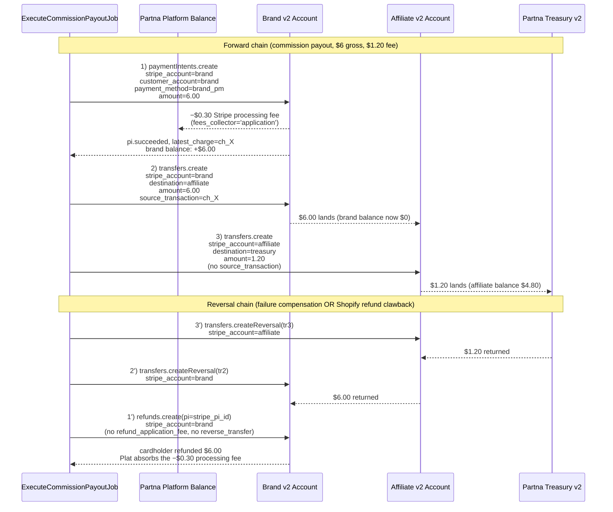

# Stripe Accounts v2 + 3-step direct-charge chain — final implementation plan (4th iteration)

## Context

Replace the post-PR-#38 brand-as-merchant direct-charge implementation with a clean **v2 Accounts + 3-step direct-charge chain** model. The brand's card is charged on the brand's v2 Account → gross commission transfers brand→affiliate → platform fee transfers affiliate→Partna Treasury v2 Account. Partna absorbs Stripe processing fees via `defaults.responsibilities.fees_collector='application'` on the brand's v2 Account. **No `application_fee_amount`, no `destination` charges, no `on_behalf_of`.**

Branch `claude/stripe-v2-overhaul` is already 1 commit in (`0b976703`):
- ✅ Schema migration `20260513400000_stripe_v2_account_columns.sql` applied (dropped legacy customer/PM/wallet/grace columns, added `stripe_payment_method_id|brand|last4`, tightened `pro_stripe_connect_status_check` to `{not_connected, onboarding, active, restricted}`).
- ✅ `config/services.php` has `connect_webhook_secret` + `platform_webhook_secret` + `api_version=2026-02-25.clover`.
- ❌ `config/services.php` still missing `partna_treasury_account_id` — plan said it was added; it's not.
- ❌ `StripeConnectService`, `CommissionPayoutService`, `CommissionPayoutRefundService`, `StripeConnectWebhookController` still on the old v1 / direct-charge-with-app-fee model. They reference dropped columns (`stripe_connect_customer_id`, `stripe_connect_payment_method_id`, `stripe_manual_balance_currency`, `stripe_grace_period_ends_at`) and the now-forbidden `stripe_connect_status='disconnected'`. **The codebase will fail at any DB write involving those columns** until Phase 3–6 ship together.

This plan closes:
1. The v2-migration rewrite (Phases 0–9 of original plan, refined).
2. **Every** May 13 bug: missing `refund_application_fee`, `payout_id` stuck after failed payout, legacy `'transferring'` payouts crashing the eligibility sweep, generic `stripe_error` failure reasons, PI ID nulled on auto-refund.
3. Dangling `'disconnected'` references in service/controller that the migration's CHECK constraint now rejects.

## API-surface confidence audit (resolved before code starts)

Findings from re-reading Stripe v2 + clover-2025-12-15 changelog docs:

| # | Question | Resolution | Confidence | Action |
|---|---|---|---|---|
| 1 | Can `PaymentIntent.create` accept a v2 Account ID via `customer` when `stripe_account` is set? | **No.** Per the [`2025-12-15.preview` changelog](https://docs.stripe.com/changelog/clover/2025-12-15/accounts-v2-v1-api-support), v1 APIs gained a new `customer_account` field that accepts an `acct_…` ID. The `customer` field continues to take `cus_…` only. v3 of original plan had `'customer' => $brand->stripe_connect_account_id` — that will fail with a type error. | 95% | Use `customer_account` everywhere a v2 Account stands in for a v1 Customer (PaymentIntent, SetupIntent, Checkout, Subscriptions). |
| 2 | Cross-account Transfer with `stripe_account=affiliate` → `destination=Treasury` — documented? | Documented in spirit: Stripe-Account header sets the *source* account; `destination` accepts any `acct_…` in the same platform. The `stripe_balance.stripe_transfers` capability is what enables a connected account to **receive** transfers from "the platform or another connected account" — that explicitly endorses the pattern. v1 Transfers API accepts `acct_…` regardless of v1/v2 origin (per migration guide). | 85% | Implement as-planned; first integration test catches edge cases. Affiliate doesn't need a special "send" capability — the platform's secret key is what authorises the operation; the connected account just hosts the source balance. |
| 3 | Step-3 (affiliate → Treasury) needs step-2 settlement first? `source_transaction` chainable to step-2's transfer? | `source_transaction` only accepts a **charge** ID. Cannot reference step-2 (a Transfer). Transferred funds land in affiliate's *pending* balance and become *available* on AU domestic settlement (T+2 typically; instant if both accounts are Stripe-on-Stripe and Express). | 90% | Execute step-3 synchronously immediately after step-2. If step-3 fails with `balance_insufficient`, treat as retryable (Horizon re-throw) and re-try via `transfer.paid` webhook on step-2; otherwise compensate (reverse step-2, refund step-1). New job `RetryStep3Job` triggered from `transfer.paid` webhook handler closes the async window. |
| 4 | Refund chain order when clawing back a completed payout (Shopify refund or step-3 failure)? | **Step-3 reversal → Step-2 reversal → Step-1 refund.** Bottom-up. Rationale: each reversal needs the prior layer to still hold funds. If step-3 reversal fails (Treasury balance issue), abort entirely — leave step-2 + step-1 intact and flag `needs_manual_refund=true`. If step-3 succeeds but step-2 fails, again abort and flag — funds are now stuck in affiliate's balance (recoverable manually); brand's card is still charged but not yet refunded. Only refund step-1 once steps 3+2 both succeeded. | 90% | Codify in `CommissionPayoutRefundService::clawbackCompletedPayout` with each step inside try/catch + early-return on first failure. |
| 5 | Webhook event scoping — what fires on **Your account** vs **Connected accounts**? | Verified via [Connect webhooks doc](https://docs.stripe.com/connect/webhooks) + [event types ref](https://docs.stripe.com/api/events/types): <br>• `v2.core.account.*` thin events → platform (Your account) scope.<br>• `account.updated` (v1 snapshot mirror) → Connected accounts scope.<br>• `payment_intent.*`, `charge.refunded`, `charge.dispute.created` for **direct charges on connected accounts** → **Connected accounts** scope (the dispute lives in the connected account's books). Original plan put `charge.dispute.created` on the platform destination — **that's wrong**.<br>• `transfer.*` events for transfers initiated under `stripe_account=acct_…` → Connected accounts scope.<br>• `checkout.session.completed` for Setup sessions created with `stripe_account=brand` → Connected accounts scope (not platform). | 90% | Move `charge.dispute.created` + `checkout.session.completed` to Destination B (Connected accounts). Destination A (Platform) keeps only `v2.core.*` events and any `charge.refunded` we initiate explicitly on the platform (none in this design, so we can drop `charge.refunded` from Destination A entirely). |
| 6 | Refunds — do `refund_application_fee` and `reverse_transfer` apply to our chain? | **No, neither apply.** Both only apply to refunds against destination charges or charges with `transfer_data`. Our model has neither: step-1 is a plain direct charge on brand's account, with no app fee. We reverse transfers manually via `transfers.createReversal`. Pass neither flag on `refunds.create`. | 95% | Codify in service: refund call carries only `payment_intent` + `metadata`. |
| 7 | Does v2 Account creation accept `defaults.currency` + `configuration.merchant.capabilities.card_payments.requested` + `configuration.recipient.capabilities.stripe_balance.stripe_transfers.requested` simultaneously? | The v2 schema (per [v2 accounts create ref](https://docs.stripe.com/api/v2/core/accounts/create)) does support all three nested fields. Affiliate doesn't need a merchant config (we never charge them as merchant). Brand doesn't need a recipient config (we never transfer *to* the brand — we only let the brand transfer *from* their balance, which platform-side credentials enable). | 80% | Build payloads as planned (brand: merchant+customer; affiliate: recipient). Verify Treasury config: `recipient` only with `stripe_balance.stripe_transfers` + `payouts`. |

**Unresolved before implementation** (must be confirmed against live Stripe in dev before merging):
- Whether `stripe.checkout.sessions.create([..., 'customer_account' => $brand->stripe_connect_account_id], ['stripe_account' => $brand->stripe_connect_account_id])` works for setup mode. Docs imply yes (Checkout supports `customer_account`); if Stripe rejects, fallback: create a v1 sub-Customer on the brand's account once via `customers.create(['stripe_account' => brand])`, persist its `cus_…` ID on `professionals.stripe_brand_subcustomer_id` (new column), and use that as `customer`. That fallback would require a follow-up migration; flag this risk to the operator.
- Whether the v2 SDK in `stripe/stripe-php` ^17 (or whatever is locked) exposes `$stripe->v2->core->accounts` + `$stripe->v2->core->accountLinks`. Should check `composer.json` lock; bump if needed.

## High-level architecture (the chain visualised)



## Phase 0 — Manual prerequisites (done outside this plan)

### 0.1 Wipe legacy dev data (operator runs in Supabase SQL)

```sql
DELETE FROM commerce.commission_payout_items WHERE payout_id IN (SELECT id FROM commerce.commission_payouts);
DELETE FROM commerce.commission_payouts;
UPDATE commerce.orders SET payout_id = NULL;

-- The migration already dropped legacy columns; reset connect state on the test brand + affiliate.
UPDATE core.professionals SET
    stripe_connect_account_id = NULL,
    stripe_connect_status = 'not_connected',
    stripe_payment_method_id = NULL,
    stripe_payment_method_brand = NULL,
    stripe_payment_method_last4 = NULL
WHERE id IN (
    '019d58b6-4231-7220-83fd-c32ed77ce256',   -- Side St (brand)
    '019d51c7-9252-71d4-9af1-c19642fe8ed6'    -- vintage-boutqiu (affiliate)
);
```

### 0.2 Create the Partna Treasury v2 Account (one-time, via Stripe Dashboard)

Onboard a Standard or Express v2 Account named **"Partna Platform Fees"** (display name visible to affiliates on their Stripe dashboard). Configuration: recipient only, capabilities `stripe_balance.stripe_transfers` + `stripe_balance.payouts`. Link Partna's operating bank, daily payout schedule. Copy the `acct_…` ID for step 0.3.

### 0.3 Laravel Cloud env vars (add)

```
STRIPE_PARTNA_TREASURY_ACCOUNT_ID=acct_xxxxxxxxxxxxx
STRIPE_PLATFORM_WEBHOOK_SECRET=whsec_... (created in 0.4)
STRIPE_CONNECT_WEBHOOK_SECRET=whsec_... (re-issued in 0.4)
```

Delete: `STRIPE_WEBHOOK_SECRET` (the legacy combined-purpose variable).

### 0.4 Recreate the two Stripe webhook destinations (delete the existing broken pair first)

**Destination A — "Partna Dev — Platform Events"**, URL `https://dev-api.partna.au/api/webhooks/stripe-platform`, scope **Your account**, API version `2026-02-25.clover`, events:

```
v2.core.account.updated
v2.core.account[identity].updated
v2.core.account[configuration.merchant].updated
v2.core.account[configuration.customer].updated
v2.core.account[configuration.recipient].updated
v2.core.account[requirements].updated
v2.core.account.closed
```

**Destination B — "Partna Dev — Connected Accounts"**, URL `https://dev-api.partna.au/api/webhooks/stripe-connect`, scope **Connected accounts**, API version `2026-02-25.clover`, events:

```
account.updated
account.application.deauthorized
payment_intent.succeeded
payment_intent.payment_failed
charge.refunded
charge.dispute.created             # MOVED: was on platform in v3 of plan; belongs on Connected for direct charges
transfer.created
transfer.paid
transfer.failed
transfer.reversed
payment_method.attached
payment_method.detached
checkout.session.completed         # MOVED: belongs on Connected because the session runs with stripe_account=brand
```

Set the resulting `whsec_…` secrets in Laravel Cloud per 0.3. Trigger "Send test event" → expect 200 on both URLs (once Phase 6 ships).

## Phase 1 — Schema (one additional migration)

Existing migration `20260513400000_stripe_v2_account_columns.sql` is correct and applied. **One new migration** to add the step-3 transfer ID column:

**`supabase/migrations/20260513500000_add_fee_transfer_id_to_commission_payouts.sql`**
```sql
ALTER TABLE commerce.commission_payouts
    ADD COLUMN IF NOT EXISTS stripe_fee_transfer_id TEXT;

COMMENT ON COLUMN commerce.commission_payouts.stripe_fee_transfer_id IS
    'Step-3 transfer ID (affiliate → Partna Treasury). NULL until step 3 succeeds. Used as reversal target on clawback.';
```

**Also: legacy-data cleanup migration** to mark dev-leftover `'transferring'` payouts from the pre-cutover model so the resume sweep doesn't trip on them. This was a May-13 crash root cause.

**`supabase/migrations/20260513600000_quarantine_pre_v2_transferring_payouts.sql`**
```sql
-- Any payout still in pending/collecting/transferring with a stripe_payment_intent_id that
-- references a PI on a v1 Express account from the pre-v2 model has no path to resume:
-- its source-account context no longer exists. Mark them failed for ops review.
UPDATE commerce.commission_payouts
   SET status = 'failed',
       failure_code = 'pre_v2_quarantine',
       failure_reason = 'Quarantined during v2 cutover — manual review required',
       processed_at = now()
 WHERE status IN ('pending', 'pending_funds', 'collecting', 'transferring')
   AND created_at < '2026-05-13 00:00:00+00';

-- Release any orders still pinned to the quarantined payouts.
UPDATE commerce.orders o
   SET payout_id = NULL
  FROM commerce.commission_payouts p
 WHERE o.payout_id = p.id
   AND p.failure_code = 'pre_v2_quarantine';
```

No other schema changes. `stripe_error_code`, `stripe_error_message`, `failure_category`, `needs_manual_refund`, `stripe_payment_intent_id`, `stripe_transfer_id` already exist on `commission_payouts`.

## Phase 2 — Config

**File:** `config/services.php` — append one line to the `stripe` array.

```php
'stripe' => [
    'secret_key' => env('STRIPE_SECRET_KEY'),
    'publishable_key' => env('STRIPE_PUBLISHABLE_KEY'),
    'connect_webhook_secret' => env('STRIPE_CONNECT_WEBHOOK_SECRET'),
    'platform_webhook_secret' => env('STRIPE_PLATFORM_WEBHOOK_SECRET'),
    'partna_treasury_account_id' => env('STRIPE_PARTNA_TREASURY_ACCOUNT_ID'),  // ← NEW
    'api_version' => env('STRIPE_API_VERSION', '2026-02-25.clover'),
],
```

## Phase 3 — Rewrite `app/Services/Stripe/StripeConnectService.php` (full file)

Delete every method that reads/writes a now-dropped column. Add v2 Account flows. **Eliminate every `'disconnected'` reference** — the CHECK constraint rejects it.

Public API of the new service:

| Method | Purpose |
|---|---|
| `createConnectAccount(Professional $pro): string` | Dispatcher → calls brand- or affiliate-specific creator |
| `createBrandConnectAccount(Professional $brand): string` | v2 Account, `identity.entity_type='company'`, `configuration.merchant.capabilities.card_payments.requested=true`, `configuration.customer={}`, `defaults.responsibilities.fees_collector='application'`, `defaults.responsibilities.losses_collector='application'`, `defaults.currency = resolveShopCurrency() ?? 'aud'`, `dashboard='express'`, metadata.sidest_professional_id, idempotency_key `acct_{$brand->id}` |
| `createAffiliateConnectAccount(Professional $aff): string` | v2 Account, `identity.entity_type='individual'`, `configuration.recipient.capabilities.stripe_balance.stripe_transfers.requested=true`, `configuration.recipient.capabilities.stripe_balance.payouts.requested=true`, `defaults.currency='aud'`, fees_collector/losses_collector=application, `dashboard='express'`, metadata, idempotency_key |
| `createOnboardingLink(Professional $pro, string $returnUrl, string $refreshUrl): string` | `$this->stripe->v2->core->accountLinks->create(['account' => $id, 'use_case' => ['type' => 'account_onboarding', 'account_onboarding' => ['configurations' => $pro->isBrand() ? ['merchant', 'customer'] : ['recipient'], 'return_url' => $returnUrlWithFresh, 'refresh_url' => $refreshUrl]]])` — append `?fresh=1` to return URL like today's code does |
| `createDashboardLink(Professional $pro): ?string` | `$this->stripe->v2->core->accountLinks->create(['account' => $id, 'use_case' => ['type' => 'account_management', 'account_management' => []]])`; null if `stripe_connect_status` ∉ `{active, restricted}` |
| `createBrandPaymentMethodSetupSession(Professional $brand, string $successUrl, string $cancelUrl): array` | `$this->stripe->checkout->sessions->create(['mode' => 'setup', 'customer_account' => $brand->stripe_connect_account_id, 'payment_method_types' => ['card'], 'success_url' => ..., 'cancel_url' => ..., 'metadata' => ['sidest_professional_id' => $brand->id, 'purpose' => 'brand_commission_payment_method']], ['stripe_account' => $brand->stripe_connect_account_id])` — returns `['url' => $session->url, 'session_id' => $session->id]` |
| `syncBrandPaymentMethodFromCheckoutSession(Professional $brand, string $sessionId): array` | retrieve session w/ expand `['setup_intent.payment_method']` + `stripe_account=brand`; validate `mode='setup'`, `status='complete'`, `setup_intent.status='succeeded'`; persist `stripe_payment_method_id|brand|last4`; **also** call `customers.update` on the v2 Account's customer config via `$this->stripe->v2->core->accounts->update($id, ['configuration' => ['customer' => ['default_payment_method' => $pm->id]]])` if the Stripe SDK supports — else skip and rely on the single PM on file. Returns `['payment_method_id', 'brand', 'last4']`. |
| `removeBrandPaymentMethod(Professional $brand): void` | `$this->stripe->paymentMethods->detach($brand->stripe_payment_method_id, null, ['stripe_account' => $brand->stripe_connect_account_id])` then null out `stripe_payment_method_id|brand|last4`. Tolerate Stripe 404 (PM already gone). |
| `disconnectAccount(Professional $pro): void` | Set `stripe_connect_status='not_connected'`, null out `stripe_connect_account_id` + `stripe_payment_method_*`. **No more 'disconnected' status.** Onboarding link creation will create a fresh v2 Account on next attempt. |
| `syncAccountStatus(Professional $pro): array` | `cacheLock->rememberLocked(...)` wrapping `fetchAndSyncAccountStatus`. Returns `['status', 'charges_enabled', 'transfers_enabled', 'details_submitted', 'requirements']`. |
| `fetchAndSyncAccountStatus(Professional $pro, string $accountId): array` (private) | `$this->stripe->v2->core->accounts->retrieve($id, ['include' => ['identity', 'configuration.merchant', 'configuration.customer', 'configuration.recipient', 'requirements']])`; derive status via `determineAccountStatus($account, $pro)`; persist; return shape above. |
| `determineAccountStatus(object $account, Professional $pro): string` (public static) | Brand: read `configuration.merchant.capabilities.card_payments.status` → `'active'` if active, `'restricted'` if restricted, `'onboarding'` otherwise. Affiliate: read `configuration.recipient.capabilities.stripe_balance.stripe_transfers.status` similarly. Treasury accounts can't reach this code path (no Professional row). |
| `statusCacheKey(string $accountId): string` (static) — keep verbatim |
| `forgetStatusCache(string $accountId): void` (static) — keep verbatim |
| `brandHasPaymentMethod(Professional $brand): bool` | `! empty($brand->stripe_payment_method_id)` |
| `mapCountryCode(?string): string` + `mapCountryCodeOrNull(?string): ?string` + `resolveShopCurrency(Professional): ?string` + `e164PhoneOrNull` + `stringOrNull` + `STRIPE_CONNECT_SUPPORTED_COUNTRIES` constant — keep verbatim from current file. |

**Delete** (all reference dropped columns or the forbidden 'disconnected' status):
`createBrandConnectCustomer`, `createBrandConnectPaymentMethodSetupSession`, `syncBrandConnectPaymentMethodFromCheckoutSession`, `saveBrandConnectPaymentMethod`, `listPaymentMethods`, `removeBrandPaymentSetup`, the `stripe_grace_period_ends_at` write in `createConnectAccount`, the `stripe_manual_balance_currency` write in `createConnectAccount`, the `business_type` patch loop in `createOnboardingLink`, the `'disconnected'` early-return in `syncAccountStatus`.

## Phase 4 — Rewrite `app/Services/Stripe/CommissionPayoutService.php`

The state machine narrows: `pending → collecting → transferring → completed` (or `→ failed`). Drop `pending_funds`, `collected` (the wallet step is gone), and stop writing `funding_source`, `wallet_debit_cents`.

### 4a. Eligibility (`processEligiblePayouts`)

```php
$eligibleBrandIds = Professional::query()
    ->where('professional_type', 'brand')
    ->whereNotNull('stripe_connect_account_id')
    ->where('stripe_connect_status', 'active')
    ->whereNotNull('stripe_payment_method_id')        // ← new column
    ->pluck('id');
```

Resume filter for in-flight batches drops `'pending_funds'`:
```php
->whereIn('status', ['pending', 'collecting', 'transferring'])
```

The new `transferring` state survives across job runs only as a resume hint for step-3 (set after step-2 succeeds, cleared on step-3 success). Quarantine migration in Phase 1 ensures no legacy `'transferring'` rows are in scope.

### 4b. `processPayoutBatch(CommissionPayout $payout): ?bool`

Skeleton (preserving existing `revalidatePayoutOrders` and the 3-state contract `true/null/false`):

```php
if ($payout->status === 'completed') { return true; }

if ($payout->status === 'pending') {
    $payout = $this->revalidatePayoutOrders($payout);
    if ($payout === null) { return null; }
}

$brand = Professional::find($payout->brand_professional_id);
$affiliate = Professional::find($payout->affiliate_professional_id);
$treasuryAccountId = config('services.stripe.partna_treasury_account_id');

if (! $brand || ! $affiliate || ! $treasuryAccountId) {
    $this->failPayout($payout, 'config_error', 'Brand, affiliate, or Treasury config missing');
    return false;
}

if (! $this->stillEligible($brand, $affiliate)) {
    // Brand lost active/PM, or affiliate lost active — release back to next sweep, NOT failed.
    Order::where('payout_id', $payout->id)->update(['payout_id' => null]);
    CommissionPayoutItem::where('payout_id', $payout->id)->delete();
    $payout->forceFill(['status' => 'cancelled', 'failure_code' => 'no_longer_eligible', 'failure_reason' => '...', 'processed_at' => now()])->save();
    return null;
}

// === STEP 1 ===
if (! in_array($payout->status, ['transferring'], true)) {
    $payout->forceFill(['status' => 'collecting'])->save();
    try {
        $pi = $this->createBrandCharge($payout, $brand);
        $payout->forceFill(['stripe_payment_intent_id' => $pi->id, 'charge_cents' => $payout->gross_commission_cents])->save();
        if ($pi->status !== 'succeeded') {
            // SCA / async — leave at 'collecting', cancel idempotency-friendly, let webhook + admin retry handle it
            $this->handleStep1NotSucceeded($payout, $brand, $pi);
            return null;
        }
        $latestChargeId = $this->extractLatestChargeId($pi);
    } catch (ApiConnectionException|RateLimitException $e) {
        throw $e;
    } catch (ApiErrorException $e) {
        $this->failPayout($payout, 'charge_failed', $this->formatStripeError($e), $e);
        Order::where('payout_id', $payout->id)->update(['payout_id' => null]);    // ← release: this was the May 13 bug
        CommissionPayoutItem::where('payout_id', $payout->id)->delete();
        return false;
    }
} else {
    // Resume path: PI already succeeded in a prior run, retrieve the latest_charge for source_transaction.
    $latestChargeId = $this->resumeStep1ChargeId($payout, $brand);
}

$payout->forceFill(['status' => 'transferring'])->save();

// === STEP 2 ===
if (! $payout->stripe_transfer_id) {
    try {
        $tr2 = $this->createBrandToAffiliateTransfer($payout, $brand, $affiliate, $latestChargeId);
        $payout->forceFill(['stripe_transfer_id' => $tr2->id])->save();
    } catch (ApiConnectionException|RateLimitException $e) { throw $e; }
    catch (ApiErrorException $e) {
        $this->autoRefundChargeOnly($payout, $brand, 'brand_to_affiliate_failed', $e);
        return false;
    }
}

// === STEP 3 ===
if ($payout->platform_fee_cents > 0 && ! $payout->stripe_fee_transfer_id) {
    try {
        $tr3 = $this->createAffiliateToTreasuryTransfer($payout, $affiliate, $treasuryAccountId);
        $payout->forceFill(['stripe_fee_transfer_id' => $tr3->id])->save();
    } catch (ApiConnectionException|RateLimitException $e) { throw $e; }
    catch (ApiErrorException $e) {
        // 'balance_insufficient' is the most likely cause for new affiliate accounts whose
        // step-2 funds are still in pending balance. Decision tree:
        //  - if error code is 'balance_insufficient' AND we have a stripe_transfer_id → leave at
        //    'transferring', schedule RetryStep3Job via delay(15min). Job rechecks then retries.
        //  - otherwise → reverse step 2, refund step 1, fail.
        if (($e->getStripeCode() ?? '') === 'balance_insufficient') {
            RetryStep3Job::dispatch($payout->id)->delay(now()->addMinutes(15));
            Log::info('Step 3 deferred — affiliate balance pending', ['payout_id' => $payout->id]);
            return null;
        }
        $this->reverseBrandToAffiliateAndRefundCharge($payout, $brand, $affiliate, 'fee_transfer_failed', $e);
        return false;
    }
}

$payout->forceFill([
    'status' => 'completed',
    'processed_at' => now(),
    'transfer_completed_at' => now(),
    'failure_code' => null,
    'failure_reason' => null,
    'stripe_error_code' => null,
    'stripe_error_message' => null,
    'failure_category' => null,
])->save();
$this->analyticsCache->bumpAnalyticsVersion($brand->id);
$this->analyticsCache->bumpAnalyticsVersion($affiliate->id);
return true;
```

### 4c. The three step helpers (exact payloads — these are the Stripe-correctness-critical bits)

```php
private function createBrandCharge(CommissionPayout $payout, Professional $brand): object
{
    return $this->stripe->paymentIntents->create([
        'amount' => $payout->gross_commission_cents,
        'currency' => strtolower($payout->currency_code),
        'customer_account' => $brand->stripe_connect_account_id,   // ← NOT 'customer'. v2 Account ID via the new clover field.
        'payment_method' => $brand->stripe_payment_method_id,
        'confirm' => true,
        'off_session' => true,
        'description' => "Commission payout #{$payout->id}",
        'metadata' => [
            'sidest_payout_id' => $payout->id,
            'brand_id' => $brand->id,
            'step' => '1_brand_charge',
        ],
        // NO application_fee_amount. NO on_behalf_of. NO transfer_data.
    ], [
        'stripe_account' => $brand->stripe_connect_account_id,
        'idempotency_key' => 'pi_'.$payout->id.($payout->retry_count > 0 ? '_r'.$payout->retry_count : ''),
    ]);
}

private function createBrandToAffiliateTransfer(CommissionPayout $payout, Professional $brand, Professional $affiliate, ?string $latestChargeId): object
{
    $payload = [
        'amount' => $payout->gross_commission_cents,
        'currency' => strtolower($payout->currency_code),
        'destination' => $affiliate->stripe_connect_account_id,
        'description' => "Commission to {$affiliate->display_name} for #{$payout->id}",
        'metadata' => ['sidest_payout_id' => $payout->id, 'brand_id' => $brand->id, 'affiliate_id' => $affiliate->id, 'step' => '2_brand_to_affiliate'],
    ];
    if ($latestChargeId) { $payload['source_transaction'] = $latestChargeId; }
    return $this->stripe->transfers->create($payload, [
        'stripe_account' => $brand->stripe_connect_account_id,
        'idempotency_key' => 'tr2_'.$payout->id,            // ← stable (no _r suffix): resume returns same transfer
    ]);
}

private function createAffiliateToTreasuryTransfer(CommissionPayout $payout, Professional $affiliate, string $treasuryAccountId): object
{
    return $this->stripe->transfers->create([
        'amount' => $payout->platform_fee_cents,
        'currency' => strtolower($payout->currency_code),
        'destination' => $treasuryAccountId,
        'description' => "Partna platform fee for payout #{$payout->id}",
        'metadata' => ['sidest_payout_id' => $payout->id, 'affiliate_id' => $affiliate->id, 'step' => '3_affiliate_to_treasury'],
        // No source_transaction — Transfers API only accepts a charge ID, and we can't chain to step 2's transfer.
    ], [
        'stripe_account' => $affiliate->stripe_connect_account_id,
        'idempotency_key' => 'tr3_'.$payout->id,
    ]);
}
```

### 4d. Failure compensations

```php
private function autoRefundChargeOnly(CommissionPayout $payout, Professional $brand, string $failureCode, ApiErrorException $e): void
{
    $finalCode = $failureCode;
    try {
        $this->stripe->refunds->create([
            'payment_intent' => $payout->stripe_payment_intent_id,
            'metadata' => ['sidest_payout_id' => $payout->id, 'reason' => 'auto_refund_step2_failed'],
            // NO refund_application_fee (no app_fee in our chain). NO reverse_transfer (no destination charge).
        ], [
            'stripe_account' => $brand->stripe_connect_account_id,
            'idempotency_key' => "rf_{$payout->id}_step2",
        ]);
        $finalCode = $failureCode.'_refunded';
    } catch (\Throwable $refundEx) {
        $finalCode = $failureCode.'_refund_failed';
        $payout->forceFill(['needs_manual_refund' => true])->save();
    }
    $this->failPayout($payout, $finalCode, $this->formatStripeError($e), $e);
    // PRESERVE stripe_payment_intent_id for the audit trail — DO NOT null it out. (May 13 bug fix.)
}

private function reverseBrandToAffiliateAndRefundCharge(CommissionPayout $payout, Professional $brand, Professional $affiliate, string $failureCode, ApiErrorException $e): void
{
    $finalCode = $failureCode;
    $reverseOk = true;
    if ($payout->stripe_transfer_id) {
        try {
            $this->stripe->transfers->createReversal($payout->stripe_transfer_id, [
                'metadata' => ['sidest_payout_id' => $payout->id, 'reason' => 'step3_failed_reverse_step2'],
            ], [
                'stripe_account' => $brand->stripe_connect_account_id,
                'idempotency_key' => "rev2_{$payout->id}",
            ]);
        } catch (\Throwable $revEx) {
            $reverseOk = false;
            $finalCode = $failureCode.'_reverse_failed';
            $payout->forceFill(['needs_manual_refund' => true])->save();
        }
    }
    if ($reverseOk && $payout->stripe_payment_intent_id) {
        try {
            $this->stripe->refunds->create([
                'payment_intent' => $payout->stripe_payment_intent_id,
                'metadata' => ['sidest_payout_id' => $payout->id, 'reason' => 'step3_failed_refund_charge'],
            ], [
                'stripe_account' => $brand->stripe_connect_account_id,
                'idempotency_key' => "rf_{$payout->id}_step3",
            ]);
        } catch (\Throwable) {
            $finalCode .= '_refund_failed';
            $payout->forceFill(['needs_manual_refund' => true])->save();
        }
    }
    $this->failPayout($payout, $finalCode, $this->formatStripeError($e), $e);
}

private function formatStripeError(\Throwable $e): string
{
    if ($e instanceof ApiErrorException) {
        return sprintf('[%s] %s (request_id=%s, type=%s)',
            $e->getStripeCode() ?? 'unknown_code',
            $e->getMessage(),
            $e->getRequestId() ?? 'n/a',
            method_exists($e, 'getError') ? ($e->getError()?->type ?? 'n/a') : 'n/a',
        );
    }
    return get_class($e).': '.($e->getMessage() ?: 'unknown_error');
}

private function failPayout(CommissionPayout $payout, string $code, string $reason, ?\Throwable $e = null): void
{
    $payout->forceFill([
        'status' => 'failed',
        'failure_code' => $code,
        'failure_reason' => $reason,
        // Persist Stripe context to dedicated columns so ops can grep + so support can quote request_id.
        'stripe_error_code' => $e instanceof ApiErrorException ? $e->getStripeCode() : null,
        'stripe_error_message' => $e instanceof ApiErrorException ? $e->getMessage() : null,
        'failure_category' => $e instanceof ApiErrorException
            ? CommissionPayoutService::categorizeTransferFailure($e->getStripeCode())
            : 'unknown',
        'processed_at' => now(),
    ])->save();

    // Release orders UNLESS the failure left funds dangling (manual ops review first).
    $danglingCodes = ['brand_to_affiliate_failed_refund_failed', 'fee_transfer_failed_reverse_failed', 'fee_transfer_failed_refund_failed'];
    if (! in_array($code, $danglingCodes, true)) {
        Order::where('payout_id', $payout->id)->update(['payout_id' => null]);     // ← May 13 fix
        CommissionPayoutItem::where('payout_id', $payout->id)->delete();
    }
}
```

### 4e. New job: `app/Jobs/Stripe/RetryStep3Job.php`

```php
class RetryStep3Job implements ShouldQueue
{
    public function __construct(public string $payoutId) {}
    public int $tries = 5;
    public function backoff(): array { return [60*15, 60*30, 60*60, 60*120, 60*240]; }
    public function handle(CommissionPayoutService $service): void
    {
        $payout = CommissionPayout::find($this->payoutId);
        if (! $payout || $payout->status !== 'transferring' || $payout->stripe_fee_transfer_id) { return; }
        $service->processPayoutBatch($payout);   // ← reentrant: step 1+2 idempotency keys return existing, step 3 retries
    }
}
```

Wire from `transfer.paid` webhook in Phase 6 (when step-2 transfer settles, dispatch a `RetryStep3Job` for the payout immediately if status='transferring' && fee_transfer_id is null).

### 4f. Code to delete in this service

- `extractBalanceTransactionNet()` and all callers — no `application_fee_amount` means no fee deduction to recompute; step-2 transfers full gross.
- `markPendingFunding()` and the `pending_funds` enum entirely — wallet path is gone.
- All references to `funding_source`, `wallet_debit_cents`, `next_retry_at`, `funding_failure_count`, `grace_started_at` writes (column reads stay for now; void/retry job stays; new failure path doesn't park).
- The `requires_action` cancel+race-recover branch in step 1 — the new model defers SCA cleanly via the `handleStep1NotSucceeded` helper, leaving the PI alive and the payout at `collecting` for webhook completion.
- The `'collected'` enum state (unused in new model — go straight `collecting → transferring`).

## Phase 5 — Rewrite `app/Services/Stripe/CommissionPayoutRefundService.php`

`handleOrderRefund` keeps its current branching (`pending/pending_funds/collecting/transferring/completed/failed/cancelled/reversed`), but drop `pending_funds`. Replace `clawbackCompletedPayout` with the **bottom-up reversal chain**:

```php
private function clawbackCompletedPayout(CommissionPayout $payout, Order $order, ?int $incrementalRefundCents, ?string $shopifyRefundId): void
{
    // ... existing exists() dedup + math (proportional ratios) — unchanged ...
    $clawbackGrossCents = $proportionalGross;     // share of step-1 charge to refund
    $clawbackFeeCents   = $proportionalFee;       // share of step-3 fee transfer to reverse
    $brand = Professional::find($payout->brand_professional_id);
    $affiliate = Professional::find($payout->affiliate_professional_id);

    $step3Ok = $step2Ok = false;

    // === Step 3 reversal first (affiliate → Treasury fee transfer) ===
    if ($payout->stripe_fee_transfer_id && $clawbackFeeCents > 0) {
        try {
            $this->stripe->transfers->createReversal($payout->stripe_fee_transfer_id, [
                'amount' => $clawbackFeeCents,
                'metadata' => ['sidest_payout_id' => $payout->id, 'order_id' => $order->id, 'reason' => 'clawback', 'shopify_refund_id' => $shopifyRefundId ?? ''],
            ], [
                'stripe_account' => $affiliate->stripe_connect_account_id,
                'idempotency_key' => "rev3_{$payout->id}_{$order->id}_".substr(md5($shopifyRefundId ?? 'manual'), 0, 16),
            ]);
            $step3Ok = true;
        } catch (ApiErrorException $e) {
            $this->insertClawbackRow($payout, $order, $shopifyRefundId, ['status' => 'reversal_failed', 'failure_reason' => 'step3_'.$e->getStripeCode(), 'amount_cents' => $clawbackGrossCents]);
            $payout->forceFill(['needs_manual_refund' => true])->save();
            return; // bail: don't unwind step-2 + step-1 while step-3 is still on the books
        }
    } else { $step3Ok = true; }     // no fee transfer ever (platform_fee_cents was 0)

    // === Step 2 reversal (brand → affiliate gross) ===
    if ($payout->stripe_transfer_id) {
        try {
            $this->stripe->transfers->createReversal($payout->stripe_transfer_id, [
                'amount' => $clawbackGrossCents,
                'metadata' => ['sidest_payout_id' => $payout->id, 'order_id' => $order->id, 'reason' => 'clawback'],
            ], [
                'stripe_account' => $brand->stripe_connect_account_id,
                'idempotency_key' => "rev2_{$payout->id}_{$order->id}_".substr(md5($shopifyRefundId ?? 'manual'), 0, 16),
            ]);
            $step2Ok = true;
        } catch (ApiErrorException $e) {
            $this->insertClawbackRow($payout, $order, $shopifyRefundId, ['status' => 'reversal_failed', 'failure_reason' => 'step2_'.$e->getStripeCode(), 'amount_cents' => $clawbackGrossCents]);
            $payout->forceFill(['needs_manual_refund' => true])->save();
            return;
        }
    }

    // === Step 1 charge refund — only if both reversals succeeded ===
    if ($step2Ok && $step3Ok && $payout->stripe_payment_intent_id) {
        try {
            $refund = $this->stripe->refunds->create([
                'payment_intent' => $payout->stripe_payment_intent_id,
                'amount' => $clawbackGrossCents,
                'metadata' => ['sidest_payout_id' => $payout->id, 'order_id' => $order->id, 'reason' => 'clawback'],
                // NO refund_application_fee. NO reverse_transfer. (Already manually reversed.)
            ], [
                'stripe_account' => $brand->stripe_connect_account_id,
                'idempotency_key' => "rf_{$payout->id}_{$order->id}_".substr(md5($shopifyRefundId ?? 'manual'), 0, 16),
            ]);
            $this->insertClawbackRow($payout, $order, $shopifyRefundId, [
                'stripe_reversal_id' => $refund->id, 'amount_cents' => $clawbackGrossCents, 'status' => 'reversed',
                'metadata' => ['refund_share_cents' => $incrementalRefundCents],
            ]);
        } catch (ApiErrorException $e) {
            // Reversals already executed; refund failed — flag for manual cardholder refund.
            $this->insertClawbackRow($payout, $order, $shopifyRefundId, ['status' => 'reversal_failed', 'failure_reason' => 'step1_'.$e->getStripeCode(), 'amount_cents' => $clawbackGrossCents]);
            $payout->forceFill(['needs_manual_refund' => true])->save();
        }
    }
}
```

Full-payout clawback (when status='completed' and all linked orders go to refunded) is the same chain with full amounts.

Delete from this service: the old single-step reversal path (`refund_application_fee: true`, `reverse_transfer: true` flag handling) — neither flag applies anymore.

## Phase 6 — Webhook controllers + routes

### 6a. New: `app/Http/Controllers/Api/Webhooks/StripePlatformWebhookController.php`

Skeleton:
```php
public function __invoke(Request $request): JsonResponse
{
    $payload = $request->getContent();
    $sigHeader = $request->header('Stripe-Signature', '');
    $secret = config('services.stripe.platform_webhook_secret');
    try { $event = Webhook::constructEvent($payload, $sigHeader, $secret); }
    catch (\Throwable) { return response()->json(['error' => 'invalid_signature'], 400); }

    // Idempotency via WebhookEvent firstOrCreate, like the existing controller
    $we = WebhookEvent::firstOrCreate(['stripe_event_id' => $event->id], ['event_type' => $event->type, 'processed_at' => now()]);
    if (! $we->wasRecentlyCreated) { return response()->json(['received' => true]); }
    $we->forceFill(['payload' => json_decode($payload, true)])->save();

    return $this->handleParsedEvent($event);
}

public function handleParsedEvent(\Stripe\Event $event): JsonResponse
{
    match (true) {
        str_starts_with($event->type, 'v2.core.account.') => $this->handleV2AccountEvent($event),
        default => Log::debug('Unhandled platform event', ['type' => $event->type]),
    };
    return response()->json(['received' => true]);
}

private function handleV2AccountEvent(\Stripe\Event $event): void
{
    // Thin events: data.object may not carry full account state. Resolve our local mapping via:
    //   - $event->data->object->id when present, OR
    //   - $event->related_object->id (per v2 thin-event shape)
    $accountId = $event->data->object->id ?? ($event->related_object->id ?? null);
    if (! $accountId) { return; }
    $pro = Professional::where('stripe_connect_account_id', $accountId)->first();
    if (! $pro) { Log::debug('v2.core.account.* for unknown account', ['id' => $accountId, 'type' => $event->type]); return; }
    StripeConnectService::forgetStatusCache($accountId);
    app(StripeConnectService::class)->syncAccountStatus($pro);   // ← does a v2 retrieve and persists status
}
```

### 6b. Refactor: `app/Http/Controllers/Api/Webhooks/StripeConnectWebhookController.php`

Keep most of the existing structure (HMAC verify, WebhookEvent dedup, account-mismatch guard). Changes:

1. **Drop multi-secret fallback** — verify against `connect_webhook_secret` only (platform secret is for the other endpoint).
2. **Drop the `'disconnected'` skip** in `handleAccountUpdated` — that status no longer exists locally. Replace with: if status check fails (deauthorized branch sets `not_connected`), the deauth handler clears the account id; the regular `account.updated` always proceeds.
3. **Rewrite `handleAccountDeauthorized`** to set `stripe_connect_status='not_connected'` (was `'disconnected'`) + null `stripe_connect_account_id` + null PM columns. This matches the new `disconnectAccount` service method.
4. **`handleCheckoutSessionCompleted`** — change call to `syncBrandPaymentMethodFromCheckoutSession` (renamed method).
5. **`handleAccountUpdated`** — change call to `StripeConnectService::determineAccountStatus($account, $pro)` (now takes `$pro` to branch brand vs affiliate). Note: this handler receives a v1-snapshot `account` object; the v1 account shape doesn't carry the v2 `configuration.merchant.capabilities.card_payments.status` field. **Decision: have v1 `account.updated` handler simply bust the cache + dispatch a fresh `syncAccountStatus()` call** (which does a v2 retrieve). Don't attempt to derive status from the v1 snapshot — it won't carry v2 capability state.
6. **Add new handler `handleTransferPaid` step-2 detection** — if `$transfer->metadata->step === '2_brand_to_affiliate'` AND payout status is `transferring` AND `stripe_fee_transfer_id` is null AND `platform_fee_cents > 0` → dispatch `RetryStep3Job` so step-3 retries against now-available affiliate balance.
7. **Keep existing handlers** for `payment_intent.succeeded/failed`, `transfer.created/failed/reversed`, `payment_method.attached/detached` — but verify they don't write the dropped `'disconnected'` status anywhere.

### 6c. Routes — `routes/api.php`

```php
Route::post('/webhooks/stripe-connect', StripeConnectWebhookController::class);
Route::post('/webhooks/stripe-platform', StripePlatformWebhookController::class);
// REMOVE: Route::post('/webhooks/stripe', StripeWebhookController::class);
```

Delete file `app/Http/Controllers/Api/Webhooks/StripeWebhookController.php` (449 lines of legacy SaaS-billing path). It's not referenced anywhere except this route and a test file that we'll delete in Phase 10.

## Phase 7 — Order-status derivation

**Files:**
- `app/Http/Controllers/Api/Professional/Brand/BrandOrdersController.php`
- `app/Http/Controllers/Api/Professional/Affiliate/AffiliateOrdersController.php`

Add a JOIN on `commission_payouts cp ON cp.id = o.payout_id` (LEFT JOIN; the `whereNull('o.payout_id')` filter still works on the joined row). Add `cp.status as payout_status` to `rowColumns()` in both. Replace `deriveLifecycleStatus`:

```php
private function deriveLifecycleStatus(object $row): string
{
    if (in_array($row->order_status, ['cancelled', 'voided', 'refunded'], true)) { return 'reversed'; }
    if ((int) $row->refund_cents >= (int) $row->net_cents && (int) $row->net_cents > 0) { return 'reversed'; }
    if (empty($row->payout_id)) { return 'pending'; }
    // Payout failed or cancelled in flight — order should be back in queue (defensive; Phase 4 also releases payout_id).
    if (in_array($row->payout_status, ['failed', 'cancelled', 'reversed'], true)) { return 'pending'; }
    if ($row->payout_status === 'completed') { return 'paid'; }
    return 'processing';     // collecting / transferring / pending
}
```

Update `applyStatusFilter`:
```php
'paid'    => $query->whereRaw("NOT ({$reversed})")->whereNotNull('o.payout_id')->where('cp.status', 'completed'),
'pending' => $query->whereRaw("NOT ({$reversed})")->where(function($q) {
    $q->whereNull('o.payout_id')->orWhereIn('cp.status', ['failed', 'cancelled', 'reversed']);
}),
'reversed' => $query->whereRaw($reversed),
```

Update `parseStatusFilter` if `'processing'` becomes a filter value (optional; can also keep 4 states client-side and 3 filter values for now).

The `resolveSettlementDate` private method (line 250-266 of BrandOrdersController) reads `payouts.processed_at` for `paid` status; the new logic keeps that working since `paid` still requires `cp.status='completed'`. No change.

## Phase 8 — `StripeConnectController` updates

**File:** `app/Http/Controllers/Api/Professional/Stripe/StripeConnectController.php`

- `GET /stripe/status`: drop `stripe_customer_id` from response (dropped column). Return shape becomes `{ connect, has_payment_method, masked_card }` where `masked_card = { brand, last4 }` from `stripe_payment_method_brand|last4` if set, null otherwise.
- `POST /stripe/payment-method/setup-checkout`: call renamed `createBrandPaymentMethodSetupSession` (no `Connect` in name).
- `POST /stripe/payment-method/sync-session`: call renamed `syncBrandPaymentMethodFromCheckoutSession`.
- `POST /stripe/payment-method/confirm`: delete the endpoint and Form Request entirely — the `saveBrandConnectPaymentMethod` method is gone; the sync-session path is the only attach path now.
- `GET /stripe/payment-methods`: delete the endpoint — the `listPaymentMethods` service method is gone; the masked_card on `/status` is enough.
- `DELETE /stripe/payment-method`: call new `removeBrandPaymentMethod` (detach + null DB fields).
- Authorize via `authorizeForUser($pro, 'managePaymentMethod', $pro)` — keep existing pattern.
- Routes file `routes/api/professional.php` (or wherever these endpoints live — verify) needs the deleted endpoints removed.

## Phase 9 — Frontend (`hunterbalcombesykes/partna-frontend`, branch `main`)

**Cloud-only constraint:** This planning session is on the backend repo; the frontend repo is not mounted here. The implementation phase will need to clone partna-frontend locally before editing. Flag this to the operator.

### 9a. `lib/stripe-connect.ts` — types

```ts
export type StripeConnectStatus = {
  connect: {
    status: 'not_connected' | 'onboarding' | 'active' | 'restricted'
    charges_enabled?: boolean
    transfers_enabled?: boolean
    details_submitted?: boolean
    requirements?: string[]
  }
  has_payment_method: boolean
  masked_card: { brand: string; last4: string } | null
}
```

Delete every legacy export: `StripeFundingMode`, `BrandTopupRecord`, `updateFundingMode`, `createTopupCheckoutSession`, `confirmTopupSession`, wallet fields on `BrandBillingSummary`, `stripe_customer_id`/`stripe_connect_customer_id` references, `'disconnected'` union member.

### 9b. `features/integrations/components/stripe-connect-section.tsx`

Restructure to 4-state UI per professional type. Brand branch:

| `status` | `has_payment_method` | UI |
|---|---|---|
| `not_connected` | – | "Connect Stripe" CTA → POST /stripe/connect/onboard |
| `onboarding` | – | "Continue onboarding" → same endpoint |
| `active` | false | "Add card" CTA → POST /stripe/payment-method/setup-checkout |
| `active` | true | masked_card pill + "Remove card" + "Open Stripe Dashboard" |
| `restricted` | – | Yellow warning + "Resolve issues" → POST /stripe/connect/dashboard |

Affiliate branch:

| `status` | UI |
|---|---|
| `not_connected` | "Connect Stripe" CTA |
| `onboarding` | "Continue onboarding" |
| `active` | "Connected — payouts deliver to your Stripe balance" + "Open Stripe Dashboard" |
| `restricted` | Yellow warning + dashboard link |

### 9c. Payouts list + `OrderHistoryTable`

Replace the 3-state pill mapper with 4 states: `pending | processing | paid | reversed`. Style `processing` (collecting/transferring) as muted gray pill so failed-mid-chain payouts don't read as "completed".

### 9d. `lib/payout-fixtures.ts`

Add a `processing` and a `pre_v2_quarantine` failure_code fixture so storybook covers the new states.

### 9e. Drop `BrandBillingSummary` wallet fields (if any survived previous PR)

Sweep for `manual_balance_cents`, `funding_mode`, `topup`, `grace_period`. Delete any callsites.

## Phase 10 — Tests

**Update:**
- `tests/Feature/Stripe/BrandConnectOnboardingTest.php` — assert v2 payload: `configuration.merchant.capabilities.card_payments.requested=true`, `configuration.customer={}`, `defaults.responsibilities.fees_collector='application'`.
- `tests/Feature/Stripe/BrandPaymentMethodSetupTest.php` — assert Checkout payload carries `customer_account` (not `customer`) and the `stripe_account` request option.
- `tests/Feature/Stripe/EligibilityFilterTest.php` — eligibility now keys off `stripe_payment_method_id` (not `stripe_connect_customer_id` + `stripe_connect_payment_method_id`).
- `tests/Feature/Stripe/CommissionPayoutServiceTest.php` — full rewrite for 3-step chain. Mock 3 sequential Stripe calls; assert idempotency keys `pi_<id>`, `tr2_<id>`, `tr3_<id>`; assert `stripe_account` header on each is the right account (brand for steps 1+2, affiliate for step 3); assert `source_transaction` is set on step 2 only; assert no `application_fee_amount` on the PI; assert step-1 `customer_account` (not `customer`).
- `tests/Feature/Stripe/StripeIdempotencyKeysTest.php` — new key inventory: `pi_<id>[_r<n>]`, `tr2_<id>`, `tr3_<id>`, `rf_<id>_{step2,step3}`, `rev2_<id>[_<order>_<hash>]`, `rev3_<id>[_<order>_<hash>]`.
- `tests/Feature/Stripe/PostPayoutClawbackTest.php` — clawback now executes 3 reversals in `step3 → step2 → step1` order. Test each abort condition (step3 fail → don't touch step2/step1; step2 fail → don't refund; step1 refund fail → flag `needs_manual_refund`).
- `tests/Feature/Webhooks/Stripe/StripeConnectWebhookControllerEndToEndTest.php` — trim to v1-on-Connected events; remove `v2.core.*` cases (those move to platform controller test); add `transfer.paid` step-2 → `RetryStep3Job` dispatch assertion.

**New:**
- `tests/Feature/Stripe/PartnaTreasuryTransferTest.php` — step 3 happy path + step 3 failure compensation (reverse step 2, refund step 1, audit-trail `stripe_payment_intent_id` preserved, `failure_reason` carries Stripe error context).
- `tests/Feature/Stripe/Step3DeferredRetryTest.php` — `balance_insufficient` on step 3 schedules `RetryStep3Job` and leaves payout in `transferring`; retry job is idempotent.
- `tests/Feature/Webhooks/Stripe/StripePlatformWebhookControllerTest.php` — `v2.core.account.*` events resolve account → bust cache → call syncAccountStatus; ignore-unknown-account path; signature validation.
- `tests/Feature/Commerce/OrderStatusDerivationTest.php` — JOIN-based derivation across Brand + Affiliate controllers; 4 states tested (pending, processing, paid, reversed); failed payout shows pending; cancelled payout shows pending; reversed payout shows reversed only if order.refund_cents >= net_cents.
- `tests/Feature/Stripe/LegacyTransferringQuarantineTest.php` — assert the Phase-1 quarantine migration marks pre-2026-05-13 in-flight payouts as failed and releases their orders.

**Delete:**
- `tests/Feature/Stripe/TransferToAffiliateTest.php` (replaced).
- `tests/Feature/Stripe/DirectChargePayoutTest.php` (replaced).
- `tests/Feature/Stripe/ClawbackOnBrandAccountTest.php` (replaced).
- Any tests of `StripeWebhookController` (controller deleted).
- Tests touching `pending_funds`, `funding_source`, `wallet_debit_cents`, `BrandTopup*` — those flows are gone.

## Phase 11 — Legacy code sweep

Grep + delete every reference to dropped columns and gone code paths. Hit list:

```
stripe_connect_customer_id
stripe_connect_payment_method_id
stripe_customer_id            # only in code; column gone
stripe_manual_balance_cents
stripe_manual_balance_currency
stripe_grace_period_ends_at
'disconnected'                # status string — replaced everywhere by 'not_connected' or full account-id null
funding_mode
funding_source
wallet_debit_cents            # column read only; safe to remove from $fillable + service writes
pending_funds                 # enum value — remove from $casts + controller filters + tests
application_fee_amount        # PI param
on_behalf_of                  # PI param
transfer_data                 # PI param
refund_application_fee        # refund param
reverse_transfer              # refund param
extractBalanceTransactionNet  # method
markPendingFunding            # method
brand_topup                   # frontend
BrandTopupRecord              # frontend
StripeFundingMode             # frontend
```

Files known to reference these (incomplete; sweep with grep):
- `app/Services/Stripe/StripeConnectService.php` (line 124, 132, 156, 208, 212-218, 238, 296-300, 308-335, 346-378, 390-462, 469-491, 499+)
- `app/Services/Stripe/CommissionPayoutService.php` (line 98-105, 396-410, 472-491, 497-517, 738-748, 805-829, 831-859, 877-913)
- `app/Http/Controllers/Api/Webhooks/StripeConnectWebhookController.php` (line 32-35, 122-132, 192-214, 226-260)
- `app/Http/Controllers/Api/Webhooks/StripeWebhookController.php` (delete entire file, 449 lines)
- `app/Http/Controllers/Api/Professional/Stripe/StripeConnectController.php` (line 49-52 + the deleted-endpoint methods)
- `app/Models/Retail/CommissionPayout.php` — remove `pending_funds`/`collected` from any enum cast/comment; drop `funding_source` from `$fillable`.
- `app/Models/Core/Professional/Professional.php` — remove dropped columns from `$fillable` (if present).
- `tests/Feature/Stripe/*.php` (per Phase 10).
- `routes/api.php` line 65 (delete legacy `/webhooks/stripe`).
- `config/services.php` already clean.

## Phase 12 — Verification, formatting, PR

```bash
vendor/bin/pint --dirty
php artisan test --compact tests/Feature/Stripe/ tests/Feature/Webhooks/ tests/Feature/Commerce/OrderStatusDerivationTest.php tests/Feature/Brand/ tests/Feature/Professional/
```

In partna-frontend:
```bash
npm run typecheck && npm run lint
```

Iterate to green. Commit on `claude/stripe-v2-overhaul` as a small number of logical commits (suggested: `feat(stripe): v2 onboarding service`, `feat(stripe): 3-step payout chain + Treasury`, `feat(stripe): split webhook controllers`, `fix(stripe): close May 13 bugs`, `feat(frontend): v2 stripe-connect UI`). PR into `development`.

## End-to-end verification checklist

1. Endpoint reachability:
   ```
   curl -X POST https://dev-api.partna.au/api/webhooks/stripe-platform     # → 400 invalid_signature
   curl -X POST https://dev-api.partna.au/api/webhooks/stripe-connect      # → 400 Missing signature
   curl -X POST https://dev-api.partna.au/api/webhooks/stripe              # → 404
   ```
2. Stripe Dashboard → both destinations → "Send test event" → 200 OK.
3. Brand (Side St) onboarding → DB row `stripe_connect_account_id` populated, `stripe_connect_status` reaches `active`. `v2.core.account[configuration.merchant].updated` lands on Destination A, 200 OK.
4. Brand adds card → DB has `stripe_payment_method_id|brand|last4`. `checkout.session.completed` lands on Destination B (Connected), 200 OK.
5. Affiliate (vintage-boutqiu) onboarding → `stripe_connect_status='active'`. `v2.core.account[configuration.recipient].updated` lands on Destination A.
6. Place Shopify order → backend job chain runs to completion. Single log line "Commission payout completed (3-step chain)". DB row has all three of `stripe_payment_intent_id`, `stripe_transfer_id`, `stripe_fee_transfer_id` populated.
7. Stripe Dashboard cross-check:
   - Platform Payments view: empty (we're not settlement merchant).
   - Brand's Express dashboard: $6 charge + $6 transfer to affiliate, balance $0.
   - Affiliate's Express dashboard: $6 in from Side St, $1.20 out to "Partna Platform Fees", balance $4.80.
   - Treasury dashboard: +$1.20.
8. UI: brand + affiliate payouts both show "Paid".
9. Negative — card decline (swap PM to `4000000000000259`): step-1 fails, payout status `failed`, `failure_code='charge_failed'`, `failure_reason` contains `[card_declined] Your card was declined. (request_id=req_..., type=card_error)`. Orders released back to pending. `stripe_payment_intent_id` PRESERVED on row. No step-2 or step-3 events at Stripe.
10. Negative — step-3 forced failure (revoke Treasury bank link briefly): steps 1+2 succeed, step 3 fails terminal → service reverses step 2 + refunds step 1. Net: $0 everywhere except a Stripe processing fee absorbed by platform balance. Payout status `failed` with `failure_code='fee_transfer_failed'`.
11. Shopify refund clawback: refund order → `clawbackCompletedPayout` runs the 3-reversal chain in order. All three reversal entries visible in respective Stripe dashboards. `commission_clawbacks` table has a row with `status='reversed'`. UI shows order as "Reversed".
12. Legacy quarantine: `SELECT id, status, failure_code FROM commerce.commission_payouts WHERE failure_code='pre_v2_quarantine'` returns the pre-2026-05-13 in-flight rows; their orders have `payout_id=NULL`.

## Shopify-rebuild crossover risks

Two collision points with the in-flight Shopify embedded-auth rebuild (`~/.claude/plans/we-spent-a-long-humming-phoenix.md`, not in repo):

1. **`resolveShopCurrency(Professional $pro)`** in `StripeConnectService` reads `professional_integrations.provider_metadata->shop_currency`. The Shopify rebuild touches that JSON object's structure for tenant-resolution. **Decision: keep the `shop_currency` key untouched; both plans must agree it's a stable contract.** Add a fallback to `'aud'` if missing (already in plan).
2. **`ProcessShopifyOrderWebhookJob`** is the entry point from `orders/paid` webhook → eventually dispatches `ProcessCommissionPayoutsJob`. The Shopify rebuild changes `/internal/embedded/*` auth but **does not change** the public webhook receiver at `/api/webhooks/shopify/orders-paid`. **No collision** — different surfaces.

No code in this v2 plan touches `/internal/embedded/*` or the new `shopify.session` middleware.

## Cloud-only execution constraints (flag for the operator)

- Implementation phase must clone `hunterbalcombesykes/partna-frontend` locally before Phase 9 — frontend code isn't mounted in this remote planning session.
- Phase 0 (Treasury Stripe Account creation + env var wiring + webhook destination recreation) requires Stripe Dashboard access + Laravel Cloud env access. **Must be done by the operator outside Claude.** The plan won't progress past Phase 2 without `STRIPE_PARTNA_TREASURY_ACCOUNT_ID` being set in Laravel Cloud.
- Treasury account onboarding needs real Partna business details (ABN, operating bank). One-time, irreversible-ish (you can leave a stale account behind but the display name is what affiliates see).
- After Phase 1 migration push, app pods need a redeploy with the new code OR the dropped-column code paths will throw on any DB write touching `stripe_connect_customer_id` etc. **Phases 1–11 must ship in a single deploy.** Don't push the migration to prod without the code.

## Risk inventory (flagged for operator decision before merge)

| Risk | Likelihood | Mitigation |
|---|---|---|
| Checkout setup mode rejects `customer_account` parameter | Low | Fallback: create a v1 sub-Customer on brand's account once, store its `cus_…` ID on a new `professionals.stripe_brand_subcustomer_id` column. Adds 1 migration + 1 service helper. Decide on first failing test. |
| v2 SDK calls (`$stripe->v2->core->...`) not present in installed `stripe/stripe-php` version | Low | `composer show stripe/stripe-php` — confirm `>= 17.x` which has the v2 namespace. Bump if needed. |
| Step-3 deferred retry job loops indefinitely on a permanent affiliate capability issue | Medium | `RetryStep3Job` has `$tries=5` and exponential backoff capped at 4h. After exhaustion, dispatches the same compensation logic as a synchronous step-3 terminal failure (reverse step-2, refund step-1, `failure_code='fee_transfer_failed_after_retries'`). |
| `charge.dispute.created` fires on Connected-accounts scope but our controller doesn't handle it yet | Low | Decision: log the event for now (no automated dispute handling). Webhook destination subscription is there so we have a paper trail; add a real handler in a follow-up. |
| `STRIPE_PARTNA_TREASURY_ACCOUNT_ID` env var missing in prod or staging when v2 rolls out | Medium | `processPayoutBatch` fails fast with `config_error` and releases orders. The eligibility filter also short-circuits if config is missing. Document the env var in `.env.example`. |
| Brand or affiliate in a country not in `STRIPE_CONNECT_SUPPORTED_COUNTRIES` | Existing | `mapCountryCode` aborts 422 — unchanged. |
| Brand's `defaults.currency` mismatches order's `currency_code` (e.g. AU brand, USD order) | Existing | Eligibility filter checks `currency_code` match in `processEligiblePayouts` — unchanged. |
| Stripe's `customer_account` field requires API version ≥ `2025-12-15.preview` | Resolved | API version is pinned to `2026-02-25.clover` (post-preview, GA-style). Verified. |

## Files touched (final)

| Layer | Files | Net lines (est) |
|---|---|---|
| Migrations | 2 new (fee_transfer_id column, pre-v2 quarantine) | +35 |
| Config | `config/services.php` (1 line) | +1 |
| Services | `StripeConnectService` (full rewrite ~500 lines), `CommissionPayoutService` (rewrite ~600 lines), `CommissionPayoutRefundService` (rewrite ~300 lines) | -1300 / +1000 |
| Jobs | `RetryStep3Job` (new) | +50 |
| Controllers | `StripePlatformWebhookController` (new, ~200), `StripeConnectWebhookController` (trim+rewrite ~400), `StripeWebhookController` (delete ~450), `StripeConnectController` (slim ~50 lines net), `BrandOrdersController` + `AffiliateOrdersController` (status derivation) | +200 / -550 |
| Routes | `routes/api.php` (1 add, 1 delete) | +1 / -1 |
| Models | `CommissionPayout` ($fillable add + comment), `Professional` ($fillable cleanup) | +5 / -10 |
| Tests | 7 rewrites + 4 new + 5 deletes | +900 / -700 |
| Frontend | `lib/stripe-connect.ts`, `features/integrations/components/stripe-connect-section.tsx`, payouts table, `lib/payout-fixtures.ts` | +250 / -200 |
| **Total** | | ~**+2700 / −2750**, net slight contraction |

## Rollback path

This is a single-PR all-or-nothing migration. To rollback:

1. `git revert` the merge commit on `development`.
2. Reverse migrations `20260513500000` (drop `stripe_fee_transfer_id` column) and `20260513600000` (un-quarantine — but the rows are now lost to manual review, no automated un-quarantine).
3. The original `20260513400000` migration (dropped columns) is harder to reverse without data loss — but since the dev DB is wiped clean per Phase 0.1, there's no production data risk on this branch.
4. The Partna Treasury Stripe Account is left in place at Stripe — harmless idle account.

## Out of scope (deferred)

- Prod environment Stripe Dashboard configuration (this plan covers dev only).
- Migrating any prod brand/affiliate Stripe Accounts (no prod commerce yet).
- Multi-currency support (assume AUD only).
- Custom domain branding on Stripe Express dashboards.
- Cross-border payouts.
- Tax/invoicing on Partna's platform fee.
- Automated dispute response on `charge.dispute.created`.
